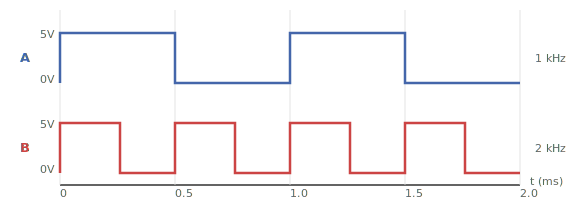

# ใบงานการทดลองที่ 2: การออกแบบวงจรแบบ combinational 

---

## วัตถุประสงค์

- อธิบายหลักการทำงานของวงจร Full Adder ได้
- สามารถสร้างวงจร Full Adder จาก Half Adder และ Logic Gate ได้
- อธิบายหลักการทำงานของ Multiplexer ได้
- สามารถสร้างวงจร Multiplexer ขนาด 2-to-1 บน Breadboard ได้
- อธิบายหลักการทำงานของ NAND Gate ในฐานะ Universal Gate ได้
- สามารถออกแบบวงจรโดยใช้ NAND Gate เพียงอย่างเดียวได้
- วิเคราะห์การทำงานของวงจรแบบ combinational จาก Truth Table และ Boolean Equation ได้

---

## อุปกรณ์ที่ใช้ในการทดลอง

- Breadboard จำนวน 1 ชุด
- IC 74HC08 (AND Gate) จำนวน 2 ตัว
- IC 74HC32 (OR Gate) จำนวน 1 ตัว
- IC 74HC86 (XOR Gate) จำนวน 2 ตัว
- IC 74HC00 (NAND Gate) จำนวน 2 ตัว
- LED จำนวน 6 ดวง
- ตัวต้านทาน 330 Ω จำนวน 6 ตัว
- Push Button จำนวน 1 ตัว
- ตัวต้านทาน 10 kΩ จำนวน 1 ตัว
- สาย Jumper ตามความเหมาะสม
- แหล่งจ่ายไฟ +5V จำนวน 1 ชุด
- Digital Oscilloscope พร้อม Probes จำนวน 1 ชุด
- Function Generator จำนวน 1 เครื่อง

---

## การทดลองที่ 2.1 การสร้างวงจร Full Adder

Full Adder เป็นวงจรบวกเลขฐานสองจำนวน 1 บิต โดยรองรับ Carry จากหลักก่อนหน้า (Carry In)

$$S = A \oplus B \oplus C_{in}$$

$$C_{out} = (A \cdot B) + (C_{in} \cdot (A \oplus B))$$

อินพุต

- $A$
- $B$
- $C_{in}$

เอาต์พุต

- $Sum$
- $C_{out}$

#### ตารางที่ 2.1 Truth Table ของ Half Adder

| $A$ | $B$ | $S$ | $C_{out}$ |
|---|---|---|---|
| 0 | 0 | 0 | 0 |
| 0 | 1 | 1 | 0 |
| 1 | 0 | 1 | 0 |
| 1 | 1 | 0 | 1 |

### ขั้นตอนการทดลอง

1. สร้าง Half Adder ชุดที่ 1
2. สร้าง Half Adder ชุดที่ 2
3. ใช้ OR Gate รวม Carry ทั้งสอง
4. ใช้ LED แสดงผล $S$ และ $C_{out}$
5. ตั้งค่า Function Generator: 
  - Channel 1 สร้างสัญญาณ Square Wave ความถี่ 1 kHz Amplitude 5 Vpp ป้อนเข้า $A$
  - Channel 2 สร้างสัญญาณ Square Wave ความถี่ 2 kHz Amplitude 5 Vpp ป้อนเข้า $B$

6. ใช้ Push Button สร้าง $C_{in}$ และทดลองครบทั้ง 8 กรณี
7. ใช้ Oscilloscope 4 ช่อง Probe $A$, $B$, $C_{in}$, $S$ พร้อมกัน — ตรวจสอบการทำงานของวงจร Debug กรณีต่อวงจรผิด
9. บันทึกผลการทดลอง

#### ตารางที่ 2.1a ผลการทดลอง

| $A$ | $B$ | $C_{in}$ | $S$ | $C_{out}$ |
|---|---|---|---|---|
| 0 | 0 | 0   |     |       |
| 0 | 0 | 1   |     |       |
| 0 | 1 | 0   |     |       |
| 0 | 1 | 1   |     |       |
| 1 | 0 | 0   |     |       |
| 1 | 0 | 1   |     |       |
| 1 | 1 | 0   |     |       |
| 1 | 1 | 1   |     |       |

### คำถามท้ายการทดลองที่ 2.1

1. เพราะเหตุใด Full Adder จึงต้องใช้ Half Adder จำนวน 2 ชุด
2. หากต้องการสร้าง 4-bit Adder จะต้องใช้ Full Adder กี่ตัว

---

## การทดลองที่ 2.2 การสร้างวงจร Multiplexer 2-to-1

Multiplexer (MUX) เป็นวงจรที่ใช้เลือกข้อมูลจากอินพุตหลายชุดเข้าสู่เอาต์พุตเพียงชุดเดียว

อินพุต

- $I_0$
- $I_1$
- $S$

เอาต์พุต

- $Y$

#### ตารางที่ 2.2 Truth Table ของ Multiplexer 2-to-1

| $S$ | $Y$ |
|---|---|
| 0 | $I_0$ |
| 1 | $I_1$ |

### ขั้นตอนการทดลอง

1. ออกแบบวงจรจากสมการ Boolean (ให้วาดวงจร)

$Y = (I_0 \cdot \overline{S}) + (I_1 \cdot S)$

2. สร้างวงจรบน Breadboard
3. ตั้งค่า Function Generator: 
  - Channel 1 สร้างสัญญาณ Square Wave ความถี่ 1 kHz Amplitude 5 Vpp ป้อนเข้่า $I_0$
  - Channel 2 สร้างสัญญาณ Square Wave ความถี่ 2 kHz Amplitude 5 Vpp ป้อนเข้า $I_1$
4. ใช้ Push Button สร้างสัญญาณ $S$ และทดลองเปลี่ยนค่าระหว่าง 0 และ 1
5. ใช้ Oscilloscope 3 ช่อง Probe $I_0$, $I_1$ และ $Y$ — สังเกตว่าเอาต์พุตเลือกอินพุตตามค่า $S$
6. บันทึกผลการทดลอง

#### ตารางที่ 2.2a ผลการทดลอง

| $S$ | $I_0$ | $I_1$ | $Y$ |
|---|---|---|---|
| 0  | 0 | 0 |   |
| 0  | 0 | 1 |   |
| 0  | 1 | 0 |   |
| 0  | 1 | 1 |   |
| 1  | 0 | 0 |   |
| 1  | 0 | 1 |   |
| 1  | 1 | 0 |   |
| 1  | 1 | 1 |   |

### คำถามท้ายการทดลองที่ 2.2

1. Multiplexer ทำหน้าที่อะไร
2. จงออกแบบวงจร 4-to-1 Multiplexer โดยใช้ 2-to-1 Multiplexer ต่อเรียงกัน

---

## การทดลองที่ 2.3 การออกแบบวงจรด้วย NAND Gate (Universal Gate)

NAND Gate เป็น Universal Gate — สามารถสร้างลอจิกเกตชนิดอื่นได้จาก NAND เพียงอย่างเดียว

#### ตารางที่ 2.3 Truth Table ของ NAND Gate

| $A$ | $B$ | $Y$ |
|---|---|---|
| 0 | 0 |   |
| 0 | 1 |   |
| 1 | 0 |   |
| 1 | 1 |   |

### การสร้างลอจิกเกตพื้นฐานจาก NAND Gate

- **NOT Gate**: ต่ออินพุตทั้งสองขาของ NAND เข้าด้วยกัน ($Y = \overline{A \cdot A} = \overline{A}$)
- **AND Gate**: ต่อ NAND → NOT ($Y = \overline{\overline{A \cdot B}} = A \cdot B$)
- **OR Gate**: ต่อ NOT → NAND (ตาม De Morgan's Law: $Y = \overline{\overline{A} \cdot \overline{B}} = A + B$)

### ขั้นตอนการทดลอง

1. แปลงสมการ $F = (A \cdot B) + (A \oplus C)$ ให้อยู่ในรูป NAND Gate เท่านั้น (ให้วาดวงจร)
2. ต่อวงจร NAND-only บน Breadboard ด้วย IC 74HC00
3. ตั้งค่า Function Generator: 
  - Channel 1 สร้างสัญญาณ Square Wave ความถี่ 1 kHz Amplitude 5 Vpp ป้อนเข้า $A$
  - Channel 2 สร้างสัญญาณ Square Wave ความถี่ 2 kHz Amplitude 5 Vpp ป้อนเข้า $B$
4. ใช้ Push Button สร้าง $C$ และทดลองครบทั้ง 8 กรณีและบันทึกผล
5. ใช้ Oscilloscope 4 ช่อง Probe อินพุต (A,B,C) และเอาต์พุต (F)
6. บันทึกผลการทดลอง

### คำถามท้ายการทดลองที่ 2.3

1. NAND Gate สามารถสร้างลอจิกเกตชนิดใดได้บ้าง
2. จงเขียนสมการ Boolean ของ F ในรูป NAND Gate เท่านั้น
3. การใช้ NAND Gate เพียงชนิดเดียวมีข้อดีอย่างไร
---

## สรุปผลการทดลอง

อธิบายผลการทดลอง พร้อมวิเคราะห์ความถูกต้องของผลลัพธ์ และอธิบายสาเหตุของข้อผิดพลาด (ถ้ามี)

## คำถามท้ายใบงาน

1. Half Adder และ Full Adder แตกต่างกันอย่างไร
2. Multiplexer มีประโยชน์อย่างไรในการออกแบบระบบดิจิทัล
3. เพราะเหตุใด NAND Gate จึงถูกเรียกว่า Universal Gate
4. จากการทดลอง นักศึกษาพบปัญหาใดบ้าง และแก้ไขอย่างไร