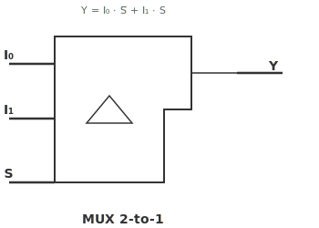
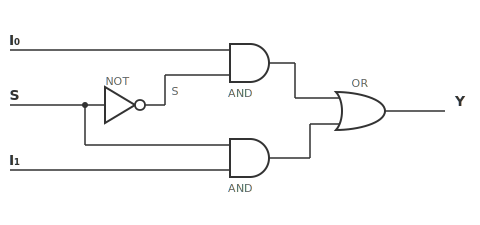

# ใบงานการทดลองที่ 3: การใช้งาน FPGA เบื้องต้นด้วย VHDL

---

## วัตถุประสงค์

- สามารถสร้างโปรเจกต์ VHDL ด้วย Quartus Prime Lite และดาวน์โหลดวงจรลงบอร์ด DE10-Lite ได้
- อธิบายหลักการทำงานของ Multiplexer และเปรียบเทียบการเขียน VHDL แบบ Structural กับ Dataflow ได้
- สามารถออกแบบวงจร MUX และเขียนวงจร combinational โดยใช้ `std_logic_vector` ได้
- ควบคุม 7-Segment Display ด้วยวงจร MUX ได้

---

## อุปกรณ์ที่ใช้ในการทดลอง

- บอร์ด DE10-Lite จำนวน 1 บอร์ด
- สาย USB Type-A to Mini-B จำนวน 1 เส้น
- คอมพิวเตอร์ จำนวน 1 เครื่อง
- โปรแกรม Quartus Prime Lite Edition
- โปรแกรม USB-Blaster Driver

---

# การทดลองที่ 3.1 การสร้างโปรเจกต์ VHDL และการกำหนด Pin Assignment

## ขั้นตอนการทดลอง

1. เปิดโปรแกรม Quartus Prime Lite
2. สร้างโปรเจกต์ใหม่ผ่าน New Project Wizard
3. กำหนดชื่อโปรเจกต์และ Working Directory
4. เลือก Target Device: `10M50DAF484C7G` (ตระกูล MAX 10 สำหรับบอร์ด DE10-Lite)
5. สร้างไฟล์ VHDL ใหม่
6. บันทึกไฟล์และกำหนดเป็น Top-Level Entity
7. เพิ่มไฟล์ Pin Assignment (.qsf) และตรวจสอบขา GPIO บนบอร์ด DE10-Lite

### คำถามท้ายการทดลองที่ 3.1

1. Target Device `10M50DAF484C7G` แต่ละส่วน (`10M50`, `DAF`, `484`, `C7G`) มีความหมายอย่างไร
2. เพราะเหตุใดจึงต้องกำหนด Top-Level Entity ก่อนการ Compile

---

# การทดลองที่ 3.2 การควบคุม LED ด้วย Slide Switch

วงจรที่ต้องการ

```
SW0 -----------> LED0
SW1 -----------> LED1
SW2 -----------> LED2
SW3 -----------> LED3
SW4 -----------> LED4
SW5 -----------> LED5
SW6 -----------> LED6
SW7 -----------> LED7
SW8 -----------> LED8
SW9 -----------> LED9
```

## ขั้นตอนการทดลอง

1. **แบบไม่ใช้ Vector** — ประกาศอินพุตและเอาต์พุตทีละบิต (10 บรรทัด):

   ```vhdl
   library ieee;
   use ieee.std_logic_1164.all;

   entity switch_to_led is
       port (
           sw0, sw1, sw2, sw3, sw4, sw5, sw6, sw7, sw8, sw9 : in  std_logic;
           led0, led1, led2, led3, led4, led5, led6, led7, led8, led9 : out std_logic
       );
   end entity;

   architecture Dataflow of switch_to_led is
   begin
       led0 <= sw0;
       led1 <= sw1;
       led2 <= sw2;
       led3 <= sw3;
       led4 <= sw4;
       led5 <= sw5;
       led6 <= sw6;
       led7 <= sw7;
       led8 <= sw8;
       led9 <= sw9;
   end architecture;
   ```

2. **แบบใช้ Vector** — ประกาศเป็นบัสด้วย `std_logic_vector` (1 บรรทัด):

   ```vhdl
   library ieee;
   use ieee.std_logic_1164.all;

   entity switch_to_led is
       port (
           sw  : in  std_logic_vector(9 downto 0);
           led : out std_logic_vector(9 downto 0)
       );
   end entity;

   architecture Dataflow of switch_to_led is
   begin
       led <= sw;
   end architecture;
   ```

   > **เปรียบเทียบ**: แบบแรกใช้ 10 บรรทัดใน Architecture — หากมี 100 อินพุตจะยิ่งยาว แบบหลังใช้ `std_logic_vector` — ต่อให้ 1,000 อินพุตก็ใช้ `led <= sw;` บรรทัดเดียว Vectors ทำให้โค้ดสั้น อ่านง่าย และแก้ไขสะดวก

   #### `to` กับ `downto` — ทิศทางของ Vector

   ```vhdl
   signal a : std_logic_vector(0 to 9);      -- MSB = a(0), LSB = a(9)
   signal b : std_logic_vector(9 downto 0);  -- MSB = b(9), LSB = b(0)
   ```

   | รูปแบบ | บิตซ้ายสุด | บิตขวาสุด | นิยมใช้ |
   |--------|-----------|----------|---------|
   | `(0 to 9)` | `a(0)` = MSB | `a(9)` = LSB | ❌ น้อย |
   | `(9 downto 0)` | `b(9)` = MSB | `b(0)` = LSB | ✅ มาตรฐาน |

   > **`downto` เป็นมาตรฐานในงานดิจิทัล** เพราะบิต 0 = LSB (Least Significant Bit) ตรงกับการเขียนเลขฐานสอง: $1010_2$ → บิต 3 = 1, บิต 0 = 0 — Lab นี้ใช้ `downto` ทั้งหมด

3. เลือกเขียนด้วยแบบ Vector (`std_logic_vector`) — กำหนด Pin Assignment ให้ SW0–SW9 และ LED0–LED9 ตรงกับขาบนบอร์ด DE10-Lite
4. Compile โปรแกรม
5. ตรวจสอบ Error และ Warning
6. Download ลงบอร์ด DE10-Lite
7. ทดลองเลื่อน Switch แต่ละตัวทีละตัว — สังเกตว่า LED ดวงที่ตรงกันติดหรือดับตาม Switch
8. ทดลองเปิด Switch พร้อมกันหลายตัว — สังเกตว่า LED ติดตามจำนวน Switch ที่เปิด

### ตารางที่ 3.1 ผลการทดลอง

| ลำดับ | SW9...SW0   | LED9...LED0 |
| ----- | ----------- | ----------- |
| 1     | `0000000000` |             |
| 2     | `0000000001` |             |
| 3     | `0000010000` |             |
| 4     | `0010000000` |             |
| 5     | `1000000000` |             |
| 6     | `1111111111` |             |

### คำถามท้ายการทดลองที่ 3.2

1. การใช้ `std_logic_vector` ประกาศอินพุตและเอาต์พุตมีข้อดีอย่างไรเมื่อเทียบกับการประกาศชื่อสัญญาณทีละบิต

---

# การทดลองที่ 3.3 วงจร Multiplexer (MUX)

Multiplexer (MUX) เป็นวงจร Combinational ที่เลือกข้อมูลจากอินพุตหลายชุดเข้าสู่เอาต์พุตเพียงชุดเดียว โดยใช้สัญญาณ Select ในการเลือก



---

## 3.3.1 วงจร MUX 2-to-1 จากลอจิกเกต

สมการ Boolean ของ MUX 2-to-1

$$Y = (I_0 \cdot \overline{S}) + (I_1 \cdot S)$$

จากสมการ วงจรภายในของ MUX 2-to-1 ประกอบด้วยลอจิกเกต 4 ตัว:

- **NOT Gate** 1 ตัว: กลับค่า $S$ เป็น $\overline{S}$
- **AND Gate** 2 ตัว: $I_0 \cdot \overline{S}$ และ $I_1 \cdot S$
- **OR Gate** 1 ตัว: รวมผลลัพธ์จาก AND ทั้งสองเป็น $Y$



### ขั้นตอนการทดลอง

1. เขียนสมการ Boolean ของ MUX 2-to-1
2. วาดวงจรจากสมการ โดยใช้อินพุต $I_0$, $I_1$, $S$ และเอาต์พุต $Y$
3. เขียนตารางความจริง (Truth Table) ให้ครบทุกกรณี 8 ชุด ($2^3 = 8$)
4. ตรวจสอบความถูกต้องของวงจรโดยเทียบกับ Function Table

### ตัวอย่าง: การเขียนวงจร MUX 2-to-1 แบบ Structural VHDL

จากวงจรเกตที่วาดไว้ในขั้นตอนที่ 2 สามารถเขียนเป็น VHDL แบบ Structural (ต่อเกต) ได้ดังนี้:

```vhdl
library ieee;
use ieee.std_logic_1164.all;

entity mux_2to1_gate is
    port (
        i0 : in  std_logic;
        i1 : in  std_logic;
        s  : in  std_logic;
        y  : out std_logic
    );
end entity;

architecture Structural of mux_2to1_gate is
    signal s_not  : std_logic;
    signal and_s0 : std_logic;
    signal and_s1 : std_logic;
begin
    -- NOT Gate: กลับค่า S
    s_not  <= not s;
    -- AND Gate 1: I0 AND (NOT S)
    and_s0 <= i0 and s_not;
    -- AND Gate 2: I1 AND S
    and_s1 <= i1 and s;
    -- OR Gate: รวมผลลัพธ์
    y      <= and_s0 or and_s1;
end architecture;
```

> สังเกตว่าโค้ดด้านบนมีโครงสร้างตรงกับวงจรเกตทุกประการ — NOT 1 ตัว, AND 2 ตัว, OR 1 ตัว — แค่เขียนในรูปภาษา VHDL

### ตารางที่ 3.2 Function Table ของ MUX 2-to-1

| S | Y    |
| - | ---- |
| 0 | $I_0$ |
| 1 | $I_1$ |

### ตารางที่ 3.3 Truth Table ของ MUX 2-to-1

| $I_0$ | $I_1$ | S | Y |
| ----- | ----- | - | - |
| 0     | 0     | 0 |   |
| 0     | 1     | 0 |   |
| 1     | 0     | 0 |   |
| 1     | 1     | 0 |   |
| 0     | 0     | 1 |   |
| 0     | 1     | 1 |   |
| 1     | 0     | 1 |   |
| 1     | 1     | 1 |   |

---

## 3.3.2 MUX 2-to-1 ด้วย VHDL

นำวงจรที่ออกแบบในข้อ 3.3.1 มาเขียนด้วยภาษา VHDL แบบ Dataflow และทดสอบบนบอร์ด DE10-Lite

### ขั้นตอนการทดลอง

1. สร้าง VHDL Entity สำหรับ MUX 2-to-1:
   - อินพุต: `i0`, `i1`, `s` (ชนิด `std_logic`)
   - เอาต์พุต: `y` (ชนิด `std_logic`)
2. เขียน Architecture โดยใช้ Conditional Signal Assignment:

   ```vhdl
   library ieee;
   use ieee.std_logic_1164.all;

   entity mux_2to1 is
       port (
           i0 : in  std_logic;
           i1 : in  std_logic;
           s  : in  std_logic;
           y  : out std_logic
       );
   end entity;

   architecture Dataflow of mux_2to1 is
   begin
       y <= i0 when s = '0' else i1;
   end architecture;
   ```

   > เปรียบเทียบกับ Structural VHDL ในข้อ 3.3.1: Dataflow ใช้เพียง 1 บรรทัด (`y <= i0 when s = '0' else i1;`) แทนการต่อเกตทีละตัว — แต่สังเคราะห์ได้วงจรเหมือนกัน

   > **Dataflow** คือการเขียน VHDL โดยอธิบายการไหลของข้อมูลด้วยสมการหรือเงื่อนไข (`when-else`, `with-select`) โดยไม่ต้องระบุเกตภายใน — เครื่องมือสังเคราะห์จะสร้างวงจรให้โดยอัตโนมัติ

3. กำหนด Pin Assignment:
   - `i0` → SW0, `i1` → SW1, `s` → SW2
   - `y` → LED0
4. Compile และ Download
5. ทดลองเปลี่ยนค่า SW0, SW1, SW2 — ตรวจสอบว่า LED0 เลือกอินพุตตามค่า S
6. เปรียบเทียบผลลัพธ์ที่ได้กับ Truth Table ในข้อ 3.3.1 — ผลลัพธ์ตรงกันหรือไม่

### ตารางที่ 3.4 ผลการทดลอง MUX 2-to-1

| $I_0$ | $I_1$ | S | Y |
| ----- | ----- | - | - |
| 0     | 0     | 0 |   |
| 0     | 1     | 0 |   |
| 1     | 0     | 0 |   |
| 1     | 1     | 0 |   |
| 0     | 0     | 1 |   |
| 0     | 1     | 1 |   |
| 1     | 0     | 1 |   |
| 1     | 1     | 1 |   |

---

## 3.3.3 MUX 2-to-1 ขนาด 4 บิต

จาก MUX 2-to-1 แบบ 1 บิตในข้อ 3.3.2 ให้ต่อยอดเป็น MUX 2-to-1 ขนาด **4 บิต** — รับอินพุตข้อมูลสองชุด ชุดละ 4 บิต ($A_{3..0}$ และ $B_{3..0}$) เลือกด้วยสัญญาณ $S$ และส่งออก 4 บิต ($Y_{3..0}$)

แนวคิด: MUX 4 บิต คือการนำ MUX 1 บิต 4 ตัวมาทำงานขนานกัน — แต่ละบิตของ $A$ และ $B$ ผ่าน MUX ของตัวเอง และถูกควบคุมด้วย $S$ ตัวเดียวกัน

```vhdl
library ieee;
use ieee.std_logic_1164.all;

entity mux_2to1_4bit is
    port (
        a : in  std_logic_vector(3 downto 0);
        b : in  std_logic_vector(3 downto 0);
        s : in  std_logic;
        y : out std_logic_vector(3 downto 0)
    );
end entity;

architecture Dataflow of mux_2to1_4bit is
begin
    y <= a when s = '0' else b;
end architecture;
```

> สังเกตว่า Architecture ใช้คำสั่งเดียวกับ MUX 1 บิตในข้อ 3.3.2 (`y <= a when s = '0' else b;`) — แต่ `a`, `b`, `y` เป็น `std_logic_vector` ทำให้คำสั่งเดียวทำงานทั้ง 4 บิตพร้อมกัน

### ตารางที่ 3.5 Function Table ของ MUX 2-to-1 ขนาด 4 บิต

| S | $Y_{3..0}$ |
| - | ---------- |
| 0 | $A_{3..0}$ |
| 1 | $B_{3..0}$ |

### ขั้นตอนการทดลอง

1. สร้าง VHDL Entity สำหรับ MUX 2-to-1 ขนาด 4 บิต:
   - อินพุต: `a`, `b` (ชนิด `std_logic_vector(3 downto 0)`), `s` (ชนิด `std_logic`)
   - เอาต์พุต: `y` (ชนิด `std_logic_vector(3 downto 0)`)
2. เขียน Architecture ด้วย Conditional Signal Assignment
3. กำหนด Pin Assignment:
   - `a(0)` → SW0, `a(1)` → SW1, `a(2)` → SW2, `a(3)` → SW3
   - `b(0)` → SW4, `b(1)` → SW5, `b(2)` → SW6, `b(3)` → SW7
   - `s` → SW8
   - `y(0)` → LED0, `y(1)` → LED1, `y(2)` → LED2, `y(3)` → LED3
4. Compile และ Download
5. ทดลองเปลี่ยนค่า $A$, $B$, และ $S$ — ตรวจสอบว่า LED แสดงค่าตามที่เลือก
6. เปรียบเทียบจำนวนบรรทัด VHDL ระหว่าง MUX 1 บิต (ข้อ 3.3.2) และ MUX 4 บิต (ข้อนี้)

### ตารางที่ 3.6 ผลการทดลอง MUX 2-to-1 ขนาด 4 บิต

| $A_{3..0}$ | $B_{3..0}$ | S | $Y_{3..0}$ |
| ---------- | ---------- | - | ---------- |
| `0000`     | `0000`     | 0 |            |
| `0101`     | `1010`     | 0 |            |
| `0101`     | `1010`     | 1 |            |
| `1111`     | `0000`     | 0 |            |
| `1111`     | `0000`     | 1 |            |
| `0011`     | `1100`     | 0 |            |
| `0011`     | `1100`     | 1 |            |

---

### คำถามท้ายการทดลองที่ 3.3

1. จากข้อ 3.3.1 (Structural) และ 3.3.2 (Dataflow) — การเขียน VHDL ทั้งสองแบบแตกต่างกันอย่างไร และเพราะเหตุใดผลลัพธ์จึงเหมือนกัน
2. จากข้อ 3.3.2 และ 3.3.1 — ผลลัพธ์จาก VHDL กับ Truth Table ที่คำนวณจากสมการ Boolean ตรงกันหรือไม่ เพราะเหตุใด
3. จากข้อ 3.3.3 — หากต้องการเปลี่ยนเป็น MUX 2-to-1 ขนาด 8 บิต ต้องแก้ไข VHDL Code อย่างไร

---

# การทดลองที่ 3.4 การควบคุม 7-Segment Display ด้วย MUX

7-Segment Display บนบอร์ด DE10-Lite ประกอบด้วย LED 7 ดวงเรียงเป็นรูปตัวเลข และจุดทศนิยม (Decimal Point) อีก 1 ดวง รวม 8 ดวงต่อ 1 หลัก

```
    a
   ---
f |   | b
  | g |
   ---
e |   | c
  | d |
   ---    * dp
```

การแสดงผลเป็นแบบ **Active-Low**: การส่งค่า `0` = Segment ติด, การส่งค่า `1` = Segment ดับ

ในการทดลองนี้ ให้ใช้ **วงจร MUX 4-to-1** เลือกรูปแบบตัวเลขที่เตรียมไว้ล่วงหน้า 4 รูปแบบ แสดงผลบน **HEX0** โดยใช้ Switch 2 ตัวเป็นสัญญาณ Select

### ขั้นตอนการทดลอง

1. ศึกษาการทำงานของ 7-Segment Display บนบอร์ด DE10-Lite
2. สร้าง VHDL Entity สำหรับ MUX 7-Segment:
   - อินพุต: `sw` (2 บิต, ชนิด `std_logic_vector(1 downto 0)`) สำหรับเลือกตัวเลข
   - เอาต์พุต: `hex0` (8 บิต, ชนิด `std_logic_vector(7 downto 0)`) ต่อกับ HEX0
3. กำหนดรูปแบบตัวเลขแบบ Active-Low (ดูตารางที่ 3.7):

   ```vhdl
   constant PATTERN0 : std_logic_vector(7 downto 0) := "11000000";  -- เลข 0
   constant PATTERN1 : std_logic_vector(7 downto 0) := "11111001";  -- เลข 1
   constant PATTERN2 : std_logic_vector(7 downto 0) := "10100100";  -- เลข 2
   constant PATTERN3 : std_logic_vector(7 downto 0) := "10110000";  -- เลข 3
   ```

4. เขียน Architecture โดยใช้ `with-select` เลือกรูปแบบตามค่า `sw`
5. กำหนด Pin Assignment:
   - `sw(0)` → SW0, `sw(1)` → SW1
   - `hex0(0)` → `hex0(7)` → ขา HEX0 บน DE10-Lite (ดูตาราง Pin Assignment จากคู่มือ)
6. Compile และ Download
7. ทดลองเปลี่ยนค่า SW0, SW1 — สังเกตตัวเลขที่แสดงบน HEX0

### ตารางที่ 3.7 ค่าการแสดงผล Active-Low สำหรับตัวเลข 0–3

| ตัวเลข | dp  | g   | f   | e   | d   | c   | b   | a   | HEX0[7:0]  |
| ----- | --- | --- | --- | --- | --- | --- | --- | --- | ---------- |
| 0     | 1   | 1   | 0   | 0   | 0   | 0   | 0   | 0   | `11000000` |
| 1     | 1   | 1   | 1   | 1   | 1   | 0   | 0   | 1   | `11111001` |
| 2     | 1   | 0   | 1   | 0   | 0   | 1   | 0   | 0   | `10100100` |
| 3     | 1   | 0   | 1   | 1   | 0   | 0   | 0   | 0   | `10110000` |

### ตารางที่ 3.8 ผลการทดลอง MUX 7-Segment

| SW1 | SW0 | ตัวเลขที่แสดง |
| --- | --- | ------------- |
| 0   | 0   |               |
| 0   | 1   |               |
| 1   | 0   |               |
| 1   | 1   |               |

### คำถามท้ายการทดลองที่ 3.4

1. เพราะเหตุใด 7-Segment Display บนบอร์ด DE10-Lite จึงใช้สัญญาณแบบ Active-Low
2. หากต้องการแสดงตัวเลข 0–9 ครบทั้ง 10 ตัว ต้องใช้ Switch กี่ตัว และต้องปรับปรุง VHDL Code อย่างไร

---

# สรุปผลการทดลอง

อธิบายผลการทดลอง พร้อมวิเคราะห์ความถูกต้องของผลลัพธ์ และอธิบายสาเหตุของข้อผิดพลาด (ถ้ามี)

---

# คำถามท้ายใบงาน

1. FPGA แตกต่างจากการใช้ IC Digital Logic อย่างไร
2. การ Compile มีวัตถุประสงค์เพื่ออะไร
3. หาก Pin Assignment ไม่ถูกต้อง จะเกิดผลอย่างไร
4. การเขียน VHDL แบบ Concurrent Assignment เหมาะกับวงจรประเภทใด
5. จากผลการทดลอง 3.3.1 และ 3.3.3 — หากต้องการสร้าง MUX 2-to-1 ขนาด 8 บิตด้วยการต่อเกต จะต้องใช้ NOT, AND, OR Gate อย่างละกี่ตัว
6. การใช้ MUX ควบคุม 7-Segment Display มีข้อดีอย่างไรเมื่อเทียบกับการต่อ Switch เข้ากับ Segment โดยตรง
