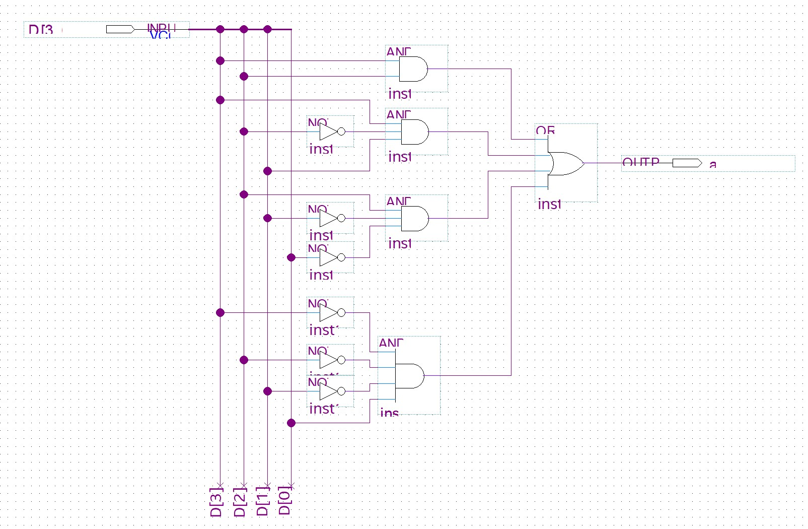
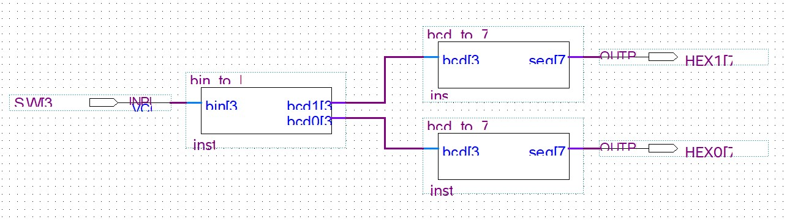
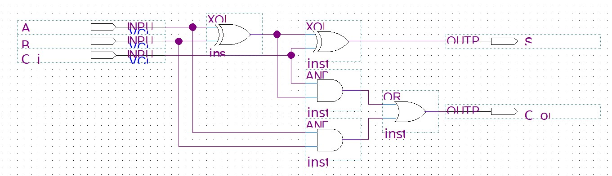
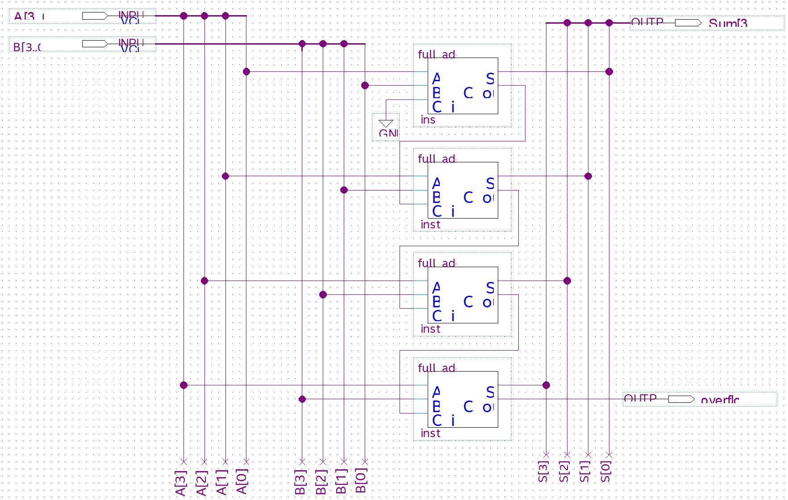

# ใบงานการทดลองที่ 4: การออกแบบวงจรถอดรหัสและการแสดงผล 7-Segment

---

## วัตถุประสงค์

- สามารถออกแบบวงจรถอดรหัสจาก Truth Table และเขียนเป็น VHDL แบบ Structural ได้
- อธิบายหลักการของรหัส BCD และการแปลงเลข Binary เป็น BCD ได้
- สามารถเชื่อมต่อวงจรแบบ Structural โดยใช้ Component ที่ออกแบบไว้แล้วได้
- สามารถออกแบบวงจร Full Adder และสร้าง Ripple Carry Adder แบบ Structural ได้

---

## อุปกรณ์ที่ใช้ในการทดลอง

- บอร์ด DE10-Lite จำนวน 1 บอร์ด
- สาย USB Type-A to Mini-B จำนวน 1 เส้น
- คอมพิวเตอร์ จำนวน 1 เครื่อง
- โปรแกรม Quartus Prime Lite Edition
- โปรแกรม USB-Blaster Driver

---

## การทดลองที่ 4.1 วงจร BCD to 7-Segment Decoder

7-Segment Display บนบอร์ด DE10-Lite ประกอบด้วย LED 7 ดวงเรียงเป็นรูปตัวเลข (a, b, c, d, e, f, g) และจุดทศนิยม (dp) อีก 1 ดวง — รวม 8 ดวงต่อ 1 หลัก การแสดงผลเป็นแบบ **Active-Low** กล่าวคือ:

- ส่ง `0` = Segment **ติด**
- ส่ง `1` = Segment **ดับ**

```
    a
   ---
f |   | b
  | g |
   ---
e |   | c
  | d |
   ---    * dp
```

**BCD (Binary Coded Decimal)** คือการแทนเลขฐานสิบแต่ละหลัก (0–9) ด้วยเลขฐานสอง 4 บิต — แต่ละหลักเก็บแยกจากกัน เช่น $25_{10}$ ในรหัส BCD คือ `0010 0101` (หลักสิบ = 2, หลักหน่วย = 5)

ในการทดลองนี้ นักศึกษาจะ **ออกแบบวงจรถอดรหัส** (Decoder) ที่รับ BCD 4 บิตเข้า และส่งรูปแบบ Segment 8 บิตออก เพื่อแสดงตัวเลข 0–9 บน HEX Display

### ขั้นตอนการทดลอง

1. **เติม Truth Table** — วงจรมีอินพุต 4 บิต (BCD: $D_3, D_2, D_1, D_0$) ตั้งแต่ `0000` ถึง `1001` (0–9) ค่าเกิน `1001` (10–15) ไม่มีในรหัส BCD — ให้กำหนดให้ Segment ดับทั้งหมด (ส่ง `1` ทุกขา) หรือเลือกให้แสดงเป็น "-" ก็ได้

   กำหนดว่าอินพุตใดทำให้ Segment ใด **ติด** (ON = `0`) และ Segment ใด **ดับ** (OFF = `1`) โดยดูจากรูปทรงของตัวเลข:

   | ตัวเลข | Segment ที่ติด (ON)      |
   | ------ | ----------------------- |
   | 0      | a, b, c, d, e, f        |
   | 1      | b, c                    |
   | 2      | a, b, d, e, g           |
   | 3      | a, b, c, d, g           |
   | 4      | b, c, f, g              |
   | 5      | a, c, d, f, g           |
   | 6      | a, c, d, e, f, g        |
   | 7      | a, b, c                 |
   | 8      | a, b, c, d, e, f, g     |
   | 9      | a, b, c, d, f, g        |

   > **ตัวอย่าง:** ตัวเลข 0 → Segment a, b, c, d, e, f ติด → ส่ง `0` ที่ขา a–f, ส่ง `1` ที่ขา g (เพราะ g ดับ)

#### ตารางที่ 4.1 Truth Table ของ BCD to 7-Segment Decoder

| $D_3$ | $D_2$ | $D_1$ | $D_0$ | ตัวเลข | a | b | c | d | e | f | g |
| ----- | ----- | ----- | ----- | ------ | - | - | - | - | - | - | - |
| 0     | 0     | 0     | 0     | 0      | 0 | 0 | 0 | 0 | 0 | 0 | 1 |
| 0     | 0     | 0     | 1     | 1      | 1 |   |   |   |   |   |   |
| 0     | 0     | 1     | 0     | 2      | 0 |   |   |   |   |   |   |
| 0     | 0     | 1     | 1     | 3      | 0 |   |   |   |   |   |   |
| 0     | 1     | 0     | 0     | 4      | 1 |   |   |   |   |   |   |
| 0     | 1     | 0     | 1     | 5      | 0 |   |   |   |   |   |   |
| 0     | 1     | 1     | 0     | 6      | 0 |   |   |   |   |   |   |
| 0     | 1     | 1     | 1     | 7      | 0 |   |   |   |   |   |   |
| 1     | 0     | 0     | 0     | 8      | 0 |   |   |   |   |   |   |
| 1     | 0     | 0     | 1     | 9      | 0 |   |   |   |   |   |   |
| 1     | 0     | 1     | 0     | —      | 1 | 1 | 1 | 1 | 1 | 1 | 1 |
| 1     | 0     | 1     | 1     | —      | 1 | 1 | 1 | 1 | 1 | 1 | 1 |
| 1     | 1     | 0     | 0     | —      | 1 | 1 | 1 | 1 | 1 | 1 | 1 |
| 1     | 1     | 0     | 1     | —      | 1 | 1 | 1 | 1 | 1 | 1 | 1 |
| 1     | 1     | 1     | 0     | —      | 1 | 1 | 1 | 1 | 1 | 1 | 1 |
| 1     | 1     | 1     | 1     | —      | 1 | 1 | 1 | 1 | 1 | 1 | 1 |

> แถว 10–15 (10–15 ในฐานสิบ) ไม่มีในรหัส BCD — กำหนดให้ดับทุก Segment (ส่ง `1` ทุกขา) เพื่อให้จอแสดงผลว่างเปล่าเมื่อรับค่านอกช่วง

2. **ลดรูปสมการด้วย K-map** — นำค่าจาก Truth Table มาลดรูปด้วย K-map เลือกใช้ **SOP** (จัดกลุ่ม `1`) หรือ **POS** (จัดกลุ่ม `0`) ก็ได้ — ทั้งสองแบบสังเคราะห์เป็นวงจรที่ให้ผลลัพธ์ตรงตาม Truth Table เหมือนกัน

   > **ตัวอย่าง: K-map สำหรับ Segment a — SOP (จัดกลุ่ม `1` = Segment ดับ)**
   >
   > จาก Truth Table — Segment a = 1 (ดับ) เมื่อตัวเลขเป็น 1, 4, 10, 11, 12, 13, 14, 15
   >
   > | $D_3D_2 \setminus D_1D_0$ | 00 | 01 | 11 | 10 |
   > | ------------------------- | -- | -- | -- | -- |
   > | 00                        | 0  | 1  | 0  | 0  |
   > | 01                        | 1  | 0  | 0  | 0  |
   > | 11                        | 1  | 1  | 1  | 1  |
   > | 10                        | 0  | 0  | 1  | 1  |
   >
   > จัดกลุ่ม `1` (SOP):
   > - กลุ่ม $m_{12} + m_{13} + m_{14} + m_{15}$ → $D_3\,D_2$
   > - กลุ่ม $m_{10} + m_{11}$ → $D_3\,\overline{D_2}\,D_1$
   > - กลุ่ม $m_4 + m_{12}$ → $D_2\,\overline{D_1}\,\overline{D_0}$
   > - $m_1$ เดี่ยว → $\overline{D_3}\,\overline{D_2}\,\overline{D_1}\,D_0$
   >
   > $$a = D_3\,D_2 + D_3\,\overline{D_2}\,D_1 + D_2\,\overline{D_1}\,\overline{D_0} + \overline{D_3}\,\overline{D_2}\,\overline{D_1}\,D_0$$
   >
   > *(หากเลือก POS: จัดกลุ่ม `0` แล้วเขียนสมการผลคูณของผลบวก — ได้วงจรคนละแบบแต่ Truth Table ตรงกัน)*
   >
   > **ตัวอย่าง POS (ทางเลือก):** จัดกลุ่ม `0` จาก K-map เดิม:
   > - กลุ่ม $m_0 + m_8$ → $(D_2 + D_1 + D_0)$
   > - กลุ่ม $m_2 + m_3 + m_6 + m_7$ → $(D_3 + \overline{D_1})$
   > - กลุ่ม $m_8 + m_9$ → $(\overline{D_3} + D_2 + D_1)$
   > - $m_5$ เดี่ยว → $(D_3 + \overline{D_2} + D_1 + \overline{D_0})$
   >
   > $$a = (D_2 + D_1 + D_0)(D_3 + \overline{D_1})(\overline{D_3} + D_2 + D_1)(D_3 + \overline{D_2} + D_1 + \overline{D_0})$$
   >
   > VHDL: `a <= (bcd(2) or bcd(1) or bcd(0)) and (bcd(3) or not bcd(1)) and (not bcd(3) or bcd(2) or bcd(1)) and ... ;`
   >
   > > **หมายเหตุ:** การจัดกลุ่มอาจทำได้หลายแบบ — ไม่มีคำตอบเดียวที่ถูกต้อง ตราบใดที่ Truth Table ตรงกัน

   **นักศึกษาทำ K-map สำหรับ Segment b** — segment b = 1 (ดับ) เมื่อตัวเลขเป็น 5, 6, 10, 11, 12, 13, 14, 15 — จัดกลุ่มและเขียนสมการ:

   > คำแนะนำ: ดูค่าในตารางที่ 4.1 ช่อง b — ลง K-map จัดกลุ่ม `1` (SOP) หรือจัดกลุ่ม `0` (POS) — ได้สมการลดรูป
   >
   > สำหรับ Segment c–g — นักศึกษาดำเนินการลดรูปด้วย K-map ในทำนองเดียวกันจนครบทั้ง 7 Segment

3. **สร้างวงจร** — เลือกทำ **Schematic** หรือ **VHDL** อย่างใดอย่างหนึ่ง (หรือทั้งคู่):

   **Schematic:**
   - สร้างไฟล์ใหม่: **File → New → Block Diagram/Schematic File**
   - ลากสัญลักษณ์ `input` (4 บิต) และ `output` (8 บิต) มาวาง
   - ลาก AND Gate, OR Gate, NOT Gate มาต่อตามสมการที่ได้จาก K-map

   

   - ต่อจนครบทั้ง 7 Segment — ต่อ `dp` เข้ากับ `VCC` (Logic 1)
   - บันทึก — กำหนดเป็น Top-Level Entity

   **VHDL:**
   - เขียน Architecture แบบ Structural — ต่อเกตตามสมการ:

   ```vhdl
   architecture Structural of bcd_to_7seg is
       signal a, b, c, d, e, f, g : std_logic;
   begin
        -- Segment a (ตัวอย่าง SOP)
        a <= (bcd(3) and bcd(2)) or
             (bcd(3) and not bcd(2) and bcd(1)) or
             (bcd(2) and not bcd(1) and not bcd(0)) or
             (not bcd(3) and not bcd(2) and not bcd(1) and bcd(0));

       -- Segment b–g — นักศึกษาเขียนตามสมการที่ลดรูปได้จาก K-map
       b <= ... ;
       ...
       seg <= '1' & g & f & e & d & c & b & a;
   end architecture;
   ```

   > Schematic เห็นภาพวงจรจริง / VHDL เขียนโค้ดต่อเกต — ทั้งสองแบบคือ Structural เหมือนกัน เลือกตามถนัด

4. **Simulate ด้วย Waveform** — ตรวจสอบความถูกต้องของวงจรก่อนลงบอร์ด:
   - **File → New → University Program VWF** สร้าง Vector Waveform File
   - **Edit → Insert → Insert Node or Bus** → Node Finder → เลือก `bcd` (input) และ `seg` (output)
   - ตั้งค่า `bcd` เป็น `0000` → `0001` → ... → `1001` → `1010` → ... → `1111` (ไล่ครบ 16 ค่า)
   - **Simulation → Run Functional Simulation**
   - ตรวจสอบว่า `seg` แต่ละค่าตรงกับ Truth Table ในตารางที่ 4.1

6. กำหนด Pin Assignment:
   - `bcd(3)` → SW3, `bcd(2)` → SW2, `bcd(1)` → SW1, `bcd(0)` → SW0
   - `seg(7:0)` → ขา HEX0 บน DE10-Lite (ดูตาราง Pin Assignment จากคู่มือบอร์ด)

7. Compile และ Download
8. ทดลองเปลี่ยนค่า SW3–SW0 — สังเกตตัวเลขที่แสดงบน HEX0 เทียบกับ Truth Table

#### ตารางที่ 4.2 ผลการทดลอง BCD to 7-Segment

| SW3–SW0 | ตัวเลขที่แสดงบน HEX0 |
| ------- | -------------------- |
| `0000`  |                      |
| `0001`  |                      |
| `0010`  |                      |
| `0011`  |                      |
| `0100`  |                      |
| `0101`  |                      |
| `0110`  |                      |
| `0111`  |                      |
| `1000`  |                      |
| `1001`  |                      |
| `1010`  |                      |

### คำถามท้ายการทดลองที่ 4.1

1. ในการลดรูปด้วย K-map — อะไรเป็นปัจจัยในการตัดสินใจเลือกระหว่าง SOP (จัดกลุ่ม `1`) กับ POS (จัดกลุ่ม `0`)
2. หากเขียน SOP โดยตรงจาก Truth Table โดยไม่ลดรูปด้วย K-map — วงจรที่ได้จะต่างจากการลดรูปแล้วอย่างไร และมีข้อเสียอะไร

---

## การทดลองที่ 4.2 วงจรแสดงผล Binary บน 7-Segment 2 หลัก

ในการทดลองนี้จะ **นำ `bcd_to_7seg` จากข้อ 4.1 กลับมาใช้ซ้ำ** — โดยออกแบบวงจร `bin_to_bcd` สำหรับแปลงเลข Binary 4 บิต (0–15) เป็น BCD 2 หลัก จากนั้นเชื่อมต่อทุก Block เข้าด้วยกันแบบ Structural เพื่อแสดงผลบน 7-Segment 2 หลัก

**ภาพรวมของระบบ:**

```
Binary Input (4-bit) → bin_to_bcd → bcd_to_7seg (หลักสิบ) → HEX1
                                  → bcd_to_7seg (หลักหน่วย) → HEX0
```

เลข Binary 4 บิตมีค่าได้ตั้งแต่ 0 ถึง 15 ($0000_2$–$1111_2$) — หากต้องการแสดงผลเป็นเลขฐานสิบบน 7-Segment 2 หลัก ต้อง **แปลงจาก Binary เป็น BCD** ก่อน

| เลขฐานสิบ | Binary (4-bit) | BCD หลักสิบ (4-bit) | BCD หลักหน่วย (4-bit) |
| --------- | -------------- | ------------------- | --------------------- |
| 0         | `0000`         | `0000`              | `0000`                |
| 5         | `0101`         | `0000`              | `0101`                |
| 9         | `1001`         | `0000`              | `1001`                |
| 10        | `1010`         | `0001`              | `0000`                |
| 12        | `1100`         | `0001`              | `0010`                |
| 15        | `1111`         | `0001`              | `0101`                |

> **ความแตกต่าง:** Binary `1010` แทนค่า 10 ในระบบเลขฐานสอง — แต่ BCD แยกเป็น 2 หลัก: หลักสิบ `0001` (1) และหลักหน่วย `0000` (0) การแปลงนี้จำเป็นเพราะ 7-Segment แต่ละตัวรับ BCD ได้เพียง 1 หลัก (0–9) เท่านั้น

### ขั้นตอนการทดลอง

**ส่วนที่ 1 — ออกแบบ `bin_to_bcd`**

1. **เติม Truth Table** — วงจรมีอินพุต `bin` 4 บิต และเอาต์พุต 2 ชุดๆ ละ 4 บิต: `bcd1` (หลักสิบ) และ `bcd0` (หลักหน่วย)

#### ตารางที่ 4.3 Truth Table ของ Binary to BCD

| $B_3$ | $B_2$ | $B_1$ | $B_0$ | ค่าฐานสิบ | bcd1 (หลักสิบ) | bcd0 (หลักหน่วย) |
| ----- | ----- | ----- | ----- | --------- | -------------- | ---------------- |
| 0     | 0     | 0     | 0     | 0         | `0000`         | `0000`           |
| 0     | 0     | 0     | 1     | 1         |                |                  |
| 0     | 0     | 1     | 0     | 2         |                |                  |
| 0     | 0     | 1     | 1     | 3         |                |                  |
| 0     | 1     | 0     | 0     | 4         |                |                  |
| 0     | 1     | 0     | 1     | 5         |                |                  |
| 0     | 1     | 1     | 0     | 6         |                |                  |
| 0     | 1     | 1     | 1     | 7         |                |                  |
| 1     | 0     | 0     | 0     | 8         |                |                  |
| 1     | 0     | 0     | 1     | 9         |                |                  |
| 1     | 0     | 1     | 0     | 10        |                |                  |
| 1     | 0     | 1     | 1     | 11        |                |                  |
| 1     | 1     | 0     | 0     | 12        |                |                  |
| 1     | 1     | 0     | 1     | 13        |                |                  |
| 1     | 1     | 1     | 0     | 14        |                |                  |
| 1     | 1     | 1     | 1     | 15        |                |                  |

> **แนวคิด:** สังเกตว่าเลข 0–9 มี `bcd1 = 0000` เสมอ — `bcd0` เท่ากับ `bin` โดยตรง เลข 10–15 มี `bcd1 = 0001` และ `bcd0 = bin − 10`

2. **เขียนสมการ Boolean สำหรับ bcd1** — เนื่องจากค่าที่เป็นไปได้ของหลักสิบมีแค่ 0 (`0000`) หรือ 1 (`0001`) — มีเพียง `bcd1(0)` ที่เปลี่ยนค่า จงเขียนสมการ:

   - `bcd1(0)` = 1 เมื่อค่า `bin` อยู่ในช่วง 10–15 — นั่นคือเมื่อ $B_3 = 1$ และ ($B_2 = 0$ หรือ $B_1 = 1$ หรือ...) — นักศึกษาเขียนสมการให้สมบูรณ์จาก Truth Table

3. **เขียน VHDL แบบ Dataflow** — ใช้ `with-select` เลือกค่าเอาต์พุตตาม `bin`:

   ```vhdl
   library ieee;
   use ieee.std_logic_1164.all;

   entity bin_to_bcd is
       port (
           bin  : in  std_logic_vector(3 downto 0);
           bcd1 : out std_logic_vector(3 downto 0);   -- หลักสิบ
           bcd0 : out std_logic_vector(3 downto 0)    -- หลักหน่วย
       );
   end entity;

   architecture Dataflow of bin_to_bcd is
   begin
       -- หลักสิบ: 0 สำหรับ 0–9, 1 สำหรับ 10–15
       with bin select bcd1 <=
           "0000" when "0000" | "0001" | "0010" | "0011" | "0100" |
                           "0101" | "0110" | "0111" | "1000" | "1001",
           "0001" when others;

       -- หลักหน่วย: นักศึกษาเติมให้ครบ 16 ค่า
       with bin select bcd0 <=
           "0000" when "0000",   --  0
           "0001" when "0001",   --  1
           -- นักศึกษาเติมให้ครบ 2–15
           "0000" when others;
   end architecture;
   ```

   > **`with-select`** — Concurrent Statement ที่เลือกค่าเอาต์พุตตามอินพุต แต่ละ `when` หมายถึง "เมื่อ `bin` มีค่าเท่านี้ ให้เอาต์พุตเป็นค่านี้" — ต้องครอบคลุมทุกกรณีที่เป็นไปได้
   >
   > สำหรับ `bcd1`: ใช้ `|` รวมหลายกรณีให้ค่าเดียวกัน — เพราะหลักสิบมีแค่ 0 (0–9) กับ 1 (10–15)
   >
   > สำหรับ `bcd0`: นักศึกษาเขียนทีละค่า 16 บรรทัด — ค่าหลักหน่วยตรงตาม Truth Table

4. ทดสอบ `bin_to_bcd` บน LED ก่อนนำไปเชื่อมกับ 7-Segment:
   - `bin(3)` → SW3, `bin(2)` → SW2, `bin(1)` → SW1, `bin(0)` → SW0
   - `bcd1(3:0)` → LED7–4, `bcd0(3:0)` → LED3–0

#### ตารางที่ 4.4 ผลการทดลอง Binary to BCD (ทดสอบบน LED)

| SW3–SW0 | ค่าฐานสิบ | LED7–4 (bcd1) | LED3–0 (bcd0) |
| ------- | --------- | ------------- | ------------- |
| `0000`  | 0         |               |               |
| `0101`  | 5         |               |               |
| `1001`  | 9         |               |               |
| `1010`  | 10        |               |               |
| `1111`  | 15        |               |               |

---

**ส่วนที่ 2 — เชื่อมต่อกับ 7-Segment แบบ Structural**

5. นำ `bcd_to_7seg` จากข้อ 4.1 มาใช้ — จะใช้ไฟล์ **Schematic** (.bdf) หรือ **VHDL** (.vhd) ก็ได้ — **ไม่ต้องแก้ไข** ใช้เป็น Component สำเร็จรูป

   > **Structural VHDL** คือการเขียนวงจรโดยประกาศ Component และเชื่อมต่อด้วย `port map` — คล้ายการนำ IC ที่ออกแบบไว้แล้วมาเสียบบน Breadboard แต่ทำในภาษา VHDL ข้อดีคือ **ใช้ซ้ำ** (Reuse) — `bcd_to_7seg` ตัวเดียวใช้ได้ทั้งหลักสิบและหลักหน่วย

6. **สร้าง Top-Level** — เลือกทำ **Schematic** (Block Diagram) หรือ **VHDL** อย่างใดอย่างหนึ่ง:

   **Schematic (Block Diagram):**
   - สร้างไฟล์ใหม่: **File → New → Block Diagram/Schematic File**
   - ก่อนสร้าง Schematic — เปิดไฟล์ .vhd แล้ว **File → Create/Update → Create Symbol Files for Current File** — Quartus จะสร้าง Symbol (.bsf) จาก Entity ให้
   - ใน Schematic Editor: ดับเบิลคลิกพื้นที่ว่าง → เลือกโฟลเดอร์ชื่อโปรเจกต์ → จะเห็น `bin_to_bcd` และ `bcd_to_7seg` เป็นบล็อกให้วาง
   - วางบล็อก `bin_to_bcd` และ `bcd_to_7seg` 2 ตัวลงบนพื้นที่วาด
   - ลาก `input` 4 บิต และ `output` 8 บิต 2 ชุด (hex1, hex0) จาก Symbol Tool
   - ลากเส้นเชื่อมตามผัง: `bin → bin_to_bcd → bcd1/bcd0 → bcd_to_7seg ×2 → hex1/hex0`

   

   - บันทึก — กำหนดเป็น Top-Level Entity

   **VHDL (Structural):**
   - ประกาศ Component + Internal Signal + Port Map — เขียนให้ตรงกับ Block Diagram:

   ```vhdl
   architecture Structural of bin_to_dual_7seg is
       component bin_to_bcd is ... end component;
       component bcd_to_7seg is ... end component;
       signal bcd1_sig : std_logic_vector(3 downto 0);   -- ตัวอย่าง
   begin
       U1: bin_to_bcd port map (bin, bcd1_sig, bcd0_sig);  -- ตัวอย่าง
   end architecture;
   ```

   > ทั้งสองแบบคือ Structural เหมือนกัน — `bcd_to_7seg` ถูกใช้ซ้ำ 2 ครั้ง เช่นเดียวกับการนำ IC มาต่อบน Breadboard 2 ตัว

5. **Simulate ด้วย Waveform** — ตรวจสอบก่อนลงบอร์ด:
   - สร้าง Vector Waveform File → เพิ่ม `bin` (input), `hex1`, `hex0` (output)
   - ตั้งค่า `bin` ไล่ `0000` ถึง `1111`
   - Run Functional Simulation — ตรวจสอบว่า `hex1/hex0` แสดงค่าถูกต้องตามตารางที่ 4.5

6. กำหนด Pin Assignment:
   - `bin(3)` → SW3, `bin(2)` → SW2, `bin(1)` → SW1, `bin(0)` → SW0
   - `hex1(7:0)` → ขา HEX1, `hex0(7:0)` → ขา HEX0

7. Compile และ Download — สังเกตตัวเลขบน HEX1–HEX0 เมื่อเปลี่ยนค่า Switch

#### ตารางที่ 4.5 ผลการทดลอง Binary to 7-Segment 2 หลัก

| SW3–SW0 | ค่าฐานสิบ | HEX1 (หลักสิบ) | HEX0 (หลักหน่วย) |
| ------- | --------- | -------------- | ---------------- |
| `0000`  | 0         |                |                  |
| `0101`  | 5         |                |                  |
| `1001`  | 9         |                |                  |
| `1010`  | 10        |                |                  |
| `1111`  | 15        |                |                  |

### คำถามท้ายการทดลองที่ 4.2

1. BCD แตกต่างจาก Binary โดยตรงอย่างไร — เพราะเหตุใดการแสดงผลบน 7-Segment จึงต้องใช้ BCD
2. `with-select` แบบ Dataflow กับสมการ Boolean แบบ Structural ในข้อ 4.1 — สังเคราะห์เป็นวงจรที่เหมือนกันหรือไม่ เพราะเหตุใด

---

## การทดลองที่ 4.3 วงจร Full Adder และ Ripple Carry Adder 4 บิต

Full Adder เป็นวงจรบวกเลขพื้นฐาน — รับ $A$, $B$, $C_{in}$ (1 บิต) และให้ $Sum$ กับ $C_{out}$ การนำ Full Adder 4 ตัวมาต่อเรียงกันโดย $C_{out}$ ของบิตก่อนหน้าต่อเข้ากับ $C_{in}$ ของบิตถัดไป เรียกว่า **Ripple Carry Adder**

### ขั้นตอนการทดลอง

1. **นำวงจร Full Adder จากใบงานที่ 2** — สมการที่ได้จากการลดรูปแล้ว:

   $Sum = A \oplus B \oplus C_{in}$

   $C_{out} = A \cdot B + A \cdot C_{in} + B \cdot C_{in} = A \cdot B + C_{in} \cdot (A \oplus B)$

   > หากยังไม่ได้ลดรูป — ใช้ Truth Table + K-map จากใบงานที่ 2 หรือใช้สมการด้านบนได้โดยตรง

2. **สร้างวงจร Full Adder** — เลือกทำ **Schematic** หรือ **VHDL** (หรือทั้งคู่):

   ```vhdl
   library ieee;
   use ieee.std_logic_1164.all;

   entity full_adder is
       port (
           a    : in  std_logic;
           b    : in  std_logic;
           cin  : in  std_logic;
           sum  : out std_logic;
           cout : out std_logic
       );
   end entity;

   architecture Structural of full_adder is
   begin
       sum  <= a xor b xor cin;
       cout <= (a and b) or (a and cin) or (b and cin);
   end architecture;
   ```

   > **Schematic:** ลาก XOR 2 ตัวต่ออนุกรมสำหรับ Sum + AND 2 ตัวป้อน OR สำหรับ Cout (ใช้ $A \oplus B$ ร่วมกับ Sum)
   >
   > 
   >
   > **VHDL:** ใช้ `xor`, `and`, `or` โดยตรงตามสมการ — แต่ละบรรทัดคือการต่อเกต

3. **สร้าง Ripple Carry Adder 4 บิต** — นำ Full Adder 4 ตัวมาต่อเรียงกัน โดย $C_{out}$ → $C_{in}$ ของบิตถัดไป:

    เลือกทำ **Schematic** (Block Diagram — ลาก FA 4 ตัวต่อกัน) หรือ **VHDL** แบบ Structural:

    

    ```vhdl
    -- Entity: a, b (in 4-bit), sum (out 4-bit), overflow (out)
    architecture Structural of adder_4bit is
        component full_adder is
            port (a, b, cin : in std_logic; sum, cout : out std_logic);
        end component;
        signal c : std_logic_vector(2 downto 0);
    begin
        FA0: full_adder port map (a(0), b(0), '0',  sum(0), c(0));
        FA1: full_adder port map (a(1), b(1), c(0), sum(1), c(1));
        -- นักศึกษาเขียน FA2, FA3 ต่อเอง (FA3 Cout → overflow)
    end architecture;
    ```

4. **Simulate ด้วย Waveform** — ตรวจสอบการทำงานของ Ripple Carry Adder:
   - สร้าง Vector Waveform File → เพิ่ม `a`, `b` (input), `sum`, `overflow` (output)
    - ทดสอบกรณี: 0+0, 3+5, 7+2, 9+8, 12+3 (ตามตารางที่ 4.6)
   - Run Functional Simulation — ตรวจสอบ `sum` และ `overflow` ตรงตามที่คำนวณ

6. กำหนด Pin Assignment:
   - `a(3..0)` → SW3–0, `b(3..0)` → SW7–4
   - `sum(3..0)` → LED3–0, `overflow` → LED5

7. Compile และ Download
8. ทดลองตามตาราง — บันทึกผล

#### ตารางที่ 4.6 ผลการทดลอง Ripple Carry Adder 4 บิต

| A (ฐานสิบ) | B (ฐานสิบ) | Sum (LED3–0) | Overflow (LED5) | ผลบวกฐานสิบ |
| ---------- | ---------- | ------------ | --------------- | ----------- |
| 0          | 0          |              |                 |             |
| 3          | 5          |              |                 |             |
| 7          | 2          |              |                 |             |
| 9          | 8          |              |                 |             |
| 12         | 3          |              |                 |             |

9. ต่อผลลัพธ์ออก 7-Segment — ใช้ `bin_to_bcd` จากข้อ 4.2 และ `bcd_to_7seg` จากข้อ 4.1 แบบ Structural:

   > เชื่อม `sum(3:0)` → `bin_to_bcd` → `bcd_to_7seg` ×2 → HEX1, HEX0
   >
   > เมื่อ `overflow = 1` (ผลบวก > 15) — ตัวเลขบน 7-Segment จะแสดงเฉพาะ 4 บิตต่ำ (ไม่ใช่ค่าจริง)  — ใช้ LED5 เป็นตัวบอกว่า "ผลลัพธ์เกินช่วง 0–15"

### คำถามท้ายการทดลองที่ 4.3

1. เพราะเหตุใด $C_{in}$ ของ FA0 (บิต 0) จึงต่อกับ `'0'` — หากเปลี่ยนเป็น `'1'` จะเกิดอะไรขึ้น
2. Ripple Carry Adder มีข้อเสียด้านความเร็วเมื่อจำนวนบิตเพิ่มขึ้น — เพราะเหตุใด

---

## สรุปผลการทดลอง

อธิบายผลการทดลอง พร้อมวิเคราะห์ความถูกต้องของผลลัพธ์ และอธิบายสาเหตุของข้อผิดพลาด (ถ้ามี)

---

## คำถามท้ายใบงาน

1. การเขียน Structural ในข้อ 4.1 (ต่อเกตตามสมการ Boolean) กับ Structural ในข้อ 4.2 (Component + Port Map) แตกต่างกันอย่างไร — แต่ละแบบเหมาะกับสถานการณ์ใด
2. เพราะเหตุใด `bcd_to_7seg` จากข้อ 4.1 จึงถูกนำมาใช้ซ้ำได้ 2 ครั้งในข้อ 4.2 — สิ่งนี้สะท้อนข้อดีอะไรของ VHDL เมื่อเทียบกับการต่อ IC จริงบน Breadboard
3. ในการทดลองนี้มีทั้งการสร้างวงจรด้วย Schematic และ VHDL — ทั้งสองแบบมีข้อดีข้อเสียแตกต่างกันอย่างไร และสถานการณ์ใดควรเลือกใช้แบบใด
