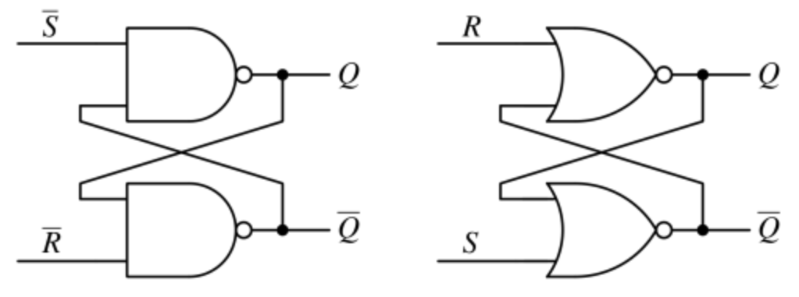
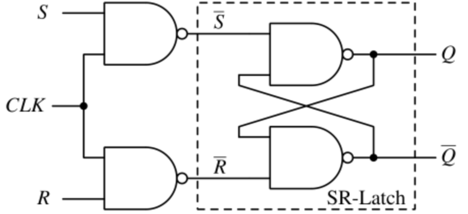
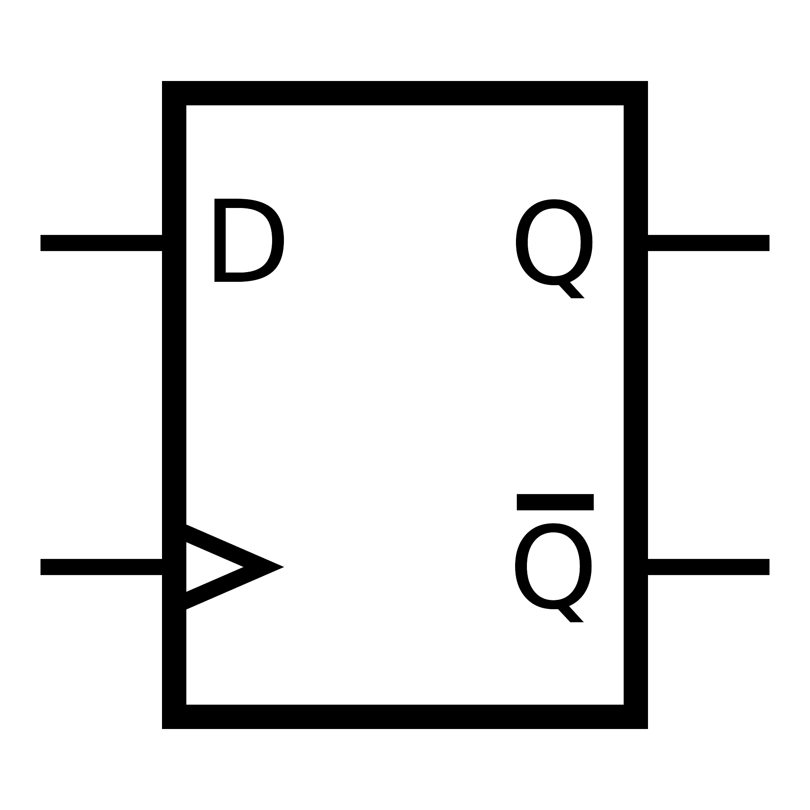
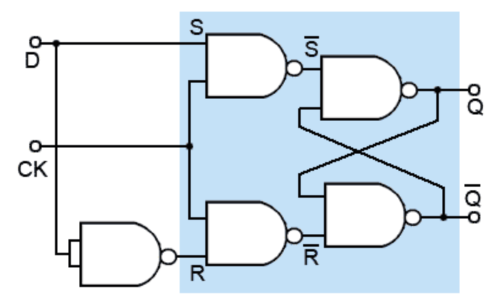
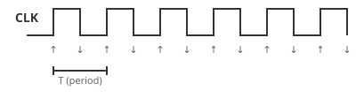
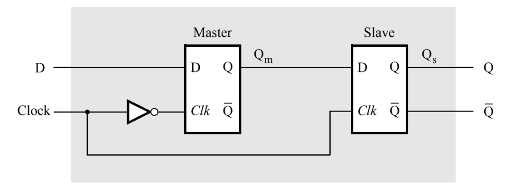
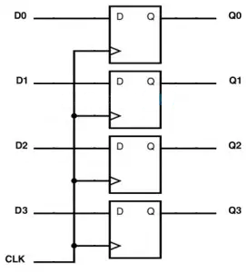

## วัตถุประสงค์

- อธิบายความแตกต่างระหว่างวงจรแบบ combinational และ sequential และหลักการทำงานของ Latch กับ Flip-Flop ได้
- สามารถออกแบบ D Flip-Flop ด้วย VHDL ได้ ทั้งแบบ Master-Slave และแบบ Behavioral (process + rising_edge())
- สามารถออกแบบ Register ขนาด 4 บิตได้

---

## อุปกรณ์ที่ใช้ในการทดลอง

- บอร์ด DE10-Lite จำนวน 1 บอร์ด
- สาย USB Type-A to Mini-B จำนวน 1 เส้น
- คอมพิวเตอร์ จำนวน 1 เครื่อง
- โปรแกรม Quartus Prime Lite Edition
- โปรแกรม USB-Blaster Driver

---

## การทดลองที่ 5.1 RS Latch และ RS Gated Latch

วงจรในใบงานที่ผ่านมา (lab 4) เป็นวงจร **Combinational** คือเอาต์พุตขึ้นอยู่กับอินพุตปัจจุบันเท่านั้น เมื่ออินพุตเปลี่ยน เอาต์พุตเปลี่ยนทันที

วงจร **Sequential** ต่างออกไป เอาต์พุตขึ้นอยู่กับอินพุตปัจจุบัน **และ** สถานะก่อนหน้า (หน่วยความจำ) วงจร Sequential พื้นฐานที่สุดคือ **Latch** ซึ่งเป็นหน่วยความจำขนาด 1 บิต

การทดลองนี้จะไล่ระดับการควบคุมสถานะจากง่ายไปยาก: 
**RS Latch** (ไม่มีตัวควบคุม) → **RS Gated Latch** (ควบคุมด้วยระดับสัญญาณ Enable) — ส่วนการควบคุมด้วยขอบ Clock จะเรียนรู้ในข้อ 5.2

### 5.1.1 RS Latch (หน่วยความจำพื้นฐาน)

RS Latch สร้างจาก **NAND Gate จำนวน 2 ตัวต่อไขว้กัน** (ต่อยอดความรู้ NAND Universal Gate จาก lab 2) — เอาต์พุตของแต่ละตัวป้อนกลับ (feedback) เข้าอินพุตของอีกตัวหนึ่ง ทำให้วงจรจำสถานะก่อนหน้าได้



สัญญาณอินพุตของ NAND Latch เป็นแบบ **Active-Low** ($\bar{S}$, $\bar{R}$):

- $\bar{S} = 0$ (Set) → $Q = 1$
- $\bar{R} = 0$ (Reset) → $Q = 0$
- $\bar{S} = \bar{R} = 1$ → คงค่าเดิม (Hold) — หน่วยความจำทำงาน
- $\bar{S} = \bar{R} = 0$ → **สถานะต้องห้าม** — $Q = \bar{Q} = 1$ พร้อมกัน (ผลลัพธ์ไม่นิยาม เมื่อปล่อยสัญญาณตัวใดตัวหนึ่ง สถานะสุดท้ายขึ้นอยู่กับว่าสัญญาณไหนมาถึงก่อน)

บนบอร์ด DE10-Lite — สวิตช์ **เลื่อนลง = 0** ดังนั้นการเลื่อนสวิตช์ลงคือการสั่ง Set/Reset (Active-Low)

#### ขั้นตอนการทดลอง

1. สร้างโปรเจกต์ใหม่ด้วย Quartus Prime Lite (อ้างอิงขั้นตอนจาก lab 3.1)
2. เขียน VHDL แบบ Structural — ต่อ NAND ไขว้ตามวงจร:

```vhdl
library ieee;
use ieee.std_logic_1164.all;

entity rs_latch is
    port (
        s_n : in  std_logic;  -- Set (active-low: 0 = ทำงาน)
        r_n : in  std_logic;  -- Reset (active-low: 0 = ทำงาน)
        q   : out std_logic;
        q_n : out std_logic
    );
end entity;

architecture Structural of rs_latch is
begin
    -- นักศึกษาเขียน Architecture เอง: ต่อ NAND ไขว้ตามรูปวงจร
end architecture;
```

> Architecture ว่างไว้ให้นักศึกษาเขียนเอง — ต่อ NAND ไขว้ตามรูปวงจร (อย่าลืมประกาศ `signal` สำหรับสายไฟภายใน) แต่ละบรรทัดคือการต่อเกต 1 ตัว

3. **Simulate ด้วย Waveform** — ตรวจสอบความถูกต้องของวงจรก่อนลงบอร์ด:
   - **File → New → University Program VWF** สร้าง Vector Waveform File
   - **Edit → Insert → Insert Node or Bus** → Node Finder → เลือก `s_n`, `r_n` (input) และ `q`, `q_n` (output)
   - ตั้งค่า `s_n`/`r_n` ไล่ตามตารางที่ 5.1 — เริ่มจาก (0,1) → (1,0) → (1,1) → (0,0)
   - **Simulation → Run Functional Simulation**
   - ตรวจสอบว่า `q`/`q_n` ตรงกับตารางที่ 5.1
4. กำหนด Pin Assignment:
   - `s_n` → SW0, `r_n` → SW1
   - `q` → LED0, `q_n` → LED1
5. Compile และ Download ลงบอร์ด
6. ทดลองตามตาราง — ไล่จากแถวแรกไปแถวสุดท้าย แล้วบันทึกผล

#### ตารางที่ 5.1 ผลการทดลอง RS Latch

| $\bar{S}$ (SW0) | $\bar{R}$ (SW1) | $Q$ (LED0) | $\bar{Q}$ (LED1) | สถานะ |
|---|---|---|---|---|
| 0 | 1 | | | |
| 1 | 0 | | | |
| 1 | 1 | | | |
| 0 | 0 | | | |

> **หมายเหตุ:** กรณีต้องห้าม — LED ทั้งสองดวงจะติดพร้อมกัน ($Q = \bar{Q} = 1$) เมื่อปล่อยสวิตช์ตัวใดตัวหนึ่ง สถานะสุดท้ายจะไม่แน่นอน — นี่คือเหตุผลที่ห้ามใช้สถานะนี้

### 5.1.2 RS Gated Latch (เพิ่มสัญญาณ Enable)

RS Latch เปลี่ยนสถานะทันทีที่ S/R เปลี่ยน — แต่ในระบบจริงมักต้องการควบคุมจังหวะการเปลี่ยนสถานะ **RS Gated Latch** เพิ่มสัญญาณ **Enable (E)** เข้ามา:

- E = 1: เปิดใช้งาน — Q เปลี่ยนตาม S/R (เหมือน RS Latch ทั่วไป)
- E = 0: ปิดใช้งาน — Q ล็อกค่าเดิม (หน่วยความจำ)



สร้างจาก **NAND Gate 4 ตัว** (ต่อยอดจากข้อ 5.1.1) — เพิ่ม **Input Stage** (NAND 2 ตัว) ด้านหน้า NAND ไขว้ เพื่อแปลง S/R ให้เป็นสัญญาณ Active-Low:

- $\bar{S} = \overline{S \cdot E}$ — เมื่อ $E = 1$ และ $S = 1$ → $\bar{S} = 0$ (Set)
- $\bar{R} = \overline{R \cdot E}$ — เมื่อ $E = 1$ และ $R = 1$ → $\bar{R} = 0$ (Reset)
- เมื่อ $E = 0$ → $\bar{S} = \bar{R} = 1$ (ล็อกค่าเดิม)

Gated Latch ยังเป็นวงจรแบบ **Level-Sensitive** — Q เปลี่ยนได้ตลอดช่วงที่ E = 1 (ไม่ใช่เฉพาะขอบสัญญาณ)

เขียน VHDL แบบ Structural — ต่อเกตตามวงจร:

```vhdl
library ieee;
use ieee.std_logic_1164.all;

entity rs_gated_latch is
    port (
        e : in  std_logic;  -- Enable (จาก SW2)
        s : in  std_logic;  -- Set (active-high)
        r : in  std_logic;  -- Reset (active-high)
        q : out std_logic
    );
end entity;

architecture Structural of rs_gated_latch is
begin
    -- นักศึกษาเขียน Architecture เอง: Input Stage (s_n, r_n) + NAND ไขว้ ตามรูปวงจร
end architecture;
```

> **Level-Sensitive:** เมื่อ `e = '1'` วงจรทำงานเหมือน RS Latch (ข้อ 5.1.1) — Q เปลี่ยนได้ตลอดช่วงที่ E เป็น 1 ต่างจาก Flip-Flop ที่จะเปลี่ยนเฉพาะขอบ Clock (ดูข้อ 5.2.3)

#### ขั้นตอนการทดลอง

1. สร้างโปรเจกต์ใหม่และเขียน VHDL ข้างต้น
2. **Simulate ด้วย Waveform** — ตรวจสอบความถูกต้องของวงจรก่อนลงบอร์ด:
   - สร้าง Vector Waveform File → เพิ่ม `e`, `s`, `r` (input) และ `q` (output)
   - ตั้งค่า `e` เป็น 1 ช่วงหนึ่ง (เปิดใช้งาน) แล้วเป็น 0 (ปิดใช้งาน) — สลับค่า `s`/`r` ทั้งช่วง
   - Run Functional Simulation — ตรวจสอบว่า `q` เปลี่ยนเฉพาะเมื่อ `e` = 1 และล็อกค่าเดิมเมื่อ `e` = 0
3. กำหนด Pin Assignment:
   - `s` → SW0, `r` → SW1, `e` → SW2, `q` → LED0
4. Compile และ Download ลงบอร์ด
5. เปิด E (SW2 ขึ้น) แล้วสลับ S/R — สังเกต Q เปลี่ยนตาม
6. ปิด E (SW2 ลง) แล้วสลับ S/R — สังเกตว่า Q เปลี่ยนตาม S/R หรือไม่
7. บันทึกผลลงตาราง

#### ตารางที่ 5.2 ผลการทดลอง RS Gated Latch

| $E$ (SW2) | $S$ (SW0) | $R$ (SW1) | $Q$ (LED0) | สถานะ |
|---|---|---|---|---|
| 0 | 0 | 0 | | |
| 0 | 0 | 1 | | |
| 0 | 1 | 0 | | |
| 0 | 1 | 1 | | |
| 1 | 0 | 0 | | |
| 1 | 0 | 1 | | |
| 1 | 1 | 0 | | |
| 1 | 1 | 1 | | |

### คำถามท้ายการทดลองที่ 5.1

1. สถานะต้องห้ามของ RS Latch คือกรณีใด และเกิดอะไรขึ้นกับ $Q$ และ $\bar{Q}$ เมื่อใช้สถานะนี้
2. จากผลการทดลอง — RS Latch (5.1.1) กับ RS Gated Latch (5.1.2) เปลี่ยนสถานะเมื่อใด ต่างกันอย่างไร

---

## การทดลองที่ 5.2 D Flip-Flop

**RS Flip-Flop** มีสถานะต้องห้าม ($S = R = 1$)
**D Flip-Flop** แก้ปัญหานี้โดยผูกอินพุตทั้งสองให้เป็น $D$ และ $\bar{D}$: แทนที่ $S$ ด้วย $D$ และแทนที่ $R$ ด้วย $\bar{D}$ — ทำให้ $S$ กับ $R$ ไม่มีทางเป็น 1 พร้อมกัน ผลลัพธ์: $Q$ ตามค่า $D$

การทดลองนี้ไล่ระดับการสร้าง D Flip-Flop จาก 3 วิธี: 
- **D Gated Latch จาก NAND Gate** (ระดับเกต)
- **Master-Slave** (ต่อ Latch 2 ตัว)
- **Behavioral** (เขียนด้วย process) 

เริ่มจาก Latch ที่เปลี่ยนตามระดับ E แล้วต่อยอดเป็น Flip-Flop ที่เปลี่ยนที่ขอบ Clock



> สัญลักษณ์ D Flip-Flop ทั่วไปมีขา RST (Reset) เพิ่มเติม — ใน lab นี้ยังไม่นำมาใช้

### 5.2.1 D Gated Latch จาก NAND Gate

ต่อยอดจาก lab 2 (NAND Universal Gate) และข้อ 5.1.1 (NAND ไขว้) — สร้าง **D Gated Latch** จาก **NAND Gate 4 ตัว + NOT Gate 1 ตัว** แบ่งเป็น 2 ส่วน:

- **Input Stage** (NAND 2 ตัว + NOT 1 ตัว) — แปลงสัญญาณ $D$ และ $E$ เป็นสัญญาณ Set/Reset แบบ Active-Low:
  - $\bar{S} = \overline{D \cdot E}$ — เมื่อ $E = 1$: $\bar{S} = \bar{D}$ (Set เมื่อ $D = 1$)
  - $\bar{R} = \overline{\bar{D} \cdot E}$ — เมื่อ $E = 1$: $\bar{R} = D$ (Reset เมื่อ $D = 0$)
- **Cross-Coupled Pair** (NAND 2 ตัวต่อไขว้) — เก็บสถานะเหมือนข้อ 5.1.1



เมื่อ $E = 0$: $\bar{S} = \bar{R} = 1$ → ล็อกค่าเดิม (Hold) — เมื่อ $E = 1$: $Q = D$ (วงจรทำงานเหมือน Gated Latch ในข้อ 5.1.2 — ต่างกันที่ D Gated Latch เพิ่ม NOT Gate 1 ตัวสร้าง $\bar{D}$)

เขียน VHDL แบบ Structural — ต่อเกตตามวงจร:

```vhdl
library ieee;
use ieee.std_logic_1164.all;

entity d_gated_latch is
    port (
        e   : in  std_logic;  -- Enable (จาก SW2)
        d   : in  std_logic;  -- ข้อมูลเข้า (จาก SW0)
        q   : out std_logic;
        q_n : out std_logic
    );
end entity;

architecture Structural of d_gated_latch is
begin
    -- นักศึกษาเขียน Architecture เอง: NOT สร้าง d_n + Input Stage (s_n, r_n) + NAND ไขว้ ตามรูปวงจร
end architecture;
```

> Architecture ว่างไว้ให้นักศึกษาเขียนเอง — วงจรคือ NAND 4 ตัว + NOT 1 ตัว: `s_n`/`r_n` คือเอาต์พุตของ Input Stage และ `q_int`/`qn_int` คือ NAND ไขว้ (เหมือนข้อ 5.1.1)

#### ขั้นตอนการทดลอง

1. สร้างโปรเจกต์ใหม่และเขียน VHDL ข้างต้น
2. **Simulate ด้วย Waveform** — ตรวจสอบความถูกต้องของวงจรก่อนลงบอร์ด:
   - สร้าง Vector Waveform File → เพิ่ม `e`, `d` (input) และ `q`, `q_n` (output)
   - ตั้งค่า `e` เป็น 1 ช่วงหนึ่ง (เปิดใช้งาน) แล้วเป็น 0 (ปิดใช้งาน) — สลับค่า `d` ทั้งช่วง
   - Run Functional Simulation — ตรวจสอบว่า `q` = `d` เมื่อ `e` = 1 และ `q` ล็อกค่าเดิมเมื่อ `e` = 0
3. กำหนด Pin Assignment:
   - `d` → SW0, `e` → SW2, `q` → LED0, `q_n` → LED1
4. Compile และ Download ลงบอร์ด
5. เปิด E (SW2 ขึ้น) แล้วสลับ D — สังเกตว่า Q ตาม D
6. ปิด E (SW2 ลง) แล้วสลับ D — สังเกตว่า Q เปลี่ยนตาม D หรือไม่
7. บันทึกผลลงตาราง

#### ตารางที่ 5.3 ผลการทดลอง D Gated Latch

| $E$ (SW2) | $D$ (SW0) | $Q$ (LED0) | สถานะ |
|---|---|---|---|
| 0 | 0 | | |
| 0 | 1 | | |
| 1 | 0 | | |
| 1 | 1 | | |

### 5.2.2 D Flip-Flop แบบ Master-Slave

D Flip-Flop สามารถสร้างได้จาก **D Gated Latch จำนวน 2 ตัว** (จากข้อ 5.2.1) ต่ออนุกรมกัน เรียกว่า **Master-Slave** — เป็นโครงสร้างที่อธิบายกลไก Edge-Triggered ได้ชัดเจนที่สุด

**Latch** และ **Gated Latch** เปลี่ยนสถานะตาม **ระดับ** สัญญาณอินพุต (level-sensitive) — เปลี่ยนได้ตลอดช่วงที่อินพุต/E เป็น 1

**Flip-Flop** เปลี่ยนสถานะเฉพาะที่ **ขอบ** ของสัญญาณ Clock (edge-triggered) — ใช้สัญญาณ Clock เป็นตัวกำหนดจังหวะการเปลี่ยนสถานะ



สัญญาณ Clock มี 2 ขอบต่อ 1 รอบ:

- **Rising Edge (ขอบขึ้น)** — สัญญาณเปลี่ยนจาก 0 → 1
- **Falling Edge (ขอบตก)** — สัญญาณเปลี่ยนจาก 1 → 0

ในการทดลองนี้ใช้ **KEY0** เป็นสัญญาณ Clock:

> **KEY0 เป็นแบบ Active-Low:** กดปุ่ม = 0, ปล่อยปุ่ม = 1 — ดังนั้น **Rising Edge เกิดตอนปล่อยปุ่ม**
>
> **หมายเหตุ:** ปุ่มกดมีอาการกระเด้ง (bounce) — ใน lab นี้ไม่กระทบผลการทดลองเพราะ D คงที่ระหว่างกด แต่ในระบบจริงต้องมีวงจร Debounce



- **Master Latch** — รับสัญญาณ Enable จาก $\overline{CLK}$ (ทำงานเมื่อ CLK = 0)
- **Slave Latch** — รับสัญญาณ Enable จาก CLK (ทำงานเมื่อ CLK = 1)

**การทำงาน:**

1. CLK = 0: Master ตามค่า D (transparent) — Slave ล็อกค่าอยู่
2. **ขอบ Clock ขึ้น (0 → 1):** Master ล็อกค่า D ที่ขอบ — Slave ปล่อย (transparent) → $Q$ ได้ค่า D
3. CLK = 1: Master ล็อกค่าไว้ — Slave ตาม Master ($Q$ = D)
4. ขอบ Clock ตก (1 → 0): Master ปล่อยตาม D อีกครั้ง — Slave ล็อกค่า $Q$ ไว้

ผลลัพธ์ — $Q$ เปลี่ยนเฉพาะที่ขอบ Clock (Edge-Triggered) เช่นเดียวกับ Behavioral ในข้อ 5.2.3

เขียนแบบ Structural — ใช้ `d_gated_latch` จากข้อ 5.2.1 เป็น Component ซ้ำ 2 ครั้ง (Component Reuse ต่อจาก lab 4):

```vhdl
library ieee;
use ieee.std_logic_1164.all;

entity d_flip_flop_ms is
    port (
        clk : in  std_logic;  -- Clock จาก KEY0
        d   : in  std_logic;
        q   : out std_logic
    );
end entity;

architecture Structural of d_flip_flop_ms is
begin
    -- นักศึกษาเขียน Architecture เอง: ใช้ entity work.d_gated_latch ต่อ 2 ตัว
    -- (Master: e => clk_n, Slave: e => clk) + สัญญาณ m, clk_n
end architecture;
```

> โค้ดนี้ใช้ entity `d_gated_latch` จากข้อ 5.2.1 — **อย่าลืมเพิ่มไฟล์ `d_gated_latch.vhd` ในโปรเจกต์** และกำหนด Top-Level Entity เป็น `d_flip_flop_ms` ก่อน Compile

#### ขั้นตอนการทดลอง

1. สร้างโปรเจกต์ใหม่ — คัดลอกไฟล์ `d_gated_latch.vhd` จากข้อ 5.2.1 มาใส่ในโปรเจกต์ แล้วเขียนโค้ดข้างต้น และตั้ง Top-Level Entity เป็น `d_flip_flop_ms`
2. **Simulate ด้วย Waveform** — ตรวจสอบความถูกต้องของวงจรก่อนลงบอร์ด:
   - สร้าง Vector Waveform File → เพิ่ม `clk`, `d` (input) และ `q` (output)
   - ตั้งค่า `clk` เป็นสัญญาณ Clock และสลับค่า `d` ระหว่าง 0 กับ 1
   - Run Functional Simulation — ตรวจสอบว่า `q` = `d` เฉพาะที่ Rising Edge ของ `clk` (ต่างจากข้อ 5.2.1 ที่ Q เปลี่ยนตามระดับ E)
3. กำหนด Pin Assignment: `d` → SW0, `clk` → KEY0, `q` → LED0
4. Compile และ Download ลงบอร์ด
5. ตั้งค่า D (SW0) แล้วปล่อย KEY0 — สังเกตว่า Q = D ที่ขอบ Clock (ต่างจากข้อ 5.2.1 ที่ Q เปลี่ยนทันทีเมื่อ E = 1)
6. ลองเปลี่ยน D ระหว่างที่ยังไม่ปล่อย KEY0 แล้วปล่อย — Q จะได้ค่า D ล่าสุดก่อนขอบ Clock
7. บันทึกผลลงตารางที่ 5.4 — ทดสอบทีละแถว: ตั้งค่า D → กด KEY0 ค้างไว้ (บันทึก Q ก่อนปล่อย) → ปล่อย KEY0 (บันทึก Q หลังปล่อย)

#### ตารางที่ 5.4 ผลการทดลอง D Flip-Flop แบบ Master-Slave

| $D$ (SW0) | $Q$ ก่อนปล่อย KEY0 (LED0) | $Q$ หลังปล่อย KEY0 (LED0) |
|---|---|---|
| 0 | | |
| 1 | | |

> **วิธีบันทึก:** "ก่อนปล่อย KEY0" = Q ขณะกด KEY0 ค้างไว้ (CLK = 0) — ควรคงค่าเดิม (Hold) / "หลังปล่อย KEY0" = Q หลัง Rising Edge — ควรเท่ากับ D

### 5.2.3 D Flip-Flop แบบ Behavioral

การทดลองที่ผ่านมา (5.2.1–5.2.2) สร้าง D Gated Latch และ D Flip-Flop จากเกตและ Component — วิธีที่กระชับที่สุดคือเขียนด้วย `process` และ `rising_edge()`:

```vhdl
library ieee;
use ieee.std_logic_1164.all;

entity d_flip_flop is
    port (
        clk : in  std_logic;  -- Clock จาก KEY0
        d   : in  std_logic;  -- ข้อมูลเข้า
        q   : out std_logic
    );
end entity;

architecture Behavioral of d_flip_flop is
begin
    process(clk)
    begin
        if rising_edge(clk) then
            q <= d;
        end if;
    end process;
end architecture;
```

> **Process** คือการเขียน VHDL แบบบล็อกคำสั่ง — โค้ดภายในทำงานตามเงื่อนไขที่กำหนด (ต่างจาก Concurrent Assignment ใน lab 3–4 ที่ทำงานพร้อมกันตลอดเวลา) คำสั่ง `rising_edge(clk)` บอกให้ทำงานเฉพาะช่วงที่ Clock เปลี่ยนจาก 0 เป็น 1
>
> โค้ด 3 บรรทัดใน `process` ให้ผลลัพธ์เหมือน Master-Slave ในข้อ 5.2.2 — ต่างกันแค่วิธีเขียน (Behavioral กระชับกว่า Structural)

#### ขั้นตอนการทดลอง

1. สร้างโปรเจกต์ใหม่และเขียน VHDL ข้างต้น
2. **Simulate ด้วย Waveform** — ตรวจสอบความถูกต้องของวงจรก่อนลงบอร์ด:
   - สร้าง Vector Waveform File → เพิ่ม `clk`, `d` (input) และ `q` (output)
   - ตั้งค่า `clk` เป็นสัญญาณ Clock (คลิกขวาที่ `clk` → **Clock** → ตั้ง Period) และสลับค่า `d` ระหว่าง 0 กับ 1
   - Run Functional Simulation — ตรวจสอบว่า `q` = `d` ที่ Rising Edge ของ `clk`
3. กำหนด Pin Assignment:
   - `d` → SW0, `clk` → KEY0, `q` → LED0
4. Compile และ Download ลงบอร์ด
5. ตั้งค่า D (SW0) แล้วปล่อย KEY0 — สังเกตว่า Q = D ที่ขอบ Clock
6. ลองเปลี่ยน D ระหว่างที่ยังไม่ปล่อย KEY0 แล้วปล่อย — Q จะได้ค่า D ล่าสุดก่อนขอบ Clock
7. บันทึกผลลงตารางที่ 5.5 — ทดสอบทีละแถว: ตั้งค่า D → กด KEY0 ค้างไว้ (บันทึก Q ก่อนปล่อย) → ปล่อย KEY0 (บันทึก Q หลังปล่อย)

#### ตารางที่ 5.5 ผลการทดลอง D Flip-Flop

| $D$ (SW0) | $Q$ ก่อนปล่อย KEY0 (LED0) | $Q$ หลังปล่อย KEY0 (LED0) |
|---|---|---|
| 0 | | |
| 1 | | |

> **วิธีบันทึก:** "ก่อนปล่อย KEY0" = Q ขณะกด KEY0 ค้างไว้ (CLK = 0) — ควรคงค่าเดิม (Hold) / "หลังปล่อย KEY0" = Q หลัง Rising Edge — ควรเท่ากับ D

### คำถามท้ายการทดลองที่ 5.2

1. เพราะเหตุใด D Flip-Flop จึงไม่มีสถานะต้องห้าม (ต่างจาก RS Flip-Flop อย่างไร)
2. D Gated Latch (ข้อ 5.2.1) กับ D Flip-Flop (ข้อ 5.2.2 และ 5.2.3) เปลี่ยนสถานะเมื่อใด ต่างกันอย่างไร
3. Master-Slave D Flip-Flop เปลี่ยนสถานะ $Q$ ที่ขอบใดของ Clock และเพราะเหตุใด

---

## การทดลองที่ 5.3 Register ขนาด 4 บิต

**Register** คือกลุ่มของ D Flip-Flop ที่แชร์สัญญาณ Clock ตัวเดียวกัน — จัดเก็บข้อมูลหลายบิตพร้อมกัน ใน lab นี้สร้าง Register 4 บิตจาก D Flip-Flop 4 ตัว (เขียนรวมกันด้วย `std_logic_vector` ตาม lab 3)



กำหนดให้

- SW3–SW0 เป็นข้อมูลเข้า D
- KEY0 เป็น Clock
- LED3–LED0 เป็นข้อมูลออก Q

```vhdl
library ieee;
use ieee.std_logic_1164.all;

entity register_4bit is
    port (
        clk : in  std_logic;                     -- Clock จาก KEY0
        d   : in  std_logic_vector(3 downto 0);  -- ข้อมูลเข้า 4 บิต
        q   : out std_logic_vector(3 downto 0)   -- ข้อมูลออก 4 บิต
    );
end entity;

architecture Behavioral of register_4bit is
begin
    process(clk)
    begin
        if rising_edge(clk) then
            q <= d;  -- บันทึกข้อมูลที่ขอบ Clock
        end if;
    end process;
end architecture;
```

#### ขั้นตอนการทดลอง

1. สร้างโปรเจกต์ใหม่และเขียน VHDL ข้างต้น
2. **Simulate ด้วย Waveform** — ตรวจสอบความถูกต้องของวงจรก่อนลงบอร์ด:
   - สร้าง Vector Waveform File → เพิ่ม `clk`, `d[3:0]` (input) และ `q[3:0]` (output)
   - ตั้งค่า `clk` เป็นสัญญาณ Clock และตั้งค่า `d` ไล่ `0000` → `0101` → `1010` → `1111`
   - Run Functional Simulation — ตรวจสอบว่า `q` = `d` ที่ Rising Edge
3. กำหนด Pin Assignment:
   - `d(0)` → SW0, `d(1)` → SW1, `d(2)` → SW2, `d(3)` → SW3
   - `clk` → KEY0
   - `q(0)` → LED0, `q(1)` → LED1, `q(2)` → LED2, `q(3)` → LED3
4. Compile และ Download ลงบอร์ด
5. ตั้งค่า D ด้วย SW3–SW0 แล้วปล่อย KEY0 — สังเกตว่า LED3–LED0 = D
6. เปลี่ยนค่า D แล้ว **ไม่ปล่อย KEY0** — LED ไม่เปลี่ยน (ข้อมูลยังไม่ถูกบันทึก)
7. บันทึกผลลงตารางที่ 5.6 — ทดสอบทีละแถว: ตั้งค่า D → กด KEY0 ค้างไว้ (บันทึก Q ก่อนปล่อย) → ปล่อย KEY0 (บันทึก Q หลังปล่อย)

#### ตารางที่ 5.6 ผลการทดลอง Register 4 บิต

| $D$ (SW3–SW0) | $Q$ ก่อนปล่อย KEY0 (LED3–LED0) | $Q$ หลังปล่อย KEY0 (LED3–LED0) |
|---|---|---|
| 0000 | | |
| 0101 | | |
| 1010 | | |
| 1111 | | |

> **วิธีบันทึก:** "ก่อนปล่อย KEY0" = Q ขณะกด KEY0 ค้างไว้ (CLK = 0) — ควรคงค่าเดิม (Hold) / "หลังปล่อย KEY0" = Q หลัง Rising Edge — ควรเท่ากับ D

### คำถามท้ายการทดลองที่ 5.3

1. Register แตกต่างจาก D Flip-Flop อย่างไร
2. หากเพิ่มขนาด Register เป็น 8 บิต ต้องแก้ไขส่วนใดของโปรแกรม

---

## สรุปผลการทดลอง

อธิบายผลการทดลอง พร้อมวิเคราะห์ความถูกต้องของผลลัพธ์ และอธิบายสาเหตุของข้อผิดพลาด (ถ้ามี)

## คำถามท้ายใบงาน

1. เพราะเหตุใดวงจร Sequential จึงต้องใช้ Clock
2. Process แตกต่างจาก Concurrent Assignment อย่างไร
3. หากต้องการสร้าง Counter จะต้องอาศัยองค์ประกอบใดจากการทดลองนี้
