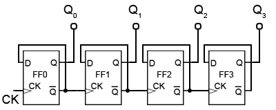
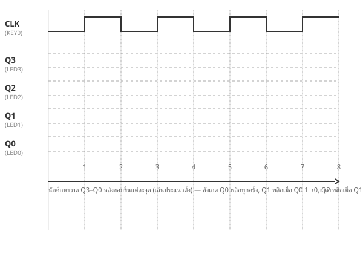
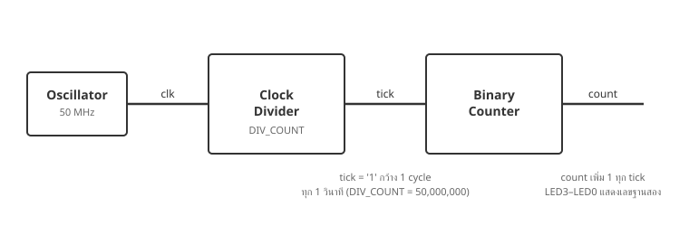
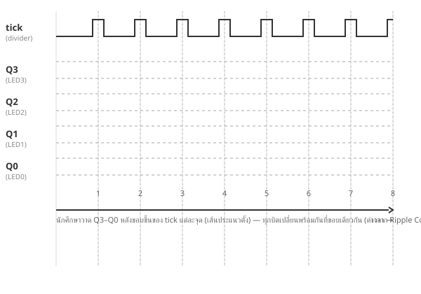
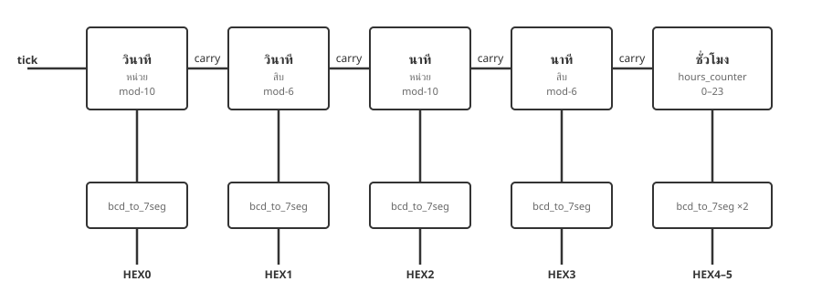
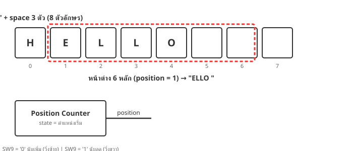
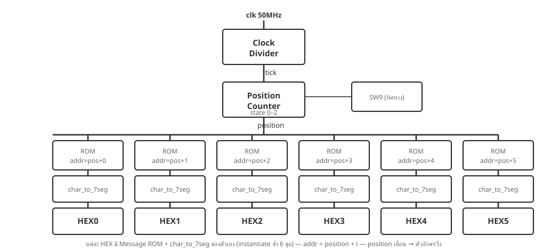

# ใบงานการทดลองที่ 6: การออกแบบวงจร Counter และนาฬิกา

---

## วัตถุประสงค์

- อธิบายหลักการต่อ D Flip-Flop เป็นวงจร Counter และหลักการทำงานของ Clock Divider กับ Mod-N Counter ได้
- สามารถเขียน VHDL สร้าง Counter พร้อม GENERIC และแสดงผลการนับบน Seven-Segment Display ได้
- บูรณาการวงจร Counter สร้าง Real-Time Clock และ Stopwatch ควบคุมด้วยปุ่มกดได้
- ประยุกต์ใช้ Counter เป็น State Position เพื่อสร้าง Scrolling Message Display และปูทางสู่ Finite State Machine ได้

---

## อุปกรณ์ที่ใช้ในการทดลอง

- บอร์ด DE10-Lite จำนวน 1 บอร์ด
- สาย USB Type-A to Mini-B จำนวน 1 เส้น
- คอมพิวเตอร์ จำนวน 1 เครื่อง
- โปรแกรม Quartus Prime Lite Edition
- โปรแกรม USB-Blaster Driver

---

## การทดลองที่ 6.1 Binary Counter และ Clock Divider

ในใบงานที่ 5 นักศึกษาสร้าง D Flip-Flop และ Register 4 บิตมาแล้ว — วงจร **Counter** คือก้าวต่อไป: นำ Flip-Flop ที่มีอยู่ **มาต่อกัน** จนเกิดพฤติกรรมการนับเอง โดยไม่ต้องเขียนโค้ดนับเลยแม้แต่บรรทัดเดียว เมื่อเข้าใจหลักการแล้ว จึงย้ายไปใช้ Clock จริง 50 MHz ของบอร์ดผ่านวงจร **Clock Divider**

### 6.1.1 Ripple Counter จาก D Flip-Flop

Counter ที่ง่ายที่สุดสร้างได้จาก D Flip-Flop ล้วน ๆ ด้วยเทคนิค 2 ข้อ:

> **Toggle Trick:** ต่อ $\overline{Q}$ กลับเข้า D ของ Flip-Flop ตัวเอง — ทุกขอบขาขึ้นของ clock ค่า Q จะสลับ 0↔1 ไปเรื่อย ๆ (เพราะ D รับ "ค่าตรงข้ามของปัจจุบัน" ไว้ล่วงหน้า)
>
> **Cascade:** FF ขั้นถัดไปใช้ $\overline{Q}$ ของขั้นก่อนหน้าเป็น clock — $\overline{Q}$ จะขาขึ้นเมื่อ Q ของขั้นก่อนหน้า 1→0 ซึ่งตรงกับจังหวะที่เลขฐานสอง "ทด" พอดี



> ทุกตัว: D ต่อกับ $\overline{Q}$ ของตัวเอง — ขั้นถัดไปใช้ $\overline{Q}$ ของขั้นก่อนหน้าเป็น clock

> **ทำไมจึงนับเป็นเลขฐานสอง:** ลองไล่ 0011 (3) → 0100 (4) — Q0 พลิก 1→0 → Q̄0 ขาขึ้น → FF1 พลิก 1→0 → Q̄1 ขาขึ้น → FF2 พลิก 0→1 — ผลคือ 0100 พอดี สัญญาณ "ไหลทด" ต่อกันเป็นทอด ๆ วงจรนี้จึงเรียกว่า **Ripple Counter**

Top-Level เป็นวงจร Structural — **นักศึกษาเขียนส่วน Architecture เอง** (Entity ให้ครบแล้ว):

```vhdl
library ieee;
use ieee.std_logic_1164.all;

entity ripple_counter_top is
    port (
        clk : in  std_logic;                    -- Clock จาก KEY0 (กดเอง)
        led : out std_logic_vector(3 downto 0)  -- LED3–LED0 แสดงค่า count
    );
end entity;

architecture Structural of ripple_counter_top is

    component d_flip_flop is
        port (
            clk : in  std_logic;
            d   : in  std_logic;
            q   : out std_logic
        );
    end component;

    signal q  : std_logic_vector(3 downto 0);
    signal qb : std_logic_vector(3 downto 0);
begin

    -- (1) สร้างสัญญาณกลับด้าน: qb(i) <= not q(i) ทั้ง 4 ขั้น

    -- (2) U0: d_flip_flop — clk => clk, d => qb(0)

    -- (3) U1–U3: d_flip_flop — clk => qb ของขั้นก่อนหน้า, d => qb ของตัวเอง

    -- (4) ส่ง q ออกทาง led

end architecture;
```

#### ขั้นตอนการทดลอง

1. สร้างโปรเจกต์ใหม่ชื่อ `lab6_step1` (Top-Level Entity ชื่อ `ripple_counter_top`) — คัดลอกไฟล์ `d_flip_flop.vhd` จากโปรเจกต์ใบงานที่ 5 มาเพิ่มเข้าโปรเจกต์ (**Project → Add/Remove Files in Project**) — **ไม่ต้องแก้ไขไฟล์**

2. สร้างไฟล์ `ripple_counter_top.vhd` — คัดลอก Entity ตามตัวอย่าง แล้วเขียน Architecture เองตามคำใบ้ (1)–(4)

3. กำหนด Pin Assignment:
    - `clk` → KEY0
    - `led(3)`–`led(0)` → LED3–LED0 (ดูตาราง Pin Assignment จากคู่มือบอร์ด)

4. **Compile** (**Processing → Start Compilation**) → **Program** ลงบอร์ดด้วย USB-Blaster

5. กด KEY0 **ช้า ๆ ทีละครั้ง** — สังเกต LED3–LED0 นับเพิ่มทีละ 1 แบบเลขฐานสอง วนจาก 0–15 ไม่สิ้นสุด — บันทึกผลโดยวาด $Q_3$–$Q_0$ ลงใน Timing Diagram ที่ 6.1

#### Timing Diagram ที่ 6.1 ผลการทดลอง Ripple Counter



> **วิธีบันทึก:** สัญญาณ CLK (KEY0) วาดไว้ให้เรียบร้อยแล้ว — นักศึกษาวาด $Q_3$–$Q_0$ (LED3–LED0) ทีละบิตในแถวว่าง หลังขอบขึ้นแต่ละจุด (เส้นประแนวตั้ง) — สังเกตว่า $Q_0$ พลิกทุกครั้งที่กด, $Q_1$ พลิกเมื่อ $Q_0$ เปลี่ยน 1→0, $Q_2$ พลิกเมื่อ $Q_1$ เปลี่ยน 1→0, $Q_3$ พลิกเมื่อ $Q_2$ เปลี่ยน 1→0 — สัญญาณ "ไหลทด" ต่อกันเป็นทอด ๆ (Ripple)

> ค่าเริ่มต้นหลัง Program อาจไม่ใช่ 0000 (Flip-Flop ในวงจรนี้ไม่ได้กำหนดค่าเริ่ม) — ให้เริ่มวาดจากค่าที่เห็นแรก แล้วนับจำนวนครั้งที่กดเพิ่มจากจุดนั้น

> **ข้อจำกัดของ Ripple Counter:** สัญญาณ "ไหลทด" ผ่านทีละขั้น — แต่ละขั้นจึงเปลี่ยนค่าช้ากว่าขั้นก่อนเล็กน้อย (delay สะสม) ขณะทดหลายขั้นติดกัน (เช่น 0111 → 1000) ค่าที่อ่านได้อาจพลาดชั่วขณะ วงจร Counter จริงจึงนิยมให้ทุกขั้นใช้ clock เดียวกัน — ซึ่งข้อ 6.1.3 จะเขียนแบบ Behavioral ที่ทุกบิตเปลี่ยนพร้อมกัน

### 6.1.2 Clock Divider

ในข้อ 6.1.1 นักศึกษาต้องกด KEY0 เองทุกครั้งที่นับ — แต่ระบบจริง เช่น นาฬิกา ต้องการจังหวะเวลาที่ **แม่นยำและอัตโนมัติ** บอร์ด DE10-Lite จึงมี **Oscillator 50 MHz** ติดตั้งบนบอร์ด ส่งสัญญาณ Clock เข้า FPGA ตลอดเวลาผ่านขา `MAX10_CLK1_50` (PIN_P11) — นั่นคือ Clock กระพริบ **50,000,000 ครั้งต่อวินาที**

ปัญหาคือ 50 MHz **เร็วเกินกว่าตามมนุษย์จะมองทัน** — ถ้านำไปต่อ LED ตรง ๆ จะเห็นเป็นแสงหรี่คงที่ วิธีแก้คือสร้าง **Clock Divider** — วงจรนับจำนวน clock cycle แล้วส่งสัญญาณอนุญาต (**tick**) ขึ้น 1 ครั้งเมื่อครบกำหนด:

> **Clock Divider:** นับ clock cycle จาก 0 ถึง `DIV_COUNT - 1` แล้ววนกลับ 0 — พร้อมส่ง tick = '1' กว้าง 1 clock cycle ในจังหวะที่วนกลับ
>
> ต้องการ tick ทุก 1 วินาที → `DIV_COUNT = 50,000,000` (50 MHz ÷ 50,000,000 = 1 Hz)



จำนวนที่นับใหญ่มาก (หลักล้าน) — การเขียนโค้ดจึงใช้ **GENERIC** ซึ่งเป็นพารามิเตอร์ของ Entity ทำให้แก้ค่าได้โดยไม่ต้องแก้ตัววงจร และตอน Simulate สามารถตั้งค่าเล็ก ๆ (เช่น 4) เพื่อให้ทดสอบได้เร็ว แล้วคืนค่าจริงตอนลงบอร์ด

#### ขั้นตอนการทดลอง

1. สร้างไฟล์ `clock_divider.vhd` (**File → New → VHDL File**) ในโปรเจกต์ `lab6_step1` — เขียนโค้ดต่อไปนี้:

    ```vhdl
    library ieee;
    use ieee.std_logic_1164.all;

    entity clock_divider is
        generic (
            DIV_COUNT : integer := 50000000   -- 50 MHz / 50,000,000 = tick ทุก 1 วินาที
        );
        port (
            clk  : in  std_logic;             -- Clock 50 MHz จาก oscillator บนบอร์ด
            tick : out std_logic              -- '1' กว้าง 1 clock cycle ทุก 1 วินาที
        );
    end entity;

    architecture Behavioral of clock_divider is
        signal count : integer range 0 to DIV_COUNT - 1 := 0;
    begin
        process(clk)
        begin
            if rising_edge(clk) then
                if count = DIV_COUNT - 1 then
                    count <= 0;
                    tick  <= '1';              -- ขึ้น 1 เพียง 1 cycle แล้ววนกลับ
                else
                    count <= count + 1;
                    tick  <= '0';
                end if;
            end if;
        end process;
    end architecture;
    ```

    > **GENERIC** คือพารามิเตอร์ที่ประกาศใน Entity — ต่างจาก Port ตรงที่ GENERIC ส่ง **ค่าคงที่** เข้าวงจรตอน Compile ไม่ใช่สัญญาณระหว่างทำงาน ทำให้โค้ดชุดเดียวใช้ได้หลายค่า

2. **Simulate ด้วย Waveform** — ตรวจสอบก่อนลงบอร์ด:
    - แก้ default ของ GENERIC เป็น `DIV_COUNT : integer := 4` **ชั่วคราว** (เพื่อให้เห็น tick ได้ในเวลาอันสั้น)
    - **File → New → University Program VWF** → Insert Node `clk`, `tick`
    - ตั้ง period ของ `clk` = 10 ns, End Time = 1 µs
    - **Simulation → Run Functional Simulation**
    - ตรวจสอบ: `tick` ขึ้น '1' กว้าง 1 cycle ทุก 4 cycle ของ clk (ทุก 40 ns)
    - **คืนค่า** `DIV_COUNT := 50000000` ก่อนขั้นตอนถัดไป

### 6.1.3 Binary Counter แบบ Behavioral

Ripple Counter ในข้อ 6.1.1 ต่อง่ายแต่มีข้อจำกัดเรื่อง delay สะสม — การเขียน Counter แบบ **Behavioral** ใช้ process เดียวกับ D Flip-Flop ในใบงานที่ 5 แต่เปลี่ยนจากรับค่า d เข้ามา เป็น **บวกค่าเพิ่มในตัวเอง** (`count + 1`) — ทุกบิตเปลี่ยนพร้อมขอบ clock เดียวกัน

#### ขั้นตอนการทดลอง

1. สร้างไฟล์ `counter_top.vhd` — วงจรหลักที่ประกอบ Clock Divider กับ Binary Counter:

    ```vhdl
    library ieee;
    use ieee.std_logic_1164.all;
    use ieee.numeric_std.all;

    entity counter_top is
        port (
            clk : in  std_logic;                    -- Clock 50 MHz จาก oscillator บนบอร์ด
            led : out std_logic_vector(3 downto 0)  -- LED3–LED0 แสดงค่า counter
        );
    end entity;

    architecture Behavioral of counter_top is
        component clock_divider is
            generic (DIV_COUNT : integer := 50000000);
            port (
                clk  : in  std_logic;
                tick : out std_logic
            );
        end component;

        signal tick  : std_logic := '0';
        signal count : unsigned(3 downto 0) := (others => '0');
    begin

        U_DIV: clock_divider
            generic map (DIV_COUNT => 50000000)
            port map (clk => clk, tick => tick);

        -- Binary Counter: นับเพิ่ม 1 ทุกครั้งที่ tick = '1'
        process(clk)
        begin
            if rising_edge(clk) then
                if tick = '1' then
                    count <= count + 1;
                end if;
            end if;
        end process;

        led <= std_logic_vector(count);

    end architecture;
    ```

    > **unsigned** คือ std_logic_vector ที่ทำ operation ทางคณิตศาสตร์ได้ (`count + 1`) — แปลงกลับด้วย `std_logic_vector(...)` ก่อนส่งออกนอกวงจร

2. ตั้ง `counter_top.vhd` เป็น Top-Level Entity (**Project → Set as Top-Level Entity**) — Simulate รวมทั้งวงจร (แก้ `DIV_COUNT := 4` ชั่วคราวทั้ง 2 จุด) ตรวจสอบว่า `count` เพิ่มขึ้น 1 ทุกครั้งที่ `tick` ขึ้น — แล้วคืนค่า 50000000

3. กำหนด Pin Assignment:
    - `clk` → PIN_P11 (`MAX10_CLK1_50`)
    - `led(3)`–`led(0)` → LED3–LED0 (ดูตาราง Pin Assignment จากคู่มือบอร์ด)

4. **Compile** (**Processing → Start Compilation**) → **Program** ลงบอร์ดด้วย USB-Blaster

5. สังเกตผลบนบอร์ด:
    - LED0 กระพริบ 1 ครั้งต่อ 2 วินาที (ขึ้น 1 วินาที ดับ 1 วินาที)
    - LED3–LED0 แสดงเลขฐานสอง นับเพิ่มวินาทีละ 1 ค่า วนจาก 0–15 ไม่สิ้นสุด
    - บันทึกผลโดยวาด $Q_3$–$Q_0$ ลงใน Timing Diagram ที่ 6.2

> **หมายเหตุ:** สังเกตว่าเรา **นำ tick ไป trigger counter แทนที่จะต่อเข้า LED โดยตรง** — เพราะ tick กว้างเพียง 1 clock cycle = 20 นาโนวินาที ตามมนุษย์มองไม่เห็น แต่ FPGA มองเห็นเสมอ

#### Timing Diagram ที่ 6.2 ผลการทดลอง Binary Counter



> **วิธีบันทึก:** สัญญาณ `tick` (จาก Clock Divider) วาดไว้ให้เรียบร้อยแล้ว — นักศึกษาวาด $Q_3$–$Q_0$ (LED3–LED0) ทีละบิตในแถวว่าง หลังขอบขึ้นของ `tick` แต่ละจุด (เส้นประแนวตั้ง) — สังเกตว่าทุกบิตเปลี่ยน **พร้อมกัน** ที่ขอบเดียวกัน (ต่างจาก Ripple Counter ในข้อ 6.1.1 ที่สัญญาณไหลเป็นทอด ๆ) และ $Q_0$ กระพริบ 1 ครั้งต่อ 2 วินาที

### คำถามท้ายการทดลองที่ 6.1

1. ใน Ripple Counter เพราะเหตุใด FF ขั้นถัดไปจึงใช้ $\overline{Q}$ ของขั้นก่อนหน้าเป็น clock — ถ้าเปลี่ยนไปใช้ Q แทน วงจรจะนับเพิ่มหรือนับลด เพราะเหตุใด

---

## การทดลองที่ 6.2 Real-Time Clock และ Stopwatch

การทดลองสุดท้าย — บูรณาการทุกอย่างเป็น **Real-Time Clock** แสดงเวลา HH:MM:SS ครบ 6 หลักบน HEX5–HEX0 จากนั้นเพิ่มปุ่ม Start/Stop/Reset ให้ทำหน้าที่ **Stopwatch** ได้ด้วย

โครงสร้าง Enable Chain ต่อยอดจากข้อ 6.2.1:



### 6.2.1 Real-Time Clock (HH:MM:SS)

นาฬิกาจริงแสดงเวลา HH:MM:SS — วินาทีและนาทีเป็น **Mod-60** (หลักหน่วย Mod-10 + หลักสิบ Mod-6) ต่อกันแบบ Enable Chain ส่วนชั่วโมงนับ 0–23 ซึ่งไม่แบ่งหลักเท่า ๆ กัน จึงต้องมีโมดูลเฉพาะ

ก่อนอื่นสร้าง **Mod-N Counter แบบ GENERIC** ไฟล์เดียว แล้วนำมา instantiate ซ้ำด้วยค่า MOD_VALUE ต่างกัน:

```vhdl
library ieee;
use ieee.std_logic_1164.all;
use ieee.numeric_std.all;

entity mod_counter is
    generic (
        MOD_VALUE : integer := 10         -- นับ 0 ถึง MOD_VALUE - 1 แล้ววนกลับ
    );
    port (
        clk   : in  std_logic;            -- Clock 50 MHz จาก oscillator บนบอร์ด
        en    : in  std_logic;            -- อนุญาตให้นับ (tick จาก divider)
        count : out std_logic_vector(3 downto 0);  -- ค่าปัจจุบัน (BCD 1 หลัก)
        carry : out std_logic             -- pulse 1 cycle เมื่อวนจาก MAX กลับ 0
    );
end entity;

architecture Behavioral of mod_counter is
    signal cnt  : unsigned(3 downto 0) := (others => '0');
    signal wrap : std_logic := '0';
begin
    process(clk)
    begin
        if rising_edge(clk) then
            wrap <= '0';                   -- default: ไม่มี carry ทุก cycle
            if en = '1' then
                if cnt = MOD_VALUE - 1 then
                    cnt  <= (others => '0');
                    wrap <= '1';           -- วนกลับ → ส่ง carry
                else
                    cnt <= cnt + 1;
                end if;
            end if;
        end if;
    end process;

    count <= std_logic_vector(cnt);
    carry <= wrap;
end architecture;
```

> **จับ Timing ของ carry ให้ดี:** ใน cycle ที่ en = '1' และ cnt อยู่ที่ค่า MAX — ขอบขาขึ้นถัดไป cnt จะกลับ 0 พร้อม wrap ขึ้น 1 ไป 1 cycle — หลักถัดไปซึ่งใช้ carry เป็น enable จะเพิ่มค่าใน cycle ถัดมาทันที (ช้ากว่าเพียง 20 ns — มองไม่ทัน)

> **Simulate `mod_counter` แยกก่อน:** ตั้ง Top-Level เป็น `mod_counter.vhd` ชั่วคราว, Insert Node `clk`, `en`, `count`, `carry` — ตั้ง `en` = '1' ตลอด, period ของ `clk` = 10 ns, End Time = 1 µs — ตรวจสอบว่า `count` ไล่ 0→9 แล้ววนกลับ 0 พร้อม `carry` ขึ้น 1 cycle พอดี แล้วตั้ง Top-Level กลับ

> **Enable Chain:** หลักหน่วยรับ enable จาก tick — เมื่อหลักหน่วยวนจาก 9 กลับ 0 จะส่ง carry ไปเป็น enable ของหลักสิบ — หลักสิบจึงเพิ่ม 1 ครั้ง ต่อการวน 1 รอบของหลักหน่วย พอดี

ส่วนชั่วโมงนับ 0–23 ซึ่งไม่แบ่งหลักเท่า ๆ กัน จึงต้องมีโมดูลเฉพาะ — นับค่าเดียว 0–23 แล้วแยกเป็น 2 หลัก BCD ภายหลัง:

```vhdl
library ieee;
use ieee.std_logic_1164.all;
use ieee.numeric_std.all;

entity hours_counter is
    port (
        clk   : in  std_logic;                      -- Clock 50 MHz จาก oscillator บนบอร์ด
        en    : in  std_logic;                      -- enable จาก carry ของนาทีสิบ
        tens  : out std_logic_vector(3 downto 0);   -- หลักสิบของชั่วโมง (0–2)
        units : out std_logic_vector(3 downto 0)    -- หลักหน่วยของชั่วโมง (0–9)
    );
end entity;

architecture Behavioral of hours_counter is
    signal hour : unsigned(4 downto 0) := (others => '0');   -- ค่า 0–23
    signal t    : std_logic_vector(3 downto 0);
    signal u    : std_logic_vector(3 downto 0);
begin
    process(clk)
    begin
        if rising_edge(clk) then
            if en = '1' then
                if hour = 23 then
                    hour <= (others => '0');        -- 23 → 00 วนใหม่
                else
                    hour <= hour + 1;
                end if;
            end if;
        end if;
    end process;

    -- แยกค่า 0–23 เป็นสองหลัก BCD
    process(hour)
    begin
        if hour < 10 then
            t <= "0000";
            u <= std_logic_vector(hour(3 downto 0));
        elsif hour < 20 then
            t <= "0001";
            u <= std_logic_vector((hour - 10)(3 downto 0));
        else                                        -- 20–23
            t <= "0010";
            u <= std_logic_vector((hour - 20)(3 downto 0));
        end if;
    end process;

    tens  <= t;
    units <= u;
end architecture;
```

> **ทำไมต้อง slice `(3 downto 0)`:** `hour` ประกาศเป็น `unsigned(4 downto 0)` (5 บิต) เพราะต้องเก็บค่าได้ถึง 23 — แต่ `u` เป็น `std_logic_vector(3 downto 0)` (4 บิต) ถ้าแปลงทั้ง 5 บิตตรง ๆ จะ width mismatch (compile error) จึงต้องตัดเฉพาะ 4 บิตล่าง `hour(3 downto 0)` ซึ่งเป็นค่าหลักหน่วยพอดี (ค่า 0–9, 0–9, 0–3 ล้วนอยู่ใน 4 บิต)

> **ทำไมไม่มีขา Reset:** ทุก signal ในใบงานนี้กำหนดค่าเริ่มต้นด้วย `:=` ตอนประกาศ — FPGA จะตั้งค่า register เหล่านี้เป็น 0 อัตโนมัติตอน Program นาฬิกาจึงเริ่มที่ 00:00:00 เสมอโดยไม่ต้องมีวงจร Reset

Top-Level `rtc_top` เป็นวงจร Structural ขนาดใหญ่ — **นักศึกษาเขียนส่วน Architecture เอง** ตามคำใบ้ 9 ข้อ (Entity ให้ครบแล้ว):

```vhdl
library ieee;
use ieee.std_logic_1164.all;

entity rtc_top is
    port (
        clk  : in  std_logic;                      -- Clock 50 MHz จาก oscillator บนบอร์ด
        hex5 : out std_logic_vector(7 downto 0);   -- ชั่วโมงสิบ
        hex4 : out std_logic_vector(7 downto 0);   -- ชั่วโมงหน่วย
        hex3 : out std_logic_vector(7 downto 0);   -- นาทีสิบ
        hex2 : out std_logic_vector(7 downto 0);   -- นาทีหน่วย
        hex1 : out std_logic_vector(7 downto 0);   -- วินาทีสิบ
        hex0 : out std_logic_vector(7 downto 0)    -- วินาทีหน่วย
    );
end entity;

architecture Structural of rtc_top is

    -- (1) ประกาศ Component ทั้ง 4 ตัว: clock_divider, mod_counter,
    --     hours_counter, bcd_to_7seg — คัดลอกจากไฟล์ .vhd ของแต่ละโมดูล

    -- (2) ประกาศ Signal:
    --     tick                          : std_logic
    --     carry 4 เส้น (sec_u, sec_t, min_u, min_t) : std_logic
    --     ค่าหลัก 6 หลัก                : std_logic_vector(3 downto 0)

begin

    -- (3) U_DIV: clock_divider → tick ทุก 1 วินาที

    -- (4) วินาที: U_SEC_U (MOD_VALUE => 10, en => tick)
    --             U_SEC_T (MOD_VALUE => 6,  en => carry ของ U_SEC_U)

    -- (5) นาที: U_MIN_U (MOD_VALUE => 10, en => carry ของ U_SEC_T)
    --           U_MIN_T (MOD_VALUE => 6,  en => carry ของ U_MIN_U)

    -- (6) ชั่วโมง: U_HOUR (hours_counter, en => carry ของ U_MIN_T)

    -- (7) Decoder ×6: bcd_to_7seg → hex5 … hex0
    --     hex5/hex4 จากชั่วโมง, hex3/hex2 จากนาที, hex1/hex0 จากวินาที

end architecture;
```

#### ขั้นตอนการทดลอง

1. สร้างโปรเจกต์ใหม่ชื่อ `lab6_rtc` (Top-Level Entity ชื่อ `rtc_top`)

2. สร้างไฟล์ `mod_counter.vhd` ตามโค้ดด้านบน แล้ว **Simulate แยก** ตรวจสอบ `carry` (ตาม note ด้านบน) — จากนั้นคัดลอกไฟล์ `clock_divider.vhd` (จากข้อ 6.1.2) และ `bcd_to_7seg.vhd` (จากใบงานที่ 4) มาเพิ่มเข้าโปรเจกต์ (**Project → Add/Remove Files in Project**) — **ไม่ต้องแก้ไขไฟล์**

3. สร้างไฟล์ `hours_counter.vhd` ตามโค้ดด้านบน

4. สร้างไฟล์ `rtc_top.vhd` — คัดลอก Entity ตามตัวอย่าง แล้วเขียน Architecture เองตามคำใบ้ (1)–(7)

5. **Compile** — แก้ Error จนผ่าน (Error ที่พบบ่อย: ลืมประกาศ Component, ต่อ enable ผิดสาย, ลืม generic map)

6. กำหนด Pin Assignment:
    - `clk` → PIN_P11 (`MAX10_CLK1_50`)
    - `hex5(7:0)` … `hex0(7:0)` → ขา HEX5–HEX0 (ดูตาราง Pin Assignment จากคู่มือบอร์ด)

7. **Compile** → **Program** ลงบอร์ด — ตรวจสอบ:
    - หลัง Program แสดง 00:00:00 แล้ววินาทีเดินเพิ่มวินาทีละ 1
    - จับจังหวะวินาทีวน 59 → 00 แล้วนาทีเพิ่ม 1 พอดี
    - จับจังหวะนาทีวน 59:59 → 00 แล้วชั่วโมงเพิ่ม 1 พอดี

8. **ทดสอบวนชั่วโมงด้วยโหมดเร่งเวลา** — รอจริง 24 ชั่วโมงไม่ไหว:
    - แก้ `DIV_COUNT := 25` ชั่วคราว (นาฬิกาเร็วขึ้น 2,000,000 เท่า — ครบ 24 ชั่วโมงในเสี้ยววินาที)
    - Compile → Program → สังเกตตัวเลขวนเร็ว ตรวจว่า 23:59:59 → 00:00:00 ถูกต้อง
    - **คืนค่า** `DIV_COUNT := 50000000` แล้ว Compile → Program ใหม่

9. บันทึกผลลงตารางที่ 6.3 (checklist) และถ่ายรูปผลจากบอร์ด

#### ตารางที่ 6.3 ผลการทดลอง Real-Time Clock

| รายการตรวจสอบ                                              | ผล (✓/✗) |
| ---------------------------------------------------------- | -------- |
| หลัง Program แสดง 00:00:00 แล้ววินาทีเดินเพิ่มทีละ 1        |          |
| วินาทีครบ 59 → 00 แล้วนาทีเพิ่ม 1 พอดี                      |          |
| นาทีครบ 59:59 → 00 แล้วชั่วโมงเพิ่ม 1 พอดี                  |          |
| (โหมดเร่งเวลา) 23:59:59 → 00:00:00 ถูกต้อง                  |          |

> **ถ่ายรูปผล:** แนบรูปบอร์ด DE10-Lite ที่แสดงเวลาบน HEX5–HEX0 อย่างน้อย 1 รูป (เช่น ตอนเวลาเดินปกติ หรือตอนโหมดเร่งเวลาที่เห็นตัวเลขวิ่ง) เพื่อเป็นหลักฐานผลการทดลอง

### 6.2.2 Stopwatch — Start/Stop/Reset ด้วยปุ่มกด

นาฬิกาที่หยุดกดไม่ได้ยังใช้งานจริงไม่ได้ — ในข้อนี้จะเพิ่มปุ่ม **KEY0 = Start/Stop** และ **KEY1 = Reset** (ปุ่มบน DE10-Lite เป็น active-low — กดแล้วสัญญาณเป็น 0)

> **ไม่ต้อง Debounce:** ปุ่ม KEY บน DE10-Lite มี **hardware debounce ในตัว** แล้ว — สัญญาณที่เข้าขา FPGA นิ่งแล้ว ไม่ต้องเขียนวงจรกรองสัญญาณเด้งเอง เพียงแต่ปุ่มเป็น active-low (กด = '0') และต้องจับ **ขอบลง** (จังหวะเริ่มกด) เพื่อให้กด 1 ครั้ง = 1 เหตุการณ์

**แนวคิด Run Flag** — การหยุด/เดินนาฬิกา ทำโดยใช้ flip-flop เก็บสถานะ `run` (กด KEY0 แล้ว toggle) แล้ว **ตัดที่ enable** ไม่ใช่ตัดสาย clock:

> **ห้าม gate สาย clock** (ต่อ AND กับสาย clk จริง) — วงจรจะเสี่ยง glitch และ timing พัง หลักปฏิบัติของ FPGA คือ **clock domain เดียว ตัดที่ enable** — ที่นี่คือ `sec_en <= tick and run`

ก่อนต่อวงจร ต้อง **เพิ่มขา clr ให้ `mod_counter`** เพื่อรองรับ Reset — แก้ process เป็น:

```vhdl
    process(clk)
    begin
        if rising_edge(clk) then
            if clr = '1' then
                cnt  <= (others => '0');
                wrap <= '0';
            elsif en = '1' then
                if cnt = MOD_VALUE - 1 then
                    cnt  <= (others => '0');
                    wrap <= '1';
                else
                    cnt <= cnt + 1;
                end if;
            end if;
        end if;
    end process;
```

(อย่าลืมเพิ่ม `clr : in std_logic` ใน Entity และ Component declaration ทุกจุดที่ instantiate — ทำเช่นเดียวกันกับ `hours_counter`)

#### ขั้นตอนการทดลอง

1. ใช้โปรเจกต์ `lab6_rtc` เดิม — แก้ไข `mod_counter.vhd` และ `hours_counter.vhd` เพิ่มขา `clr` ตามตัวอย่าง

2. แก้ไข `rtc_top.vhd` เพิ่มส่วนต่อไปนี้:
    - เพิ่ม Port: `key0`, `key1` : in std_logic
    - เพิ่ม Signal: `run`, `sec_en`, `key0_prev`, `key1_prev`, `press_start`, `press_reset`
    - **Edge Detect** (จับขอบลงของปุ่ม active-low — กด 1 ครั้ง = 1 pulse):
      ```vhdl
      process(clk)
      begin
          if rising_edge(clk) then
              key0_prev <= key0;
              key1_prev <= key1;
          end if;
      end process;
      press_start <= '1' when (key0_prev = '1' and key0 = '0') else '0';
      press_reset <= '1' when (key1_prev = '1' and key1 = '0') else '0';
      ```
    - Run Flag: `process(clk)` — ถ้า `press_reset = '1'` ตั้ง `run <= '0'`; ถ้า `press_start = '1'` toggle `run`
    - `sec_en <= tick and run;` แล้วเปลี่ยน enable ของ U_SEC_U จาก tick เป็น sec_en
    - ต่อ `clr => press_reset` ให้ทุก Counter (วินาที นาที ชั่วโมง)

3. กำหนด Pin Assignment เพิ่ม: `key0` → KEY0, `key1` → KEY1 (ดูตาราง Pin Assignment จากคู่มือบอร์ด)

4. **Compile** → **Program** ลงบอร์ด — ทดสอบตามลำดับ:
    - หลัง Program นาฬิกา **หยุดนิ่ง** ที่ 00:00:00 (run เริ่ม 0)
    - กด KEY0 → เวลาเดิน / กด KEY0 อีกครั้ง → เวลาหยุดนิ่ง
    - กด KEY1 → กลับมา 00:00:00 ทั้งที่เวลาเดินอยู่
    - กด KEY0 → เดินต่อจากค่าที่ค้าง
    - บันทึกผลลงตารางที่ 6.4

#### ตารางที่ 6.4 ผลการทดลอง Stopwatch

| การกระทำ        | ผลที่สังเกตได้ |
| --------------- | -------------- |
| กด KEY0 ครั้งที่ 1 |             |
| รอ 3 วินาที     |                |
| กด KEY0 ครั้งที่ 2 |             |
| กด KEY1         |                |
| กด KEY0 ครั้งที่ 3 |             |

### คำถามท้ายการทดลองที่ 6.2

1. เพราะเหตุใดการหยุดนาฬิกาจึงใช้วิธี gate สัญญาณ enable (`tick and run`) แทนการ gate สาย clock โดยตรง
2. Mod-N Counter ต่างจาก Binary Counter ในข้อ 6.1 อย่างไร — และสัญญาณ `carry` ทำหน้าที่อะไรเมื่อต่อหลักจำนวนมากเข้าด้วยกัน

---

## การทดลองที่ 6.3 Scrolling Message Display — จาก Counter สู่ State Position

ตลอดใบงานนี้ counter ถูกใช้เพื่อ **นับ** — นับวินาที นับหลัก นับชั่วโมง แต่ counter ยังใช้เป็นอย่างอื่นได้อีก: เป็น **ตัวเลือกตำแหน่ง (state position)** ของข้อมูล ในการทดลองนี้จะนำ counter มาควบคุมว่าตัวอักษรตัวใดจะแสดงบน HEX หลักใด — เมื่อ counter เปลี่ยนค่า ตัวอักษรก็ "วิ่ง" ไปตามจอ นี่คือก้าวแรกสู่ **Finite State Machine (FSM)** ที่จะเรียนต่อในใบงานถัดไป

> **แนวคิด State Position:** ค่าปัจจุบันของ counter = **state** (สถานะ) ของระบบ — ที่นี่คือตำแหน่งเริ่มต้นของหน้าต่าง 6 หลักบนข้อความยาว ๆ เมื่อ counter เปลี่ยนค่า (transition) ระบบก็เปลี่ยนสถานะ ตัวอักษรบนจอจึงเปลี่ยนตาม — หลักการเดียวกับ FSM ที่ state เปลี่ยนตามเงื่อนไข

### 6.3.1 State Position และ ROM เก็บข้อความ

ข้อความตัวอย่างคือ **"HELLO"** ตามด้วย **space 3 ตัว** (รวม 8 ตัวอักษร) — เก็บไว้ใน **ROM** (Read-Only Memory) ซึ่งใน VHDL เขียนด้วย `case` statement: รับ index ของตัวอักษร แล้วส่ง 7-segment pattern ที่ตรงกันออกมา



> **หน้าต่าง 6 หลัก:** จอมี HEX เพียง 6 หลัก แต่ข้อความยาว 8 ตัว — จึงมองเห็นได้ครั้งละ 6 ตัวอักษรเท่านั้น ตำแหน่งเริ่มของหน้าต่างคือ `position` (0–2) — HEX0 แสดงตัวอักษรที่ `position+0`, HEX1 แสดงที่ `position+1`, … HEX5 แสดงที่ `position+5` เมื่อ `position` เลื่อน ตัวอักษรบนจอก็เลื่อนตาม

#### ขั้นตอนการทดลอง

1. สร้างโปรเจกต์ใหม่ชื่อ `lab6_step4` (Top-Level Entity ชื่อ `scrolling_top`)

2. สร้างไฟล์ `char_to_7seg.vhd` — ROM แปลงตัวอักษรเป็น 7-segment pattern (active-low เหมือน `bcd_to_7seg` ในใบงานที่ 4):

    ```vhdl
    library ieee;
    use ieee.std_logic_1164.all;

    entity char_to_7seg is
        port (
            char : in  std_logic_vector(4 downto 0);  -- index 0–31 ของตัวอักษร
            seg  : out std_logic_vector(7 downto 0)   -- 7-seg + dp (active-low)
        );
    end entity;

    architecture Behavioral of char_to_7seg is
    begin
        process(char)
        begin
            case char is
                when "00000" => seg <= "11111111";  -- space (ทุก segment ดับ)
                when "00001" => seg <= "1001000";   -- H
                when "00010" => seg <= "0110000";   -- E
                when "00011" => seg <= "1110001";   -- L
                when "00100" => seg <= "1000000";   -- O
                when others  => seg <= "11111111";  -- ตัวอักษรอื่น → ดับหมด
            end case;
        end process;
    end architecture;
    ```

    > **ROM ใน VHDL:** `case` statement ที่รับค่าแล้วส่งค่าคงที่ออกมาเสมอ (ไม่มี state ภายใน) คือ ROM — ข้อมูลถูก "ฝัง" ในวงจรตอน Compile ต่างจาก RAM ที่เขียน-อ่านได้ระหว่างทำงาน

3. สร้างไฟล์ `message_rom.vhd` — ROM เก็บลำดับตัวอักษรของข้อความ **"HELLO" + space 3 ตัว** (รวม 8 ตัวอักษร) โดยใช้ index ของ `char_to_7seg` (H=1, E=2, L=3, O=4, space=0):

    ```vhdl
    library ieee;
    use ieee.std_logic_1164.all;
    use ieee.numeric_std.all;

    entity message_rom is
        port (
            addr : in  std_logic_vector(3 downto 0);  -- ตำแหน่ง 0–7 ในข้อความ
            char : out std_logic_vector(4 downto 0)   -- index ตัวอักษร → char_to_7seg
        );
    end entity;

    architecture Behavioral of message_rom is
    begin
        process(addr)
        begin
            case addr is
                when "0000" => char <= "00001";  -- H
                when "0001" => char <= "00010";  -- E
                when "0010" => char <= "00011";  -- L
                when "0011" => char <= "00011";  -- L
                when "0100" => char <= "00100";  -- O
                when "0101" => char <= "00000";  -- space
                when "0110" => char <= "00000";  -- space
                when "0111" => char <= "00000";  -- space
                when others => char <= "00000";  -- blank
            end case;
        end process;
    end architecture;
    ```

4. **Simulate** `message_rom` แยกต่างหาก — ตั้ง Top-Level เป็น `message_rom.vhd` ชั่วคราว, Insert Node `addr`, `char` — ไล่ `addr` จาก 0–7 ตรวจสอบว่า `char` ออกมาเป็นลำดับ H-E-L-L-O-space-space-space ถูกต้อง แล้วตั้ง Top-Level กลับเป็น `scrolling_top.vhd`

### 6.3.2 Scrolling Message Display

เมื่อมี ROM เก็บข้อความแล้ว ต่อไปคือการสร้าง **Position Counter** — counter ที่นับ 0–2 แล้ววน (เพราะหน้าต่าง 6 หลักบนข้อความ 8 ตัวอักษร เลื่อนได้ 0–2) ค่าที่นับคือ `position` ซึ่งเป็น **state** ของระบบ — และใช้ **SW9** เลือกทิศทาง: นับเพิ่ม (ตัวอักษรวิ่งซ้าย) หรือนับลด (ตัวอักษรวิ่งขวา)



#### ขั้นตอนการทดลอง

1. สร้างไฟล์ `scrolling_top.vhd` — วงจรหลักที่ประกอบ Clock Divider, Position Counter, Message ROM และ char_to_7seg ×6:

    ```vhdl
    library ieee;
    use ieee.std_logic_1164.all;
    use ieee.numeric_std.all;

    entity scrolling_top is
        port (
            clk  : in  std_logic;                    -- Clock 50 MHz จาก oscillator บนบอร์ด
            sw9  : in  std_logic;                    -- ทิศทาง: '0' วิ่งซ้าย, '1' วิ่งขวา
            hex5 : out std_logic_vector(7 downto 0); -- HEX5 (ซ้ายสุด)
            hex4 : out std_logic_vector(7 downto 0);
            hex3 : out std_logic_vector(7 downto 0);
            hex2 : out std_logic_vector(7 downto 0);
            hex1 : out std_logic_vector(7 downto 0);
            hex0 : out std_logic_vector(7 downto 0)  -- HEX0 (ขวาสุด)
        );
    end entity;

    architecture Structural of scrolling_top is
        component clock_divider is
            generic (DIV_COUNT : integer := 50000000);
            port (
                clk  : in  std_logic;
                tick : out std_logic
            );
        end component;

        component message_rom is
            port (
                addr : in  std_logic_vector(3 downto 0);
                char : out std_logic_vector(4 downto 0)
            );
        end component;

        component char_to_7seg is
            port (
                char : in  std_logic_vector(4 downto 0);
                seg  : out std_logic_vector(7 downto 0)
            );
        end component;

        signal tick     : std_logic := '0';
        signal position : unsigned(3 downto 0) := (others => '0');  -- state 0–2
        signal addr     : std_logic_vector(3 downto 0);
        signal char     : std_logic_vector(4 downto 0);
        signal seg      : std_logic_vector(7 downto 0);
    begin

        U_DIV: clock_divider
            generic map (DIV_COUNT => 50000000)   -- tick ทุก 1 วินาที
            port map (clk => clk, tick => tick);

        -- Position Counter: state = ตำแหน่งเริ่มของหน้าต่าง (0–2)
        process(clk)
        begin
            if rising_edge(clk) then
                if tick = '1' then
                    if sw9 = '0' then             -- วิ่งซ้าย: position เพิ่ม
                        if position = 2 then
                            position <= (others => '0');
                        else
                            position <= position + 1;
                        end if;
                    else                          -- วิ่งขวา: position ลด
                        if position = 0 then
                            position <= to_unsigned(2, 4);
                        else
                            position <= position - 1;
                        end if;
                    end if;
                end if;
            end if;
        end process;

        -- HEX0 (ขวาสุด) แสดงตัวอักษรที่ตำแหน่ง position
        addr <= std_logic_vector(position);

        U_ROM0: message_rom
            port map (addr => addr, char => char);

        U_DEC0: char_to_7seg
            port map (char => char, seg => seg);

        hex0 <= seg;

        -- (1) HEX1 แสดงตัวอักษรที่ position+1:
        --     ประกาศ signal addr1, char1, seg1 แล้ว instantiate U_ROM1, U_DEC1
        --     addr1 <= std_logic_vector(position + 1);  hex1 <= seg1;

        -- (2) HEX2 แสดงตัวอักษรที่ position+2 (ทำแบบเดียวกับ HEX1)

        -- (3) HEX3 แสดงตัวอักษรที่ position+3

        -- (4) HEX4 แสดงตัวอักษรที่ position+4

        -- (5) HEX5 แสดงตัวอักษรที่ position+5

    end architecture;
    ```

    > **Position Counter คือ state machine:** `position` เก็บ state ปัจจุบัน (0–2) — ทุก tick ระบบเปลี่ยน state ตามทิศทาง (`+1` หรือ `-1`) และวนกลับที่ขอบเขต นี่คือโครงสร้างของ FSM: **state + transition logic** — ต่างจาก FSM เต็มรูปแบบตรงที่ transition ขึ้นกับทิศทางคงที่ ไม่ใช่เงื่อนไขเหตุการณ์

2. **นักศึกษาเขียนส่วนที่เหลือเอง** — หลัก HEX1–HEX5 ต้องแสดงตัวอักษรที่ `position+1` ถึง `position+5` ตามคำใบ้ (1)–(5) โดยแต่ละหลักต้องมี `message_rom` + `char_to_7seg` ของตัวเอง (instantiate ซ้ำ 5 ชุด) — ใช้ `unsigned` บวกค่า (`position + i`) แล้วแปลงกลับเป็น `addr` ด้วย `std_logic_vector(...)` (อย่าลืมว่า `position` เป็น `unsigned(3 downto 0)` และ `addr` เป็น `std_logic_vector(3 downto 0)`)

3. ตั้ง `scrolling_top.vhd` เป็น Top-Level Entity — กำหนด Pin Assignment:
    - `clk` → PIN_P11 (`MAX10_CLK1_50`)
    - `sw9` → SW9
    - `hex5(7:0)` … `hex0(7:0)` → ขา HEX5–HEX0 (ดูตาราง Pin Assignment จากคู่มือบอร์ด)

4. **Compile** → **Program** ลงบอร์ด — ทดสอบ:
    - SW9 = '0' → ตัวอักษร "HELLO" **วิ่งไปทางซ้าย** (ตัวอักษรเลื่อนจากขวาไปซ้าย)
    - สลับ SW9 = '1' → ตัวอักษร **วิ่งไปทางขวา** (เลื่อนจากซ้ายไปขวา)
    - บันทึกผลลงตารางที่ 6.5

> **หมายเหตุ:** ความเร็ววิ่งถูกกำหนดโดย `DIV_COUNT` ของ Clock Divider — ค่า 50,000,000 ให้เลื่อน 1 ครั้งต่อวินาที ลองแก้เป็นค่าที่เล็กลง (เช่น 5,000,000) เพื่อให้วิ่งเร็วขึ้น แล้วสังเกตความต่าง

#### ตารางที่ 6.5 ผลการทดลอง Scrolling Message

| SW9 | ทิศทางที่วิ่ง | ตัวอักษรที่เห็นบน HEX5–HEX0 (ตัวอย่าง) |
| --- | ------------ | -------------------------------------- |
| 0   | ซ้าย         |                                        |
| 1   | ขวา          |                                        |

### คำถามท้ายการทดลองที่ 6.3

1. เพราะเหตุใด `position` จึงเรียกว่าเป็น "state" ของระบบ — ต่างจากการใช้ counter นับวินาทีในข้อ 6.1–6.2 อย่างไร
2. ถ้าข้อความยาว 8 ตัวอักษร หน้าต่าง 6 หลัก เลื่อนได้ 0–2 — ถ้าข้อความยาว 20 ตัวอักษร หน้าต่าง 6 หลัก จะเลื่อนได้กี่ตำแหน่ง และต้องแก้ `position` เป็นกี่บิต

---

## สรุปผลการทดลอง

อธิบายผลการทดลอง พร้อมวิเคราะห์ความถูกต้องของผลลัพธ์ และอธิบายสาเหตุของข้อผิดพลาด (ถ้ามี)

## คำถามท้ายใบงาน

1. หากต้องการเปลี่ยนนาฬิกาเป็นระบบ 12 ชั่วโมง (แสดง 01–12) ต้องแก้ไขวงจรส่วนใด อย่างไร
2. หากสาย carry ระหว่างหลักหน่วยวินาทีกับหลักสิบวินาทีขาดหาย นาฬิกาจะแสดงอาการอย่างไร — เหตุใดหลักอื่นจึงยังเดินปกติ
3. จากการใช้ GENERIC (`DIV_COUNT`, `MOD_VALUE`) ในใบงานนี้ จงสรุปประโยชน์ของ GENERIC ต่อการออกแบบและการทดสอบวงจร
4. ยกตัวอย่างระบบจริงรอบตัวอย่างน้อย 3 ระบบ ที่ใช้หลักการ Counter ร่วมกับ Clock Divider พร้อมระบุว่าแต่ละระบบนับอะไร
5. จากแนวคิด state position ในข้อ 6.3 จงยกตัวอย่างระบบจริงที่ใช้ counter เป็น "ตัวเลือกสถานะ" (ไม่ใช่แค่นับจำนวน) พร้อมอธิบายว่า state แต่ละค่าหมายถึงอะไร
