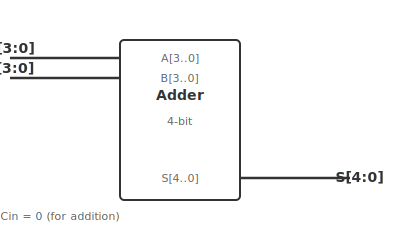

# ใบงานการทดลองที่ 7: การออกแบบวงจรเลขคณิต

---

## วัตถุประสงค์

- สามารถออกแบบวงจรบวกเลขฐานสองขนาด 4 บิตด้วย VHDL ได้
- สามารถออกแบบวงจรบวก/ลบเลขฐานสองด้วย VHDL ได้
- สามารถแสดงผลลัพธ์ผ่าน Seven-Segment Display ได้
- ทดสอบและวิเคราะห์ผลการทำงานของวงจรเลขคณิตได้

---

## อุปกรณ์ที่ใช้ในการทดลอง

- บอร์ด DE10-Lite จำนวน 1 บอร์ด
- สาย USB Type-A to Mini-B จำนวน 1 เส้น
- คอมพิวเตอร์ จำนวน 1 เครื่อง
- โปรแกรม Quartus Prime Lite Edition
- Digital Oscilloscope พร้อม Probes จำนวน 1 ชุด
- Function Generator จำนวน 1 เครื่อง

---

## การทดลองที่ 7.1 การสร้างวงจรบวกเลขฐานสอง 4 บิต

กำหนดให้

- SW3–SW0 แทนข้อมูล A
- SW7–SW4 แทนข้อมูล B

แสดงผล

- LED4–LED0 แสดงผลลัพธ์การบวก

### ขั้นตอนการทดลอง

1. สร้างวงจร 4-bit Adder
2. Compile โปรแกรม
3. Download ลงบอร์ด
4. ทดลองค่าต่าง ๆ
5. ใช้ Oscilloscope 2 ช่อง Probe Carry-In และ Carry-Out ของ Full Adder แต่ละบิต — ดูการ Propagate ของ Carry ผ่านวงจร
6. ใช้ Function Generator ป้อนสัญญาณ Clock ความถี่ต่ำ (~1 Hz) แทนการกด Switch — ดู Waveform การบวกแบบ Real-time บน Oscilloscope

#### ตารางที่ 7.1a การวัด Carry Propagation

| บิตที่ | A | B | Carry-In | Carry-Out |
|--------|---|---|----------|-----------|
| 0 | | | | |
| 1 | | | | |
| 2 | | | | |
| 3 | | | | |

#### ตารางที่ 7.1 ผลการทดลอง

| A | B | Sum |
|---|---|-----|
|1|1||
|3|2||
|5|4||
|7|8||
|9|6||

---

## การทดลองที่ 7.2 การสร้างวงจรบวกและลบ

กำหนดให้

- KEY0 ใช้เลือกโหมด

| KEY0 | การทำงาน |
|------|-----------|
|0|Addition|
|1|Subtraction|

### ขั้นตอนการทดลอง

1. เพิ่มวงจรเลือกการทำงาน
2. ทดลองโหมดบวก
3. ทดลองโหมดลบ
4. ใช้ Oscilloscope 2 ช่อง Probe สัญญาณ Mode Select (KEY0) และเอาต์พุต Sum — สังเกตว่ารูปแบบ Waveform เปลี่ยนไปเมื่อสลับโหมด
5. ใช้ Function Generator ป้อนสัญญาณ Square Wave ที่ Mode Select — สลับโหมดบวก/ลบอัตโนมัติ ดูการเปลี่ยนแปลงบน Oscilloscope

### คำถามท้ายการทดลองที่ 7.2

1. วงจรเดียวกันสามารถใช้ทั้งบวกและลบได้อย่างไร
2. เหตุใดจึงต้องมีสัญญาณควบคุม (Control Signal)

---

## การทดลองที่ 7.3 การแสดงผลบน Seven-Segment

ให้นำผลลัพธ์จากวงจรเลขคณิตไปแสดงบน Seven-Segment

### ขั้นตอนการทดลอง

1. เชื่อมต่อโมดูล Seven-Segment Decoder
2. ทดลองผลลัพธ์หลายค่า
3. ตรวจสอบการแสดงผล
4. ใช้ Oscilloscope Probe สัญญาณ Segment — ตรวจสอบว่าผลลัพธ์เลขคณิตที่แสดงบน Seven-Segment ถูกต้องหรือไม่ กรณีที่ผิด ให้ใช้ Scope หาจุดที่บกพร่อง

---

## สรุปผลการทดลอง

อธิบายผลการทดลอง พร้อมวิเคราะห์ความถูกต้องของผลลัพธ์ และอธิบายสาเหตุของข้อผิดพลาด (ถ้ามี)

## คำถามท้ายใบงาน

1. เหตุใดจึงควรออกแบบวงจรเป็นหลายโมดูล
2. หากต้องการเพิ่มการคูณ จะต้องเพิ่มโมดูลใด
3. วงจรเลขคณิตที่สร้างขึ้นสามารถนำไปประยุกต์ใช้ในระบบใดได้บ้าง
4. เพราะเหตุใดจึงควรทดสอบหลายชุดข้อมูลก่อนนำวงจรไปใช้งานจริง
5. การใช้ Oscilloscope ดู Carry Propagation ใน 4-bit Adder ช่วยให้เข้าใจการทำงานของ Ripple Carry Adder อย่างไร
6. การใช้ Function Generator สลับ Mode บวก/ลบ อัตโนมัติช่วยในการทดสอบวงจรต่างจากการกด Switch ด้วยมืออย่างไร
