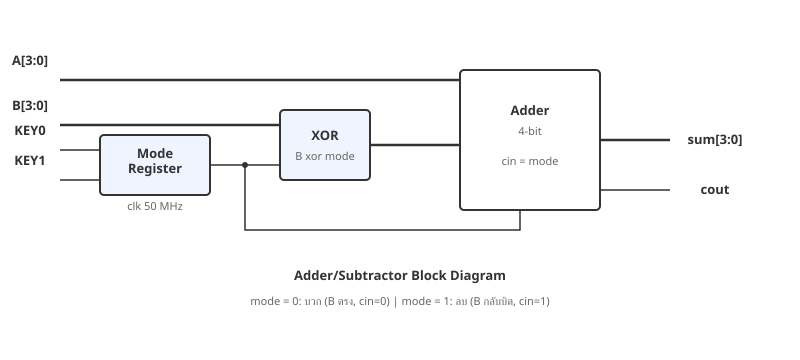
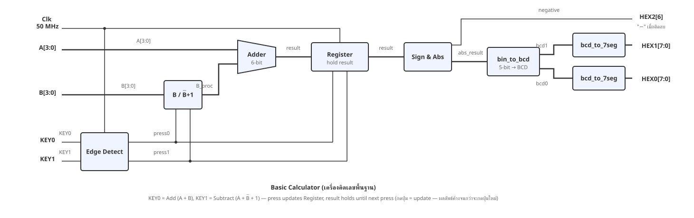
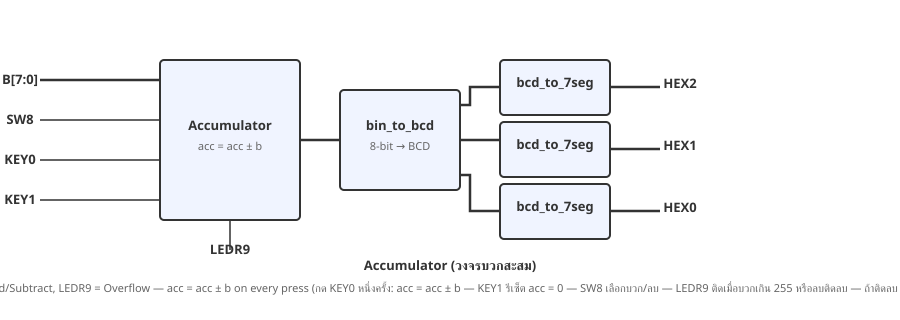

# ใบงานการทดลองที่ 7: เครื่องคิดเลขอย่างง่าย (Simple Calculator)

---

## วัตถุประสงค์

- อธิบายหลักการลบเลขฐานสองด้วยวิธี Two's Complement และการสร้างวงจรบวก/ลบได้
- อธิบายหลักการล็อกผลลัพธ์ด้วย Register และการแสดงผลลัพธ์ติดลบบน 7-Segment Display ได้
- อธิบายความแตกต่างระหว่างวงจรเลขคณิตแบบ combinational กับแบบมีสถานะ (sequential) ได้
- สามารถออกแบบวงจรเครื่องคิดเลขอย่างง่ายด้วย VHDL ได้
- บูรณาการโมดูลจากใบงานก่อนหน้า (Full Adder, Register, bin_to_bcd, bcd_to_7seg) เข้าด้วยกันแบบ Structural ได้

---

## อุปกรณ์ที่ใช้ในการทดลอง

- บอร์ด DE10-Lite จำนวน 1 บอร์ด
- สาย USB Type-A to Mini-B จำนวน 1 เส้น
- คอมพิวเตอร์ จำนวน 1 เครื่อง
- โปรแกรม Quartus Prime Lite Edition
- โปรแกรม USB-Blaster Driver

---

## การทดลองที่ 7.1 เครื่องคิดเลขพื้นฐาน (บวก/ลบ)

ในใบงานที่ 4 นักศึกษาได้สร้าง Ripple Carry Adder 4 บิต (`adder_4bit`) ไว้แล้ว — ใบงานนี้จะนำความรู้ทั้งหมดมาประกอบเป็น **เครื่องคิดเลขอย่างง่าย**:

- ใส่ค่า A (SW3–SW0) และ B (SW7–SW4)
- กด **KEY0** → คำนวณ **A + B** แสดงผลบน HEX1/HEX0
- กด **KEY1** → คำนวณ **A − B** แสดงผลบน HEX1/HEX0
- ผลลัพธ์ **ค้างอยู่บนจอ** จนกว่าจะกดปุ่มใหม่
- ถ้าผลลบติดลบ → HEX2 แสดง "−" และ HEX1/HEX0 แสดงค่าสัมบูรณ์

> **หลักการลบด้วย Two's Complement:** การลบ $A - B$ ทำได้โดยการบวก $A$ กับ **Two's Complement ของ B**:
>
> $$A - B = A + (\overline{B} + 1)$$
>
> นั่นคือ กลับบิตทุกบิตของ B ($\overline{B}$) แล้วบวก 1 — ผลลัพธ์ที่ได้คือคำตอบที่ถูกต้องในระบบ Two's Complement — **การลบคือการต่อยอดจากวงจรบวก** — ไม่ต้องสร้างวงจรลบใหม่ ใช้ Ripple Carry Adder จากใบงานที่ 4 ได้เลย

**วงจร Adder/Subtractor 4 บิต:**



- **Mode Register** — จำปุ่มที่กดล่าสุด (KEY0 = บวก, KEY1 = ลบ) — ส่งค่า `mode` ให้วงจร
- **XOR** — กลับบิต B เมื่อ `mode = 1` (ลบ): `B xor mode` — ถ้า mode = 0 ได้ B ตรง, mode = 1 ได้ $\overline{B}$
- **Adder 4-bit** — บวก $A + (B \oplus mode) + cin$ โดย `cin = mode` — เมื่อลบ: $A + \overline{B} + 1 = A - B$

**ภาพรวมของระบบ:**



กำหนดให้

- SW3–SW0 แทนค่า A, SW7–SW4 แทนค่า B
- **KEY0** กด = บวก, **KEY1** กด = ลบ
- HEX1/HEX0 แสดงผลลัพธ์ (บวก: 0–30, ลบ: ค่าสัมบูรณ์ 0–15)
- HEX2 แสดง "−" เมื่อผลลบติดลบ
- ผลลัพธ์ค้างอยู่บนจอจนกว่าจะกดปุ่มใหม่

> **ทำไมผลลัพธ์ต้อง "ค้าง"?** — ปุ่ม KEY เป็นแบบ momentary (กดแล้วเด้งกลับ) — ถ้าไม่มี Register ผลลัพธ์จะหายไปทันทีที่ปล่อยปุ่ม — **Register** (จากใบงานที่ 5) ทำหน้าที่ **จำค่า** ไว้ข้าม clock cycle — การจำค่านี้คือ **state** (สถานะ) ของวงจร — เป็นก้าวแรกสู่ FSM ในใบงานที่ 8

### ขั้นตอนการทดลอง

1. สร้างโปรเจกต์ใหม่ชื่อ `lab7_step1` (Top-Level Entity ชื่อ `calculator_top`) — คัดลอกไฟล์ `bcd_to_7seg.vhd` (จากใบงานที่ 4) มาเพิ่มเข้าโปรเจกต์ (**Project → Add/Remove Files in Project**)

2. สร้างไฟล์ `bin_to_bcd.vhd` — **ขยายจากใบงานที่ 4.2** ให้รับอินพุต 5 บิต (0–30) เพราะผลบวก A+B สูงสุด 15+15 = 30 — **คัดลอก Entity ตามตัวอย่าง แล้วเขียน Architecture เอง**:

    ```vhdl
    library ieee;
    use ieee.std_logic_1164.all;

    entity bin_to_bcd is
        port (
            bin  : in  std_logic_vector(4 downto 0);   -- ค่า 0–30
            bcd1 : out std_logic_vector(3 downto 0);   -- หลักสิบ
            bcd0 : out std_logic_vector(3 downto 0)    -- หลักหน่วย
        );
    end entity;

    architecture Dataflow of bin_to_bcd is
    begin
        -- (1) bcd1: with bin select — หลักสิบ: 0 (0–9), 1 (10–19), 2 (20–29), 3 (30)
        --     ใช้ "0011" when others สำหรับค่า 30 (11110)

        -- (2) bcd0: with bin select — หลักหน่วย: bin mod 10
        --     ใช้ "1001" when others สำหรับ 9, 19, 29
    end architecture;
    ```

    > **ขยายจาก 4 บิตเป็น 5 บิต:** ใบงานที่ 4.2 แปลงค่า 0–15 (4 บิต) — ใบงานนี้ผลบวกได้ถึง 30 จึงต้องเพิ่มบิตที่ 5 (`bin(4)`) — หลักสิบมีค่าได้ถึง 3 (เลข 30) — หลักหน่วยแต่ละค่าปรากฏ 3 ครั้ง (เช่น 0 = `00000`, `01010`, `10100`) — ใช้ `|` รวมกรณีที่ให้ค่าเดียวกัน และใช้ `when others` ปิดท้าย

3. สร้างไฟล์ `calculator_top.vhd` — วงจรหลัก: รับ KEY0/KEY1 → คำนวณ + ล็อกผลลัพธ์ → แสดงผล — **คัดลอก Entity ตามตัวอย่าง แล้วเขียน Architecture เอง**:

    แต่ละส่วนของวงจรทำงานดังนี้ (ตามบล็อกไดอะแกรมด้านบน):

    - **Edge Detect** — ปุ่ม KEY เป็น active-low (กด = `0`) — ต้องจับ **ขอบลง** (การเปลี่ยน `1 → 0`) เพื่อให้กด 1 ครั้ง = 1 เหตุการณ์ — ใช้ Register เก็บค่าปุ่มก่อนหน้า (`key0_prev`, `key1_prev`) แล้วเทียบกับค่าปัจจุบัน — สร้างสัญญาณ `press0`/`press1`
    - **B / B̄+1** — เลือก operand B ตามปุ่ม: กด KEY0 (บวก) ใช้ `B` ตรง ๆ — กด KEY1 (ลบ) ใช้ `B̄ + 1` (2's complement ของ B) — ส่งออกเป็น `b_proc`
    - **Adder 6-bit** — บวก `A + b_proc` — ผลลัพธ์ `result` (6 บิต signed) — ใช้ adder ตัวเดียวทั้งบวกและลบ (ต่อยอดจาก lab 4)
    - **Result Register** — process ที่ทำงานทุก `rising_edge(clk)` — เมื่อมี press ให้เก็บ `result` ลง Register — ผลลัพธ์ค้างจนกว่าจะกดปุ่มใหม่
    - **Sign & Abs** — แยกเครื่องหมายและค่าสัมบูรณ์: `negative` = sign bit (MSB) — ถ้าติดลบ ทำ 2's complement ให้เป็นค่าสัมบูรณ์ (`abs_result`)
    - **bin_to_bcd** — แปลง `abs_result` (5 บิต) เป็น BCD 2 หลัก
    - **bcd_to_7seg ×2** — แปลง BCD แต่ละหลักเป็น 7-segment pattern
    - **HEX2** — แสดง "−" (segment g = bit 6) เมื่อ `negative = '1'` — นอกนั้นดับ

    ```vhdl
    library ieee;
    use ieee.std_logic_1164.all;
    use ieee.numeric_std.all;

    entity calculator_top is
        port (
            clk  : in  std_logic;                    -- Clock 50 MHz จาก oscillator บนบอร์ด
            a    : in  std_logic_vector(3 downto 0); -- Operand A (SW3–SW0)
            b    : in  std_logic_vector(3 downto 0); -- Operand B (SW7–SW4)
            key0 : in  std_logic;                    -- บวก (KEY0)
            key1 : in  std_logic;                    -- ลบ (KEY1)
            hex2 : out std_logic_vector(7 downto 0); -- เครื่องหมายลบ (HEX2)
            hex1 : out std_logic_vector(7 downto 0); -- หลักสิบ (HEX1)
            hex0 : out std_logic_vector(7 downto 0)  -- หลักหน่วย (HEX0)
        );
    end entity;

    architecture Structural of calculator_top is
        component bin_to_bcd is
            port (
                bin  : in  std_logic_vector(4 downto 0);
                bcd1 : out std_logic_vector(3 downto 0);
                bcd0 : out std_logic_vector(3 downto 0)
            );
        end component;

        component bcd_to_7seg is
            port (
                bcd : in  std_logic_vector(3 downto 0);
                seg : out std_logic_vector(7 downto 0)
            );
        end component;

        signal key0_prev : std_logic := '1';
        signal key1_prev : std_logic := '1';
        signal press0    : std_logic;
        signal press1    : std_logic;
        signal b_proc    : std_logic_vector(3 downto 0);              -- B หรือ B̄+1 ตามปุ่ม
        signal result    : signed(5 downto 0) := (others => '0');  -- ผลลัพธ์ signed 6 บิต (−32..31)
        signal negative  : std_logic := '0';                          -- ผลลบติดลบ? (sign bit)
        signal abs_result : unsigned(4 downto 0);                     -- ค่าสัมบูรณ์ (0–30)
        signal bcd1_sig  : std_logic_vector(3 downto 0);
        signal bcd0_sig  : std_logic_vector(3 downto 0);
    begin

        -- (1) Edge Detect: process(clk) เก็บ key0/key1 ลง key0_prev/key1_prev
        --     แล้วสร้าง press0/press1 = '1' เมื่อปุ่มเปลี่ยนจาก 1 → 0

        -- (2) B / B̄+1: เลือก b_proc ตามปุ่ม
        --     press0 (บวก): b_proc <= b
        --     press1 (ลบ):  b_proc <= not b + 1   -- 2's complement ของ B

        -- (3) Adder 6-bit: result <= signed(resize(a,6)) + signed(resize(b_proc,6))

        -- (4) Result Register: process(clk) — เมื่อมี press ให้เก็บ result

        -- (5) Sign & Abs: negative <= result(5)  -- sign bit (MSB): '1' = ติดลบ
        --     ถ้า result < 0 → abs_result <= unsigned(0 - result(4 downto 0))  -- 2's complement
        --     else: abs_result <= unsigned(result(4 downto 0))

        -- (6) U_BCD: bin_to_bcd — bin => std_logic_vector(abs_result)

        -- (7) U_DEC1/U_DEC0: bcd_to_7seg — bcd => bcd1_sig/bcd0_sig

        -- (8) hex2: "10111111" เมื่อ negative = '1' (segment g = bit 6 ติด) — นอกนั้น "11111111"

    end architecture;
    ```

    > **Result Register คือ state:** `result` เก็บผลลัพธ์ไว้ข้าม clock cycle — เมื่อกดปุ่มคำนวณแล้ว ต่อให้สลับสวิตช์ A/B ผลลัพธ์บนจอก็ยังคงค่าเดิม จนกว่าจะกดปุ่มใหม่
    >
    > **การแสดงผลลบ:** `result` เป็น **signed** — เมื่อ A < B (เช่น 3 − 5) ผลลัพธ์เป็นค่าลบจริง (−2) — `negative` = sign bit (MSB) = '1' — ก่อนแสดงผลต้องทำ **2's complement** (กลับบิต + 1 หรือ `0 − result`) ให้เป็นค่าสัมบูรณ์ (2) — HEX2 แสดง "−" และ HEX1/HEX0 แสดง 2 — รวมเป็น "−2"

4. **Simulate ด้วย Waveform** — ตรวจสอบความถูกต้องของวงจรก่อนลงบอร์ด:
    - **File → New → University Program VWF** → Insert Node `clk`, `a`, `b`, `key0`, `key1` (input) และ `hex2`, `hex1`, `hex0` (output)
    - ตั้งค่า `clk` เป็นสัญญาณ Clock (period 10 ns) — กด `key0` (ขอบลง) ทดสอบการบวก (เช่น 3+2=5, 9+9=18)
    - กด `key1` (ขอบลง) ทดสอบการลบ (เช่น 5−2=3, 3−5=−2 — ตรวจสอบว่า `hex2` แสดง "−")
    - **Simulation → Run Functional Simulation**
    - ตรวจสอบว่า `hex1`/`hex0` ตรงกับผลบวก/ผลลบที่คำนวณได้ และ `hex2` เปลี่ยนเฉพาะเมื่อผลลบติดลบ

5. กำหนด Pin Assignment:
    - `clk` → PIN_P11 (`MAX10_CLK1_50`)
    - `a(3)`–`a(0)` → SW3–SW0
    - `b(3)`–`b(0)` → SW7–SW4
    - `key0` → KEY0, `key1` → KEY1
    - `hex2(7:0)` → ขา HEX2, `hex1(7:0)` → ขา HEX1, `hex0(7:0)` → ขา HEX0

6. **Compile** (**Processing → Start Compilation**) → **Program** ลงบอร์ดด้วย USB-Blaster

7. ทดลองตามตารางที่ 7.1 — ตั้งค่า A, B แล้วกด KEY0/KEY1 บันทึกผล

#### ตารางที่ 7.1 ผลการทดลองเครื่องคิดเลขพื้นฐาน

| A (ฐานสิบ) | B (ฐานสิบ) | กดปุ่ม | การทำงาน | ภาพถ่ายผลลัพธ์ (HEX2/HEX1/HEX0) |
| ---------- | ---------- | ------ | -------- | ------------------------------- |
| 3          | 2          | KEY0   | บวก      |                                 |
| 12         | 5          | KEY0   | บวก      |                                 |
| 15         | 15         | KEY0   | บวก      |                                 |
| 15         | 7          | KEY1   | ลบ       |                                 |
| 12         | 15         | KEY1   | ลบ       |                                 |
| 3          | 5          | KEY1   | ลบ       |                                 |

### คำถามท้ายการทดลองที่ 7.1

1. วงจรเดียวกันสามารถใช้ทั้งบวกและลบได้อย่างไร — อธิบายหลักการ Two's Complement
2. เพราะเหตุใดผลลัพธ์จึงค้างอยู่บนจอแม้ปล่อยปุ่มและสลับสวิตช์ — อธิบายบทบาทของ Register

---

## การทดลองที่ 7.2 Accumulator (วงจรบวกสะสม)

ในข้อ 7.1 เครื่องคิดเลขคำนวณผลลัพธ์ครั้งเดียวแล้วล็อกไว้ — ระบบจริงมักต้องการ **สะสมค่าไปเรื่อย ๆ** เช่น เครื่องคิดเงินที่รวมยอดสินค้าทีละรายการ

**Accumulator** คือวงจรที่ **บวก/ลบค่าเข้ากับค่าที่สะสมไว้** ทุกครั้งที่กดปุ่ม:

$$acc = acc \pm a$$

โดย `acc` (accumulator) เป็น Register ที่เก็บค่าสะสม — ทุกครั้งที่กด KEY0 ค่า `acc` จะเปลี่ยนตาม `a` และทิศทางที่เลือกด้วย SW8 — นี่คือ **state ที่สะสมค่า** ต่อยอดจากแนวคิด Register ในข้อ 7.1

> **จาก Counter สู่ Accumulator:** ในใบงานที่ 6 Counter นับเพิ่มทีละ 1 (`count + 1`) — Accumulator ต่างกันตรงที่บวก/ลบเพิ่มทีละ `a` (ค่าใดก็ได้) แทนที่จะเป็น 1 เสมอ — ทั้งคู่คือ Register ที่ "สะสมค่า" ตามจังหวะ clock

**ภาพรวมของระบบ:**



กำหนดให้

- SW7–SW0 แทนค่า A (ค่าที่บวก/ลบสะสม) — 8 บิต (0–255)
- SW8 เลือกทิศทาง: `0` = บวก, `1` = ลบ
- KEY0 กด = สะสม 1 ครั้ง (Edge Detect — เหมือนข้อ 7.1)
- KEY1 กด = reset — `acc` กลับเป็น 0
- LEDR9 แสดง **overflow** — ติดเมื่อผลลัพธ์เกินช่วงแสดงผล 0–255 (บวกเกิน 255 หรือลบติดลบ)
- HEX3 แสดง "−" เมื่อ `acc` ติดลบ — HEX2/HEX1/HEX0 แสดงค่าสัมบูรณ์ของ `acc` (0–255)

> **ต่อยอดจากข้อ 7.1:** วงจรนี้ใช้โมดูลเดียวกับเครื่องคิดเลขพื้นฐาน — Edge Detect, A / Ā+1, Adder, Accumulator Register, Sign & Abs, bin_to_bcd, bcd_to_7seg — ต่างกันตรงที่ Register เก็บ **ค่าสะสม** (บวก/ลบเข้ากับค่าเดิมทุกครั้ง) แทนที่จะล็อกผลลัพธ์ครั้งเดียว — และ A เป็น 8 บิต (0–255) จึงขยาย `bin_to_bcd` จาก 5 บิตเป็น 8 บิต

### ขั้นตอนการทดลอง

1. สร้างโปรเจกต์ใหม่ชื่อ `lab7_step2` (Top-Level Entity ชื่อ `accumulator_top`) — คัดลอกไฟล์ `bin_to_bcd.vhd` และ `bcd_to_7seg.vhd` (จากข้อ 7.1) มาเพิ่มเข้าโปรเจกต์ (**Project → Add/Remove Files in Project**)

2. แก้ไข `bin_to_bcd.vhd` — **ขยายจากข้อ 7.1** ให้รับอินพุต 8 บิต (0–255) และเพิ่มเอาต์พุต `bcd2` (หลักร้อย):

    ```vhdl
    library ieee;
    use ieee.std_logic_1164.all;

    entity bin_to_bcd is
        port (
            bin  : in  std_logic_vector(7 downto 0);   -- ค่า 0–255
            bcd2 : out std_logic_vector(3 downto 0);   -- หลักร้อย
            bcd1 : out std_logic_vector(3 downto 0);   -- หลักสิบ
            bcd0 : out std_logic_vector(3 downto 0)    -- หลักหน่วย
        );
    end entity;

    architecture Dataflow of bin_to_bcd is
    begin
        -- (1) bcd2: with bin select — หลักร้อย: 0 (0–99), 1 (100–199), 2 (200–255)
        --     ใช้ "0010" when others สำหรับค่า 200–255

        -- (2) bcd1: with bin select — หลักสิบ: (bin / 10) mod 10
        --     ใช้ "0101" when others สำหรับ 250–255

        -- (3) bcd0: with bin select — หลักหน่วย: bin mod 10
        --     ใช้ "1001" when others สำหรับค่าที่ลงท้าย 9
    end architecture;
    ```

    > **ขยายจาก 5 บิตเป็น 8 บิต:** ข้อ 7.1 แปลงค่า 0–30 (5 บิต) — ข้อนี้ค่าสะสมสูงสุด 255 จึงต้องเพิ่มบิตที่ 6–8 และเพิ่มหลักร้อย (`bcd2`) — หลักสิบ/หน่วยแต่ละค่าปรากฏหลายครั้ง — ใช้ `|` รวมกรณีที่ให้ค่าเดียวกัน และใช้ `when others` ปิดท้าย

3. สร้างไฟล์ `accumulator_top.vhd` — วงจรหลัก: รับ KEY0/KEY1/SW8 → สะสมค่า → แปลง BCD → แสดงผล — **คัดลอก Entity ตามตัวอย่าง แล้วเขียน Architecture เอง**:

    แต่ละส่วนของวงจรทำงานดังนี้ (ตามบล็อกไดอะแกรมด้านบน):

    - **Edge Detect** — เหมือนข้อ 7.1 — จับขอบลงของ KEY0 (`press_add`) และ KEY1 (`press_rst`) — กด 1 ครั้ง = 1 เหตุการณ์
    - **A / Ā+1** — เลือก operand ตาม SW8: `add_sub = '0'` (บวก) ใช้ `A` ตรง ๆ — `add_sub = '1'` (ลบ) ใช้ `−A` (2's complement ใน 9 บิต) — ส่งออกเป็น `a_proc` (signed 9 บิต)
    - **Adder 9-bit** — บวก `acc + a_proc` — ใช้ผลเต็ม 10 บิต (`sum_full`) ตรวจ overflow ก่อน แล้วตัดเหลือ 9 บิต (`acc_next`) — **acc เกินช่วงจะ wrap (วนกลับ)**
    - **Accumulator Register** — process ที่ทำงานทุก `rising_edge(clk)` — เมื่อ `press_add` ให้เก็บ `acc_next` ลง `acc` — เมื่อ `press_rst` ให้ `acc = 0` — **ตรวจ overflow ใน process เดียวกัน** (ตาม diagram: สัญญาณ `overflow` ออกจาก Register ไป LEDR9) — `overflow = '1'` เมื่อ `sum_full > 255` หรือ `sum_full < 0` (เกินช่วงแสดงผล 0–255)
    - **Sign & Abs** — เหมือนข้อ 7.1 — ถ้า `acc` ติดลบ ทำ 2's complement ให้เป็นค่าสัมบูรณ์ (`abs_acc`)
    - **bin_to_bcd** — แปลง `abs_acc` (8 บิต) เป็น BCD 3 หลัก
    - **bcd_to_7seg ×3** — แปลง BCD แต่ละหลักเป็น 7-segment pattern

    ```vhdl
    library ieee;
    use ieee.std_logic_1164.all;
    use ieee.numeric_std.all;

    entity accumulator_top is
        port (
            clk      : in  std_logic;                    -- Clock 50 MHz จาก oscillator บนบอร์ด
            a        : in  std_logic_vector(7 downto 0); -- ค่าที่บวก/ลบสะสม (SW7–SW0)
            add_sub  : in  std_logic;                    -- SW8: '0' = บวก, '1' = ลบ
            key0     : in  std_logic;                    -- สะสม (KEY0)
            key1     : in  std_logic;                    -- reset (KEY1)
            hex3     : out std_logic_vector(7 downto 0); -- เครื่องหมายลบ (HEX3)
            hex2     : out std_logic_vector(7 downto 0); -- หลักร้อย (HEX2)
            hex1     : out std_logic_vector(7 downto 0); -- หลักสิบ (HEX1)
            hex0     : out std_logic_vector(7 downto 0); -- หลักหน่วย (HEX0)
            overflow : out std_logic                     -- LEDR9: เกินช่วง 0–255
        );
    end entity;

    architecture Structural of accumulator_top is
        component bin_to_bcd is
            port (
                bin  : in  std_logic_vector(7 downto 0);
                bcd2 : out std_logic_vector(3 downto 0);
                bcd1 : out std_logic_vector(3 downto 0);
                bcd0 : out std_logic_vector(3 downto 0)
            );
        end component;

        component bcd_to_7seg is
            port (
                bcd : in  std_logic_vector(3 downto 0);
                seg : out std_logic_vector(7 downto 0)
            );
        end component;

        signal key0_prev : std_logic := '1';
        signal key1_prev : std_logic := '1';
        signal press_add : std_logic;
        signal press_rst : std_logic;
        signal a_proc    : signed(8 downto 0);              -- A หรือ −A ตาม SW8 (signed 9 บิต)
        signal acc       : signed(8 downto 0) := (others => '0');  -- ค่าสะสม signed 9 บิต (−256..255)
        signal sum_full  : signed(9 downto 0);                        -- ผลเต็ม 10 บิต (ตรวจ overflow)
        signal acc_next  : signed(8 downto 0);                        -- acc หลัง wrap
        signal negative  : std_logic := '0';                          -- acc ติดลบ? (sign bit)
        signal abs_acc   : unsigned(7 downto 0);                      -- ค่าสัมบูรณ์ (0–255)
        signal bcd2_sig  : std_logic_vector(3 downto 0);
        signal bcd1_sig  : std_logic_vector(3 downto 0);
        signal bcd0_sig  : std_logic_vector(3 downto 0);
    begin

        -- (1) Edge Detect: process(clk) เก็บ key0/key1 ลง key0_prev/key1_prev
        --     แล้วสร้าง press_add/press_rst = '1' เมื่อปุ่มเปลี่ยนจาก 1 → 0

        -- (2) A / Ā+1: เลือก a_proc ตาม SW8
        --     add_sub = '0' (บวก): a_proc <= resize(signed(a), 9)
        --     add_sub = '1' (ลบ):  a_proc <= 0 - resize(signed(a), 9)   -- −A ใน 9 บิต (A สูงสุด 255 ต้องใช้ 9 บิต)

        -- (3) Adder 9-bit: sum_full <= resize(acc, 10) + resize(a_proc, 10)
        --     acc_next <= sum_full(8 downto 0)   -- ตัดบิตเกิน → wrap (วนกลับ)

        -- (4) Accumulator Register: process(clk) — เมื่อ press_add ให้ acc <= acc_next
        --     เมื่อ press_rst ให้ acc <= (others => '0')

        -- (5) Overflow: sample ที่ขอบ clock พร้อม acc (ใน process เดียวกับ Register)
        --     overflow <= '1' เมื่อ sum_full > 255 หรือ sum_full < 0
        --     -- ตรวจจาก sum_full (ผลเต็ม 10 บิต) แล้วเก็บลง Register — LEDR9 บอกว่าเกินช่วงแสดงผล

        -- (6) Sign & Abs: negative <= acc(8)  -- sign bit (MSB): '1' = ติดลบ
        --     ถ้า acc < 0 → abs_acc <= unsigned(0 - acc(7 downto 0))  -- 2's complement
        --     else: abs_acc <= unsigned(acc(7 downto 0))

        -- (7) U_BCD: bin_to_bcd — bin => std_logic_vector(abs_acc)

        -- (8) U_DEC2/U_DEC1/U_DEC0: bcd_to_7seg — bcd => bcd2_sig/bcd1_sig/bcd0_sig

        -- (9) hex3: "10111111" เมื่อ negative = '1' (segment g = bit 6 ติด) — นอกนั้น "11111111"

    end architecture;
    ```

    > **`acc` เป็น `signed(8 downto 0)`:** ค่าสะสม 9 บิต (−256..255) — เก็บค่าลบได้จริง — เมื่อบวกเกิน 255 (เช่น 127 + 131 = 258) ผลเต็ม 10 บิต (`sum_full`) เกินช่วง → `overflow = '1'` — แต่ `acc` ถูกตัดเหลือ 9 บิต → **wrap** เป็น −254 — HEX แสดง 254 — LEDR9 บอกว่านี่คือ overflow
    >
    > **การแสดงผลลบ:** เมื่อ `acc` ติดลบ (เช่น 96 − 167 = −71) — sign bit (MSB) = '1' — ก่อนแสดงผลต้องทำ **2's complement** ให้เป็นค่าสัมบูรณ์ (71) — HEX3 แสดง "−" และ HEX2/1/0 แสดง 71 — รวมเป็น "−71"

4. **Simulate ด้วย Waveform** — ตรวจสอบความถูกต้องของวงจรก่อนลงบอร์ด:
    - **File → New → University Program VWF** → Insert Node `clk`, `a`, `add_sub`, `key0`, `key1` (input) และ `hex3`, `hex2`, `hex1`, `hex0`, `overflow` (output)
    - ตั้งค่า `clk` เป็นสัญญาณ Clock (period 10 ns) — ตั้งค่า `a = 127` (01111111), `add_sub = 0` — กด `key0` (ขอบลง) 1 ครั้ง — ตรวจสอบ acc = 127, `overflow` = 0
    - ตั้งค่า `a = 131` (10000011), `add_sub = 0` — กด `key0` 1 ครั้ง — ตรวจสอบ acc = −254 (wrap จาก 258), **`overflow` = 1**
    - ตั้งค่า `a = 89` (01011001), `add_sub = 1` — กด `key0` 1 ครั้ง — ตรวจสอบ acc = 169 (wrap จาก −343), **`overflow` = 1**
    - กด `key1` (ขอบลง) — ตรวจสอบ acc = 0
    - ตั้งค่า `a = 167` (10100111), `add_sub = 1` — กด `key0` 1 ครั้ง — ตรวจสอบ acc = −167, **`overflow` = 1** (ติดลบ — HEX3 แสดง "−" และ HEX2/1/0 แสดง 167)
    - ตรวจสอบ BCD: เมื่อ acc = 127 → `bcd2` = 1, `bcd1` = 2, `bcd0` = 7

5. กำหนด Pin Assignment:
    - `clk` → PIN_P11 (`MAX10_CLK1_50`)
    - `a(7)`–`a(0)` → SW7–SW0
    - `add_sub` → SW8
    - `key0` → KEY0, `key1` → KEY1
    - `overflow` → LEDR9
    - `hex3(7:0)` → ขา HEX3
    - `hex2(7:0)` → ขา HEX2
    - `hex1(7:0)` → ขา HEX1
    - `hex0(7:0)` → ขา HEX0

6. **Compile** → **Program** ลงบอร์ด

7. ทดลองตามตารางที่ 7.2 — **กด KEY1 (reset) ครั้งเดียวตอนเริ่ม** ให้ acc = 0 แล้วทำตามลำดับ: ตั้งค่า A และ SW8 ตามแถว → **ถ่ายรูป 7-segment ก่อนกด** (HEX3/HEX2/HEX1/HEX0) → กด KEY0 **หนึ่งครั้ง** → **ถ่ายรูป 7-segment หลังกด** — ทำต่อเนื่องโดย **ไม่ reset ระหว่างแถว** (acc ไหลต่อจากแถวก่อนหน้า)

#### ตารางที่ 7.2 ผลการทดลอง Accumulator

| ลำดับ | A (SW7–0) | SW8 | ก่อนกด (HEX3–HEX0) | หลังกด (HEX3–HEX0) | overflow (LEDR9) |
| ----- | ---------- | --- | ------------------ | ------------------ | ---------------- |
| 1 | 127 | 0 (บวก) |  |  |  |
| 2 | 131 | 0 (บวก) |  |  |  |
| 3 | 89 | 1 (ลบ) |  |  |  |
| 4 | 73 | 1 (ลบ) |  |  |  |
| 5 | 167 | 1 (ลบ) |  |  |  |
| 6 | 251 | 0 (บวก) |  |  |  |
| 7 | 53 | 1 (ลบ) |  |  |  |
| 8 | 113 | 1 (ลบ) |  |  |  |
| 9 | 199 | 0 (บวก) |  |  |  |
| 10 | 97 | 0 (บวก) |  |  |  |

### คำถามท้ายการทดลองที่ 7.2

1. เมื่อค่าสะสมเกิน 255 หรือลบจนติดลบ เกิดอะไรขึ้นกับ `acc` — `overflow` (LEDR9) บอกอะไร — และระบบจริงควรจัดการอย่างไร
2. บทบาทของ SW8 (`add_sub`) คืออะไร — ถ้าไม่มีสัญญาณนี้ วงจรจะทำได้เพียงใด

---

## สรุปผลการทดลอง

อธิบายผลการทดลอง พร้อมวิเคราะห์ความถูกต้องของผลลัพธ์ และอธิบายสาเหตุของข้อผิดพลาด (ถ้ามี)

## คำถามท้ายใบงาน

1. เหตุใดจึงควรออกแบบวงจรเป็นหลายโมดูล (Modular Design) แทนการเขียนเป็นวงจรเดียวขนาดใหญ่
2. จากแนวคิด Register (ข้อ 7.1) และ Accumulator (ข้อ 7.2) — จงยกตัวอย่างระบบจริงที่ต้อง "จำค่า" หรือ "สะสมค่า" พร้อมอธิบายว่า state แต่ละค่าหมายถึงอะไร