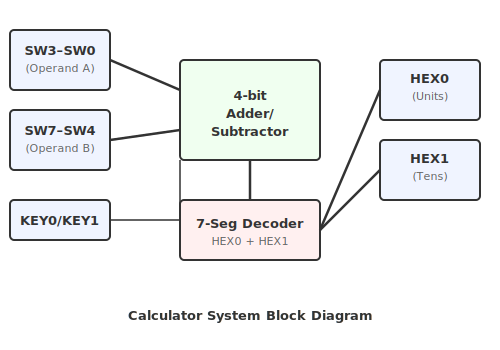

# ใบงานการทดลองที่ 8: การบูรณาการระบบเครื่องคิดเลขด้วย VHDL

---

## วัตถุประสงค์

- บูรณาการโมดูล VHDL หลายโมดูลเข้าด้วยกันได้
- สามารถออกแบบ Top-Level Entity สำหรับระบบเครื่องคิดเลขได้
- ทดสอบการทำงานของระบบโดยรวมบนบอร์ด DE10-Lite ได้
- วิเคราะห์และแก้ไขข้อผิดพลาดของระบบดิจิทัลได้
- ประยุกต์ใช้แนวคิด Modular Design ในการพัฒนาระบบ FPGA ได้

---

## อุปกรณ์ที่ใช้ในการทดลอง

- บอร์ด DE10-Lite จำนวน 1 บอร์ด
- สาย USB Type-A to Mini-B จำนวน 1 เส้น
- คอมพิวเตอร์ จำนวน 1 เครื่อง
- โปรแกรม Quartus Prime Lite Edition
- Digital Oscilloscope พร้อม Probes จำนวน 1 ชุด
- Function Generator จำนวน 1 เครื่อง

---

## การทดลองที่ 8.1 การรวมโมดูล (System Integration)

ให้นำโมดูลที่สร้างจากใบงานก่อนหน้ามาประกอบเป็นระบบเดียว ได้แก่

- Four-bit Adder/Subtractor
- Seven-Segment Decoder
- Top-Level Controller

กำหนดการใช้งานดังนี้

| อุปกรณ์ | หน้าที่ |
|----------|---------|
| SW3–SW0 | Operand A |
| SW7–SW4 | Operand B |
| KEY0 | เลือกการบวก (+) |
| KEY1 | เลือกการลบ (−) |
| HEX0 | หลักหน่วยของผลลัพธ์ |
| HEX1 | หลักสิบของผลลัพธ์ (ถ้ามี) |

### ขั้นตอนการทดลอง

1. สร้าง Top-Level Entity
2. Instantiate โมดูลต่าง ๆ
3. เชื่อมต่อสัญญาณระหว่างโมดูล
4. Compile โปรแกรม
5. Download ลงบอร์ด

---

## การทดลองที่ 8.2 การทดสอบระบบ

ทดสอบการทำงานของระบบด้วยชุดข้อมูลต่อไปนี้

#### ตารางที่ 8.1 ผลการทดลอง

| A | B | Operation | Actual |
|---|-----------|--------|
|2|3|+||
|5|2|-||
|7|8|+||
|9|4|-||
|8|8|+||

---

### ขั้นตอนการทดลอง

1. ป้อนข้อมูลผ่าน Switch
2. เลือกการดำเนินการ
3. บันทึกผลลัพธ์
4. เปรียบเทียบกับค่าที่คำนวณได้
5. **การ Debug ด้วย Oscilloscope**: เมื่อระบบรวมแล้วทำงานผิดพลาด ให้ใช้ Oscilloscope Probe จุดเชื่อมต่อระหว่าง Module ดังนี้:
   - Probe สัญญาณ Operand A และ B ที่เข้าสู่ Adder/Subtractor — ตรวจสอบว่าข้อมูลถูกต้อง
   - Probe สัญญาณเอาต์พุตของ Adder/Subtractor ก่อนเข้า Decoder — ตรวจสอบว่าผลลัพธ์ถูกต้อง
   - Probe สัญญาณ Segment ของ Seven-Segment — ตรวจสอบ Decoder
6. ใช้ Function Generator ป้อนข้อมูลทดสอบอัตโนมัติเพื่อตรวจสอบการทำงานทุกกรณี

---

## การทดลองที่ 8.3 การวิเคราะห์และปรับปรุงระบบ

ศึกษาการทำงานของระบบในกรณีต่อไปนี้

- ผลลัพธ์มากกว่า 15
- ผลลัพธ์ติดลบ
- การป้อนข้อมูลไม่ถูกต้อง
- การ Reset ระบบ

อภิปรายแนวทางในการปรับปรุงระบบให้รองรับกรณีดังกล่าว

---

## สรุปผลการทดลอง

อธิบายผลการทดลอง พร้อมวิเคราะห์ความถูกต้องของผลลัพธ์ และอธิบายสาเหตุของข้อผิดพลาด (ถ้ามี)

## คำถามท้ายใบงาน

1. การแบ่งระบบออกเป็นหลายโมดูลมีข้อดีอย่างไร
2. หากต้องการเพิ่มการคูณ (×) จะต้องแก้ไขหรือเพิ่มโมดูลใด
3. หากต้องการรองรับตัวเลข 8 บิต จะต้องปรับปรุงส่วนใดของระบบ
4. เพราะเหตุใดการทดสอบระบบทั้งระบบ (System Integration Testing) จึงมีความสำคัญ
5. จากการทดลอง นักศึกษาพบปัญหาใดมากที่สุดในการเชื่อมต่อโมดูล และแก้ไขอย่างไร
6. การใช้ Oscilloscope ช่วยในการ Debug การรวมระบบ (System Integration) อย่างไรบ้าง จงยกตัวอย่างที่พบจากการทดลอง
7. ในฐานะวิศวกร การมี Oscilloscope เป็นเครื่องมือ Debug มีความสำคัญอย่างไรเมื่อเทียบกับการดู LED เพียงอย่างเดียว