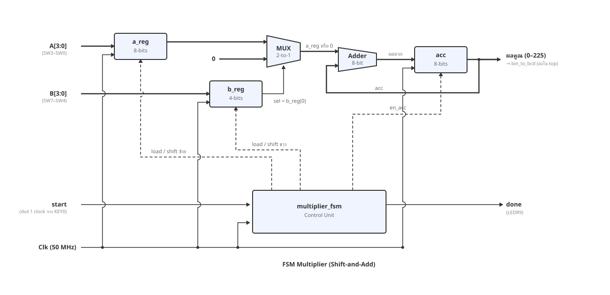
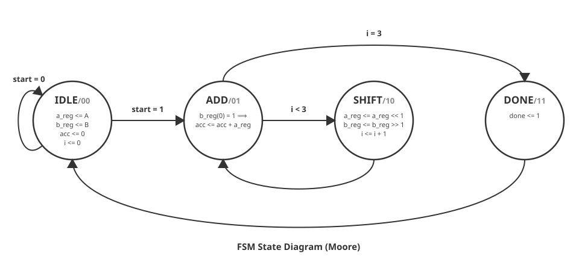
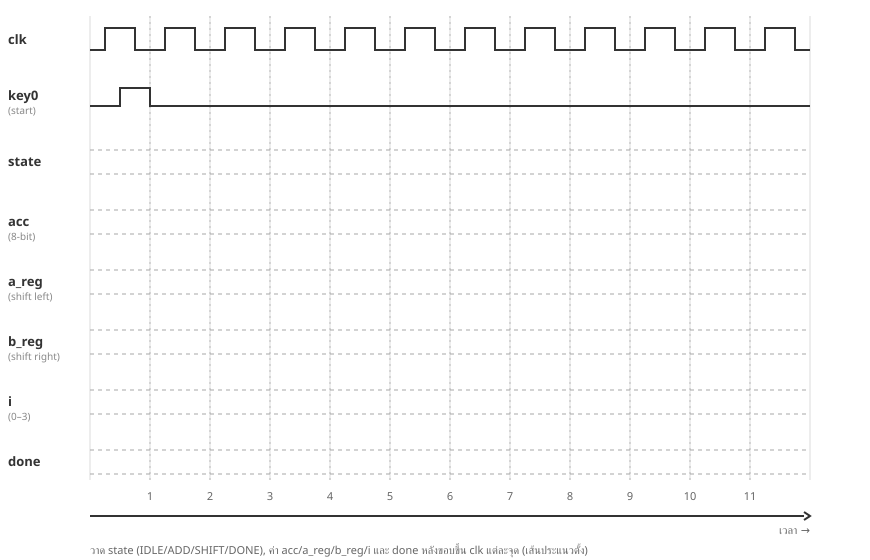

# ใบงานการทดลองที่ 8: วงจรคูณเลขด้วย FSM (FSM Multiplier)

---

## วัตถุประสงค์

- อธิบายหลักการคูณเลขฐานสองด้วยวิธี Shift-and-Add ได้
- อธิบายโครงสร้าง Finite State Machine (FSM) ประกอบด้วย state, transition และการแยกส่วน Control กับ Datapath ได้
- สามารถเขียน VHDL แบบ Behavioral สำหรับ FSM ที่ทำงานหลาย clock cycle ได้
- บูรณาการโมดูลจากใบงานก่อนหน้า (Adder, bin_to_bcd, bcd_to_7seg) เข้ากับ FSM ใน Top-Level Entity ได้
- วิเคราะห์พฤติกรรมของวงจรหลาย clock cycle จาก Timing Diagram ได้

---

## อุปกรณ์ที่ใช้ในการทดลอง

- บอร์ด DE10-Lite จำนวน 1 บอร์ด
- สาย USB Type-A to Mini-B จำนวน 1 เส้น
- คอมพิวเตอร์ จำนวน 1 เครื่อง
- โปรแกรม Quartus Prime Lite Edition
- โปรแกรม USB-Blaster Driver

---

## การทดลองที่ 8.1 วงจรคูณด้วย FSM (Shift-and-Add Multiplier)

ในใบงานที่ 7 เครื่องคิดเลขบวก/ลบคำนวณเสร็จใน **1 clock cycle** แต่การคูณต้องรวมผลคูณย่อยหลายพจน์ จึงนิยมใช้ **หลาย clock cycle** ต่อคำตอบ 1 ครั้ง วงจรที่ไล่ลำดับขั้นตอนด้วย state เรียกว่า **Finite State Machine (FSM)** ซึ่งเป็นการต่อยอดแนวคิด state ของ Register จากใบงานที่ 7

**หลักการคูณแบบ Shift-and-Add** คือวิธีคูณทวิภาคแบบด้วยมือ:

$$A \times B = \sum_{i=0}^{3} b_i \times (A \ll i)$$

ตัวอย่าง 11 × 13 (A = 1011₂, B = 1101₂):

```text
        1011  (= 11)   ← A
      × 1101  (= 13)   ← B
      -----
        1011           ← บิต 0 ของ B = 1 → วาง A (เลื่อน 0 ตำแหน่ง)
       0000            ← บิต 1 ของ B = 0 → วาง 0
      1011             ← บิต 2 ของ B = 1 → วาง A เลื่อนซ้าย 2
     1011              ← บิต 3 ของ B = 1 → วาง A เลื่อนซ้าย 3
    -------
    10001111  (= 143)  ← ผลคูณ 8 บิต
```

**หลักการของวงจร:** วงจรบวกผลคูณย่อยแต่ละพจน์เข้ากับค่าสะสม (accumulator) ทีละรอบจนครบทุกบิตของ B ให้ผลลัพธ์เดียวกับวิธีคูณด้วยมือที่เขียนผลคูณย่อยทุกแถวแล้วบวกรวมกันครั้งเดียว โดย:

- พิจารณาบิตล่าง `b_reg(0)` ถ้ามีค่าเป็น 1 → บวก `a_reg` (ยังไม่เลื่อน) เข้า `acc`
- จากนั้นเลื่อน `a_reg` **ไปทางซ้าย** (เตรียมผลคูณย่อยแถวถัดไป) และเลื่อน `b_reg` **ไปทางขวา** (ตัดบิตที่ใช้แล้วออก)

**ภาพรวมของระบบ (Datapath + Control):**



- **a_reg (8-bit)** เก็บค่า A เลื่อนซ้าย 1 บิตทุก state SHIFT (A สูงสุด 15 เลื่อนซ้าย 3 ครั้ง = 120 ไม่ล้น 8 บิต)
- **b_reg (4-bit)** เก็บค่า B เลื่อนขวา 1 บิตทุก state SHIFT โดยวงจรพิจารณาเฉพาะบิตล่าง `b_reg(0)` เสมอ
- **acc (8-bit)** สะสมผลคูณย่อย โดยค่าสุดท้ายคือผลคูณ (0–225)
- **Adder 8-bit** บวก `acc + (a_reg หรือ 0)` เป็นการต่อยอดแนวคิด adder จากใบงานที่ 4/7
- **multiplier_fsm** เป็น Control Unit สั่ง enable/shift ทุก Register ตาม state diagram ด้านล่าง

**แผนภาพสถานะ (State Diagram):**



FSM มี 4 สถานะ ใช้รหัส 2 บิต (`00`–`11`) โดยแต่ละสถานะมีการทำงาน (Output) และเงื่อนไขการเปลี่ยนสถานะ (Next State) ดังตาราง:

| State | Code | Output | Next State |
| ----- | ---- | ------ | ---------- |
| IDLE | 00 | `a_reg <= A`<br>`b_reg <= B`<br>`acc <= 0`<br>`i <= 0` | IDLE (`start = 0`)<br>ADD (`start = 1`) |
| ADD | 01 | `b_reg(0) = 1 ⟹`<br>`acc <= acc + a_reg` (ถ้า 0 คงเดิม) | SHIFT (`i < 3`)<br>DONE (`i = 3`) |
| SHIFT | 10 | `a_reg <= a_reg << 1`<br>`b_reg <= b_reg >> 1`<br>`i <= i + 1` | ADD |
| DONE | 11 | `done <= 1` | IDLE |

> **การนับรอบ:** IDLE → ADD → SHIFT → ADD → SHIFT → ADD → SHIFT → ADD → DONE ครบ 4 รอบ ADD สำหรับ B 4 บิต โดยรอบสุดท้ายบวกบิตที่ 3 แล้วเปลี่ยนเข้า state DONE ทันที (ไม่ผ่าน SHIFT อีก) รวม 9 clock cycles จาก start ถึง done ซึ่งช้ากว่า combinational ที่จบใน 1 cycle

กำหนดการใช้งาน:

| อุปกรณ์ | หน้าที่ |
|----------|---------|
| SW3–SW0 | Operand A (0–15) |
| SW7–SW4 | Operand B (0–15) |
| KEY0 | start (กดครั้งเดียว FSM ทำงานจนเสร็จสมบูรณ์) |
| HEX2–HEX0 | ผลคูณ 0–225 (3 หลัก) |
| LEDR9 | done (ติดเมื่อผลคูณพร้อม) |

### ขั้นตอนการทดลอง

1. สร้างโปรเจกต์ใหม่ชื่อ `lab8_step1` (Top-Level Entity ชื่อ `multiplier_top`) คัดลอกไฟล์ `bin_to_bcd.vhd` (จากใบงานที่ 7.2) และ `bcd_to_7seg.vhd` (จากใบงานที่ 4.1) มาเพิ่มเข้าโปรเจกต์ (**Project → Add/Remove Files in Project**)

2. สร้างไฟล์ `multiplier_fsm.vhd` โดย **คัดลอก Entity ตามตัวอย่าง แล้วเขียน Architecture เอง**:

    ```vhdl
    library ieee;
    use ieee.std_logic_1164.all;
    use ieee.numeric_std.all;

    entity multiplier_fsm is
        port (
            clk   : in  std_logic;                    -- Clock 50 MHz จาก oscillator บนบอร์ด
            start : in  std_logic;                    -- พัลส์กว้าง 1 clock จาก Edge Detect
            a     : in  std_logic_vector(3 downto 0); -- Operand A (0–15)
            b     : in  std_logic_vector(3 downto 0); -- Operand B (0–15)
            done  : out std_logic;                    -- '1' เมื่อผลคูณพร้อม
            acc   : out std_logic_vector(7 downto 0)  -- ผลคูณ 0–225
        );
    end entity;

    architecture Behavioral of multiplier_fsm is
    begin

        -- นักศึกษาเขียน Architecture เอง ตาม State Diagram และตาราง State ด้านบน
        -- เริ่มจากประกาศ signal ภายในให้ครบทุกตัวที่ต้อง "จำ" ค่าข้าม clock cycle

    end architecture;
    ```

    > **สิ่งที่ต้องประกาศเอง:** วงจรต้อง "จำ" ค่าข้าม clock cycle หลายอย่าง — สถานะปัจจุบันของ FSM, ค่า A ที่ถูกเลื่อนซ้าย, ค่า B ที่ถูกเลื่อนขวา, ค่าสะสมผลคูณย่อย, ตัวนับจำนวนบิตที่ผ่านไป (0–3) และสัญญาณ done — ทั้งหมดนี้ต้องประกาศเป็น signal ในส่วน declarative ของ architecture พร้อมกำหนดค่าเริ่มต้นด้วย `:=` (เทคนิคเดียวกับใบงานที่ 6 ที่ทำให้วงจรเริ่มที่ค่าที่ต้องการโดยไม่ต้องมีขา Reset)
    >
    > **โครงสร้าง process เดียว:** ทุก signal ที่ต้องจำค่าอยู่ใน `process(clk)` เดียวด้วย `case state` ซึ่งต่างจากใบงานที่ 5/6 ที่แยก process เล็ก ๆ หลายส่วน เมื่อ FSM มีขนาดใหญ่ขึ้น การรวมไว้ใน process เดียวช่วยป้องกันการลืมกำหนดค่าสัญญาณในบาง state
    >
    > **ชนิดข้อมูล:** ใช้ `unsigned` กับฟังก์ชัน `resize`, `shift_left`, `shift_right` จาก `ieee.numeric_std` และแปลงกลับเป็น `std_logic_vector` เฉพาะตอนส่งออกทางพอร์ต `acc`
    >
    > **สัญญาณ done:** ตามตาราง State คือ `done <= 1` เฉพาะใน state DONE เท่านั้น — สังเกตว่า done ต้อง **คงค่า** ข้าม state จนกลับถึง IDLE จึงไม่สามารถใช้ concurrent assignment ตรง ๆ ได้ ต้องมี signal ภายในเก็บค่าแล้วส่งออกท้าย architecture

3. สร้างไฟล์ `multiplier_top.vhd` เป็นวงจรหลัก (Edge Detect → FSM → BCD → 7-Segment) โดย **คัดลอก Entity ตามตัวอย่าง แล้วเขียน Architecture เอง**:

    แต่ละส่วนทำงานดังนี้ (ตามบล็อกไดอะแกรม):

    - **Edge Detect** เหมือนใบงานที่ 7 จับขอบลงของ KEY0 (active-low) และสร้างพัลส์ `start` กว้าง 1 clock ต่อการกด 1 ครั้ง
    - **multiplier_fsm** รับ `start`, A, B แล้วทำงาน 9 cycles ส่ง `acc` (8-bit) และ `done` ออก ซึ่งคำนวณเสร็จเร็วเกินกว่าสายตาจะมองเห็น และผลคูณคงอยู่บน HEX จนกด start ใหม่
    - **bin_to_bcd** จากใบงานที่ 7.2 (รับ 8 บิต ออก 3 หลัก) ใช้ได้ทันทีเพราะผลคูณ 0–225 อยู่ในช่วง 0–255
    - **bcd_to_7seg ×3** จากใบงานที่ 4.1 แสดงผลที่ HEX2/HEX1/HEX0

    ```vhdl
    library ieee;
    use ieee.std_logic_1164.all;
    use ieee.numeric_std.all;

    entity multiplier_top is
        port (
            clk  : in  std_logic;                    -- Clock 50 MHz
            a    : in  std_logic_vector(3 downto 0); -- Operand A (SW3–SW0)
            b    : in  std_logic_vector(3 downto 0); -- Operand B (SW7–SW4)
            key0 : in  std_logic;                    -- start (KEY0, active-low)
            hex2 : out std_logic_vector(7 downto 0); -- หลักร้อย (HEX2)
            hex1 : out std_logic_vector(7 downto 0); -- หลักสิบ (HEX1)
            hex0 : out std_logic_vector(7 downto 0); -- หลักหน่วย (HEX0)
            done : out std_logic                     -- LEDR9
        );
    end entity;

    architecture Structural of multiplier_top is
    begin

        -- นักศึกษาเขียน Architecture เอง ตามบล็อกไดอะแกรมและรายละเอียดด้านบน
        -- ประกาศ component ให้ครบทุกตัวที่ต้อง instantiate (ตรวจสอบ port กับ entity
        -- ในไฟล์ .vhd ที่คัดลอกเข้าโปรเจกต์) และประกาศ signal ภายในสำหรับสายเชื่อม

    end architecture;
    ```

4. **Simulate ด้วย Waveform** เพื่อตรวจสอบความถูกต้องของ FSM ก่อนลงบอร์ด:
    - **File → New → University Program VWF** → Insert Node `clk`, `a`, `b`, `key0` (input) และ `hex2`, `hex1`, `hex0`, `done` (output)
    - ตั้งค่า `clk` เป็นสัญญาณ Clock (period 10 ns) กำหนด `a = 1011` (11), `b = 1101` (13)
    - กด `key0` (ขอบลง) **หนึ่งครั้ง** แล้ว Run Functional Simulation
    - ตรวจสอบว่า `done` เปลี่ยนเป็น 1 หลังผ่านไป 9 clock cycles และ `hex2`/`hex1`/`hex0` แสดง **143** (หลักร้อย = 1, หลักสิบ = 4, หลักหน่วย = 3)
    - ทดสอบเพิ่มเติม: `a = 0111` (7), `b = 0000` (0) → ผลคูณต้องเป็น 0 และ `a = 1111` (15), `b = 1111` (15) → ผลคูณ **225** (11100001₂)

5. **บันทึก Timing Diagram** จากผล simulation (ตาม Timing Diagram ที่ 8.1 ด้านล่าง)

6. กำหนด Pin Assignment:
    - `clk` → PIN_P11 (`MAX10_CLK1_50`)
    - `a(3)`–`a(0)` → SW3–SW0
    - `b(3)`–`b(0)` → SW7–SW4
    - `key0` → KEY0
    - `hex2(7:0)` → ขา HEX2, `hex1(7:0)` → ขา HEX1, `hex0(7:0)` → ขา HEX0
    - `done` → LEDR9

7. **Compile** (**Processing → Start Compilation**) → **Program** ลงบอร์ดด้วย USB-Blaster

#### Timing Diagram ที่ 8.1 การทำงานของ FSM (กรณี 11 × 13)



> **วิธีบันทึก:** จากผล simulation ของ 11 × 13 ให้วาดค่า `state` (IDLE/ADD/SHIFT/DONE), `acc`, `a_reg`, `b_reg`, `i` และ `done` หลังขอบขึ้น clk แต่ละจุด (เส้นประแนวตั้ง) พร้อมสังเกตว่า `acc` เพิ่มค่าใน state ใด (state ที่ `b_reg(0)` เป็น 1) และ `done` ติดที่ cycle ใด

---

## การทดลองที่ 8.2 การทดสอบวงจรคูณบนบอร์ด

ทดสอบ FSM Multiplier บนบอร์ด DE10-Lite ด้วยชุดข้อมูลต่อไปนี้ โดยทุกแถวดำเนินการดังนี้ **ตั้งค่า A, B ด้วย SW → กด KEY0 หนึ่งครั้ง → รอ LEDR9 (done) ติด → บันทึกผล**

### ขั้นตอนการทดลอง

1. ตั้งค่า A (SW3–SW0) และ B (SW7–SW4) ตามแถวของตารางที่ 8.1
2. กด KEY0 หนึ่งครั้ง FSM จะทำงานคำนวณจนเสร็จสมบูรณ์ (LEDR9 ติด)
3. บันทึกผลคูณที่แสดงบน HEX2/HEX1/HEX0 และสถานะ done (LEDR9)
4. ทำซ้ำครบทุกแถว แล้วเปรียบเทียบกับค่าที่คำนวณได้ด้วยตนเอง

#### ตารางที่ 8.1 ผลการทดลองวงจรคูณ

| A (ฐานสิบ) | B (ฐานสิบ) | ผลคูณที่แสดง (HEX2–HEX0) | done (LEDR9) |
| ---------- | ---------- | ------------------------ | ------------ |
| 3          | 2          |                          |              |
| 11         | 13         |                          |              |
| 12         | 10         |                          |              |
| 9          | 9          |                          |              |
| 6          | 7          |                          |              |
| 2          | 15         |                          |              |
| 5          | 0          |                          |              |
| 7          | 1          |                          |              |
| 13         | 11         |                          |              |

### คำถามท้ายการทดลองที่ 8.2

1. ขณะที่ FSM กำลังคำนวณ (LEDR9 ยังไม่ติด) ถ้านักศึกษาเปลี่ยนค่า SW ของ A หรือ B จะกระทบผลคูณที่กำลังคำนวณหรือไม่ เพราะเหตุใด จงอ้างอิงจากช่วงเวลาที่ FSM โหลดค่าลง register
2. เมื่อกด KEY0 หนึ่งครั้ง ผลคูณคงอยู่บน HEX แม้ปล่อยปุ่มและเปลี่ยนค่า SW ให้ตอบว่าส่วนใดของวงจรเป็นตัว "จำ" ค่านี้ โดยอ้างอิงแนวคิด state ของ FSM และ Register

---

## สรุปผลการทดลอง

อธิบายผลการทดลอง พร้อมวิเคราะห์ความถูกต้องของผลลัพธ์ และอธิบายสาเหตุของข้อผิดพลาด (ถ้ามี)

## คำถามท้ายใบงาน

1. เปรียบเทียบการใช้ state ในวงจรจากใบงานที่ 5–8: Flip-Flop, Counter, Register/Accumulator และ FSM Multiplier แต่ละวงจร "จำ" อะไร และ state ของมันเปลี่ยนตามอะไร
2. Control Unit (`multiplier_fsm`) กับ Datapath (a_reg, b_reg, acc, Adder) ทำหน้าที่ต่างกันอย่างไร และสัญญาณใดที่เชื่อมสองส่วนนี้เข้าด้วยกัน
3. Shift-and-Add ตามใบงานนี้ใช้กับเลขไม่ติดลบเท่านั้น ถ้าต้องการคูณเลขติดลบ (signed) จะมีแนวทางอย่างไร จงเชื่อมโยงกับเทคนิค Sign & Abs จากใบงานที่ 7
