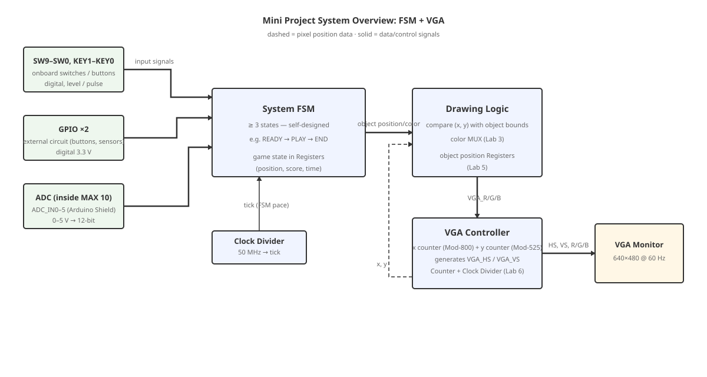
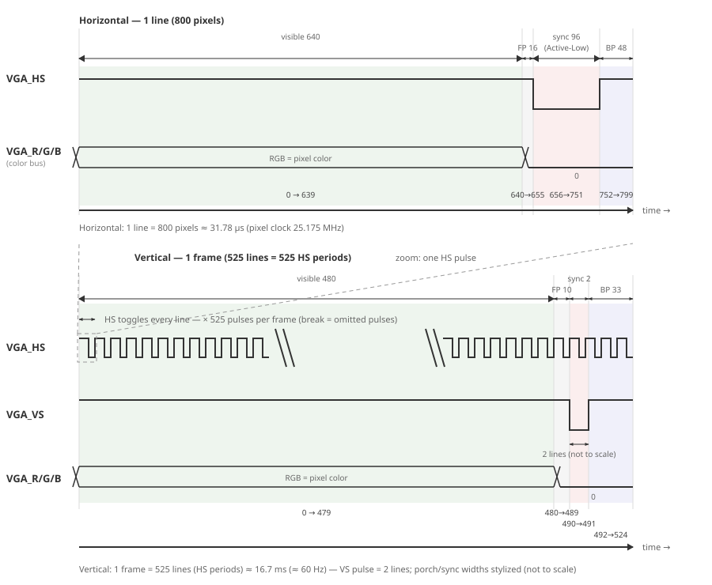

# Mini Project: โปรเจกต์อิสระ — ระบบ FSM แสดงผล VGA

---

## ภาพรวมโปรเจกต์

ตลอดทั้งเทอม นักศึกษาได้สร้างวงจรตั้งแต่ logic gate พื้นฐานจนถึงวงจรคูณเลขด้วย FSM (ใบงานที่ 8) — mini project นี้ปิดท้ายด้วย **โปรเจกต์อิสระ** กลุ่มละ **2 คน** เลือกหัวข้อและออกแบบระบบของตัวเองบนบอร์ด DE10-Lite โดยมีข้อบังคับหลักสองข้อ:

- **FSM อย่างน้อย 3 สถานะ** — หัวใจของระบบต้องเป็น Finite State Machine ที่นักศึกษาออกแบบ state diagram และ state table เอง (ต่อยอดจากใบงานที่ 5–8)
- **แสดงผลออกจอ VGA** — วาดภาพหรือข้อมูลบนจอความละเอียด 640×480 — เป็นอุปกรณ์ใหม่ที่ไม่เคยใช้ในใบงาน เอกสารนี้จึงมีหัวข้อ "หลักการ VGA" เตรียมพื้นฐานให้ครบสำหรับลงมือทำได้

นอกจากสองข้อบังคับนี้ **เปิดให้เลือกเองทั้งหมด** — หัวข้อโปรเจกต์จะเป็นเกม แอนิเมชัน เครื่องมือ หรือระบบจำลองก็ได้ รวมถึงอุปกรณ์อินพุต: ใช้สวิตช์/ปุ่มบนบอร์ด วงจรภายนอกผ่าน GPIO หรือสัญญาณแอนะล็อกผ่าน ADC ตามความเหมาะของหัวข้อ

> **ทำไมต้อง FSM + VGA:** FSM คือเครื่องมือออกแบบวงจร sequential ที่ทรงพลังที่สุดที่ได้เรียนมา — เปลี่ยนสเปก "ระบบที่มีพฤติกรรมเปลี่ยนตามเวลา" ใด ๆ ให้กลายเป็นตารางสถานะที่ลงมือสร้างได้จริง — ส่วนจอ VGA บังคับให้ต้องทำงานกับ **จังหวะเวลาจริง** ระดับไมโครวินาที (นับพิกเซลทุก ~40 ns) ไม่ใช่แค่ tick ระดับวินาทีแบบใบงานที่ 6 — สองทักษะนี้คือพื้นฐานตรงของงานระบบดิจิทัลในอุตสาหกรรม

**ภาพรวมของระบบ:**



---

## ข้อกำหนดหลัก (Requirements)

| ข้อ | ข้อกำหนด | รายละเอียด |
| --- | -------- | ---------- |
| 1 | **FSM ≥ 3 สถานะ** | ต้องมี state diagram และ state table ครบทุกสถานะ เงื่อนไขเปลี่ยนสถานะ และผลลัพธ์ของแต่ละสถานะ — แนบในรายงาน |
| 2 | **แสดงผลออกจอ VGA** | ความละเอียด 640×480 @ ~60 Hz — เนื้อหาและรูปแบบบนจอกำหนดเองตามหัวข้อโปรเจกต์ |
| 3 | **บอร์ด DE10-Lite** | พัฒนาด้วย Quartus Prime Lite ตามขั้นตอนเดียวกับใบงานที่ 3–8 |
| 4 | **กลุ่ม 2 คน** | ทุกสมาชิกต้องเข้าใจระบบทั้งหมด — สาธิตและสัมภาษณ์ร่วมกัน |

> **อินพุตของระบบไม่บังคับประเภท** — เลือกจาก SW/KEY บนบอร์ด, GPIO, หรือ ADC หรือใช้หลายแหล่งรวมกันก็ได้ — หัวข้อที่ไม่ต้องมีอินพุต (เช่น แอนิเมชันล้วน) ก็ทำได้ ขอเพียง FSM มีสถานะและเงื่อนไขเปลี่ยนที่ชัดเจนมีเหตุผล

---

## อินพุตที่มีบนบอร์ด

| อุปกรณ์ | ประเภทสัญญาณ | รายละเอียด |
| ------- | ------------ | ---------- |
| SW9–SW0 | ดิจิทัล (ระดับ) | สวิตช์เลื่อน 10 ตัว — ขึ้น = 1, ลง = 0 (ใช้มาแล้วในใบงานที่ 3–8) |
| KEY1–KEY0 | ดิจิทัล (พัลส์) | ปุ่มกด 2 ตัว — **Active-Low**: กด = 0, ปล่อย = 1 (ขอบขึ้นเกิดตอนปล่อยปุ่ม — ใบงานที่ 5) |
| GPIO ×2 | ดิจิทัล 3.3 V | ขั้วต่อแถว 40 pin สองชุด (GPIO0/GPIO1) ต่อวงจรภายนอก: ปุ่ม สวิตช์ เซ็นเซอร์ดิจิทัล จอยสติ๊ก ฯลฯ |
| ADC (ภายใน MAX 10) | แอนะล็อก 0–5 V → ดิจิทัล 12 บิต | วงจร ADC แบบ SAR ฝังในชิป FPGA เอง — รับอินพุตผ่านช่อง **ADC_IN0–ADC_IN5** ของคอนเนกเตอร์ Arduino Shield — ใช้งานผ่าน Altera Modular ADC IP |

### GPIO

- ตรวจสอบหมายเลขขาจากตาราง Pin Assignment ในคู่มือ DE10-Lite ก่อนต่อวงจรจริงทุกครั้ง
- ระดับสัญญาณ **3.3 V เท่านั้น** — ต่อแหล่งจ่าย 5 V เข้าขา FPGA ตรง ๆ อาจทำความเสียหายถาวร
- วงจรภายนอกต้องใช้ **GND ร่วมกัน** กับบอร์ดเสมอ (ต่อสาย GND ของขั้วต่อไปยัง breadboard ด้วย)
- ขา GPIO เป็นเอาต์พุตได้ด้วย — ใช้ส่งสัญญาณออกไปยัง LED ภายนอกหรืออุปกรณ์อื่นตามการออกแบบ

### ADC (อยู่ภายในชิป MAX 10)

ชิป MAX 10 FPGA ของบอร์ดมีวงจร **ADC แบบ SAR ความละเอียด 12 บิต** ฝังอยู่ภายใน (ไม่ต้องต่อชิป ADC ภายนอก) — รับสัญญาณแอนะล็อกเข้าที่ช่อง **ADC_IN0–ADC_IN5** บนคอนเนกเตอร์ Arduino Shield (JP8) รวม 6 ช่อง ระดับแรงดัน **0–5 V**

**การเข้าถึง ADC จาก VHDL:**

วงจร ADC ภายในไม่ได้ต่อกับ logic ของ FPGA โดยตรง — ต้องสร้าง **Altera Modular ADC IP** จาก IP Catalog ของ Quartus (ตั้งค่าเป็น MAX 10 ADC) แล้ววงจรของเราอ่านค่าจาก IP ตัวนี้ — ดูขั้นตอนจากคู่มือ IP และตัวอย่าง "ADC Measurement" ในคู่มือ DE10-Lite (บทที่ 5.6)

**การแปลงค่าดิจิทัลเป็นแรงดัน:**

วงจร **Analog Front-End** บนบอร์ดย่อแรงดันจากขา Arduino ครึ่งหนึ่ง (5.0 V → 2.5 V) ก่อนเข้า ADC — ค่า 12 บิต (0–4095) จึงคำนวณกลับเป็นแรงดันที่ขาจริงด้วยสูตร:

```text
V_input = (ค่า 12-bit) / 4095 × 5.0  หน่วยโวลต์
```

> **การทดสอบ ADC:** บอร์ดไม่มี potentiometer ในตัว — ต่อ **potentiometer** หรือเซ็นเซอร์แอนะล็อกภายนอก (แหล่งจ่าย 0–5 V) เข้าช่อง ADC_IN0–ADC_IN5 ผ่าน breadboard พร้อมต่อ **GND ร่วม** กับบอร์ดเสมอ — หมายเลขขา ADC_IN0–5 ดูจากตาราง Pin Assignment ในคู่มือ DE10-Lite (บทที่ 3.6–3.7)

---

## หลักการ VGA

จอ VGA แสดงภาพโดย "เดินสแกน" จุดสีจากซ้ายไปขวาทีละบรรทัด จากบนลงล่าง แล้ววนกลับขึ้นบน — มุมมองของผู้ออกแบบวงจรคือ:

> **VGA = ตัวนับ 2 ตัว + สัญญาณ sync** — ตัวนับ **x** (0–799) วิ่งทุกจังหวะ pixel clock เมื่อครบ 799 กลับ 0 พร้อมเพิ่มตัวนับ **y** (0–524) เมื่อ y ครบ 524 กลับ 0 — นี่คือ **ตัวนับ Mod-N ต่อกันสองชุด** แนวคิดเดียวกับ Clock Divider + Counter ในใบงานที่ 6 ทั้งสิ้น

- ช่วงที่ x < 640 **และ** y < 480 คือ **พื้นที่แสดงภาพ (visible)** — จอนำค่าสี RGB ที่วงจรส่งออก ณ จังหวะนั้นไปแสดงที่จุด (x, y)
- ช่วงที่เหลือ (porch) จอไม่แสดงภาพ — เป็นเวลาให้จอกลับต้นบรรทัด/ต้นเฟรม
- สัญญาณ **VGA_HS** (horizontal sync) เป็น **Active-Low** — pulse 96 pixel ท้ายบรรทัด — บอกจอให้เริ่มบรรทัดใหม่
- สัญญาณ **VGA_VS** (vertical sync) เป็น **Active-Low** — pulse 2 บรรทัดท้ายเฟรม — บอกจอให้กลับมุมบนซ้าย

### จังหวะเวลา 640×480 @ 60 Hz

ค่ามาตรฐานที่ใช้ (นับเป็นจำนวน pixel ในแนวนอน และจำนวนบรรทัดในแนวตั้ง):

| ช่วง | แนวนอน (pixel) | แนวตั้ง (บรรทัด) |
| ---- | -------------- | ---------------- |
| แสดงภาพ (visible) | 640 | 480 |
| Front porch | 16 | 10 |
| Sync pulse (Active-Low) | 96 | 2 |
| Back porch | 48 | 33 |
| **รวมทั้งช่วง** | **800** | **525** |

- **Pixel clock 25.175 MHz** → 1 บรรทัด = 800 pixel ≈ **31.78 µs** → 1 เฟรม = 525 บรรทัด ≈ **16.7 ms** ≈ 60 เฟรม/วินาที
- สัญญาณ sync ทั้งสองเป็น **Active-Low**



### Pixel Clock จาก CLOCK_50

นาฬิกาหลักของบอร์ด CLOCK_50 = 50 MHz แต่ระบบต้องการ ~25.175 MHz — มีสองแนวทาง:

1. **หาร 2** ด้วย Flip-Flop ตัวเดียวได้ 25 MHz — จอส่วนใหญ่ยอมรับ (รีเฟรชเพี้ยนเล็กน้อยเป็น ~59.5 Hz) — ง่ายและเพียงพอสำหรับ mini project
2. **ใช้ PLL IP** ของ Quartus สร้าง 25.175 MHz ตรงตามมาตรฐาน

หรือจะทำงานที่ 50 MHz ตลอดแล้วใช้ **สัญญาณ enable** (สไตล์ tick จากใบงานที่ 6) อนุญาตให้ตัวนับ x, y เดินทุก 2 cycle ก็ได้ — นักศึกษาเลือกแนวทางพร้อมอธิบายเหตุผลในรายงาน

### สัญญาณ VGA บนบอร์ด DE10-Lite

| สัญญาณ | จำนวนขา | หน้าที่ |
| ------ | ------- | ------- |
| VGA_R, VGA_G, VGA_B | 4 + 4 + 4 | ระดับสีแดง/เขียว/น้ำเงิน 0–15 ต่อช่อง — บอร์ดมีวงจร DAC แปลงเป็นแอนะล็อกต่อไปที่ขั้วจอให้ |
| VGA_HS | 1 | Horizontal sync |
| VGA_VS | 1 | Vertical sync |
| VGA_BLANK_N | 1 | ต่อระดับ 1 (เปิดการแสดงผล) |
| VGA_SYNC_N | 1 | ต่อระดับ 0 ตามคู่มือบอร์ด |
| VGA_CLK | 1 | ต่อด้วย pixel clock |

> ค่า 4 บิตต่อสี = 0 (ดำ) ถึง 15 (สว่างสุด) — ผสมได้ 4,096 สี — หมายเลขขาทั้งหมดดูจากตาราง Pin Assignment ในคู่มือ DE10-Lite

### การวาดภาพและการเชื่อมกับ FSM

หลักการวาดรูปทรงบนจอคือ **เปรียบเทียบตำแหน่ง (x, y) ปัจจุบันกับขอบเขตของวัตถุ** แล้วเลือกสี:

- ถ้า (x, y) อยู่ในกรอบของวัตถุ → ส่งสีของวัตถุออกทาง VGA_R/G/B
- ถ้าไม่อยู่ → ส่งสีพื้นหลัง

ตำแหน่งขอบเขตวัตถุเก็บใน **register** — เมื่อ FSM เปลี่ยนสถานะ (เช่น ลูกบอลเด้ง เปลี่ยนฉาก เพิ่มคะแนน) FSM อัปเดตค่าใน register → ภาพบนจอเปลี่ยนตามทันทีในเฟรมถัดไป

ชิ้นส่วนที่นำจากใบงานเดิมมาใช้ได้โดยตรง: วงจรเปรียบเทียบและเลือก (MUX — ใบงานที่ 3), Register (ใบงานที่ 5), Counter/Clock Divider (ใบงานที่ 6) และ FSM (ใบงานที่ 8)

---

## ตัวอย่างแนวคิดโปรเจกต์

รายการต่อไปนี้เป็นเพียง **แนวคิด** ให้เห็นขอบเขตของโจทย์ — เลือกหนึ่งข้อ ดัดแปลง หรือคิดหัวข้อใหม่เองทั้งหมดก็ได้:

- **Pong อย่างง่าย** — แร็กเกตขยับด้วยสวิตช์หรือ potentiometer ที่ต่อเข้าช่อง ADC ลูกบอลเด้งอัตโนมัติ FSM จัดการสถานะเกมและคะแนน
- **โวลต์มิเตอร์บนจอ** — อ่านแรงดันจากช่อง ADC_IN (potentiometer หรือเซ็นเซอร์แอนะล็อกภายนอก) แสดงเป็นกราฟแท่ง เข็ม หรือค่าตัวเลขบนจอ
- **เกมความจำ (จับคู่การ์ด)** — ตารางช่องบนจอ กดปุ่มเพื่อเปิดช่อง FSM จำสถานะการจับคู่และนับคะแนน
- **Scoreboard กีฬา** — นับคะแนนสองฝ่ายด้วยปุ่ม พร้อมเวลาถอยหลังบนจอ จบเกมเมื่อหมดเวลา
- **ไฟจราจรจำลองสี่แยก** — ไฟเปลี่ยนตามเวลาของแต่ละทิศ มีปุ่มขอสัญญาณคนข้ามถนนที่ทำให้ FSM เข้าสู่เฟสพิเศษ
- **สล็อตแมชชีน** — สัญลักษณ์วิ่งบนจอ กดปุ่มหยุดทีละวง FSM ตรวจผลรางวัล
- **เกมวัดปฏิกิริยา** — สัญญาณบนจอสุ่มกระพริบ ผู้เล่นกดปุ่มให้ทัน FSM วัดเวลาและแสดงผล
- **จอวาดภาพ (Etch-a-Sketch)** — เคอร์เซอร์เคลื่อนด้วยสวิตช์/ปุ่ม ทิ้งรอยสีไว้บนจอ
- **แอนิเมชัน/สกรีนเซฟเวอร์** — รูปทรงเคลื่อนที่เปลี่ยนฉากตามเวลา — ไม่ต้องมีอินพุต แต่ FSM ต้องมีสถานะและเงื่อนไขเปลี่ยนที่ชัดเจน

---

## สเปกโปรเจกต์ที่ต้องกำหนดเอง

ก่อนลงมือสร้างวงจร นักศึกษาต้องกำหนดสเปกของโปรเจกต์ให้ครบถ้วนและเขียนอธิบายไว้ในรายงานทุกข้อ:

> **ข้อกำหนดของสเปก** — รายงานต้องมีสเปกครบทุกข้อ:
>
> 1. **ชื่อและเป้าหมาย** — ระบบทำอะไร ผู้ใช้เห็นอะไรบนจอ ใช้อุปกรณ์อินพุตอะไรบ้าง
> 2. **สเปก FSM** — รายชื่อสถานะทั้งหมด เงื่อนไขการเปลี่ยนสถานะ ผลลัพธ์ของแต่ละสถานะ — พร้อม **state diagram** และ **state table**
> 3. **อินพุต/เอาต์พุต** — หน้าที่ของสวิตช์ ปุ่ม หรือช่อง ADC แต่ละตัว (ถ้าใช้) และสิ่งที่ระบบส่งออกทั้งหมด
> 4. **หน้าจอ VGA** — รูปทรง ตำแหน่ง ขนาด สีของสิ่งที่แสดง พร้อมเงื่อนไขที่ภาพเปลี่ยนแปลง
> 5. **การทดสอบ** — กรณีทดสอบที่พิสูจน์ว่า FSM เปลี่ยนสถานะถูกต้องและภาพตรงตามสเปก (ทั้ง simulate และบอร์ดจริง)

---

## Acceptance Criteria

ระบบที่ส่งมอบถือว่าสมบูรณ์เมื่อ:

- FSM ทำงานตรงตาม state diagram และ state table ที่กำหนดไว้ ครบทุกสถานะและทุกเงื่อนไขเปลี่ยน
- ภาพบนจอ VGA ถูกต้องเสถียร (ไม่มีภาพเลื่อน วิบวับ หรือหลุด sync) และตรงตามสเปกที่เขียนไว้
- ภาพเปลี่ยนตามสถานะ FSM / อินพุตตรงตามเงื่อนไขที่กำหนดในสเปก
- ทุกกรณีทดสอบตรวจสอบได้ทั้งจาก Waveform Simulation และบอร์ดจริง

---

## ข้อกำหนดการส่งงาน

1. **ไฟล์โปรเจกต์ Quartus** — โฟลเดอร์โปรเจกต์ครบทุกไฟล์ `.vhd` compile ผ่าน พร้อมไฟล์ที่ใช้สาธิต
2. **รายงาน** — อย่างน้อยประกอบด้วย:
   - สเปกโปรเจกต์ตามข้อกำหนด 5 ข้อในหัวข้อ "สเปกโปรเจกต์ที่ต้องกำหนดเอง" (ชื่อ/เป้าหมาย, FSM, อินพุต/เอาต์พุต, หน้าจอ VGA, การทดสอบ)
   - ภาพรวมการออกแบบ (บล็อกไดอะแกรม + คำอธิบายการทำงาน)
   - State diagram และ state table ของ FSM
   - Waveform simulation ที่ยืนยันการเปลี่ยนสถานะและการแสดงผล
   - ภาพถ่ายผลการรันบนบอร์ดและหน้าจอ VGA
   - ปัญหาที่พบระหว่างพัฒนาและวิธีแก้
   - บทบาทของสมาชิก — ใครรับผิดชอบส่วนใด (เช่น FSM / VGA / ADC / รายงาน)
3. **การสาธิต (Demo)** — รันโปรเจกต์บนบอร์ดให้อาจารย์ตรวจในคาบนัดหมาย — อาจมีคำถามสัมภาษณ์เทคนิคเกี่ยวกับวงจรที่เขียน ทุกสมาชิกต้องตอบได้

> **เกณฑ์การให้คะแนน (Rubric)** — คะแนนกลุ่ม 30 + รายบุคคล 10 = 40 คะแนน — รายละเอียดจะแจกในคาบ / ประกาศในระบบของภาควิชา (ไม่เผยแพร่บนเว็บไซต์)
