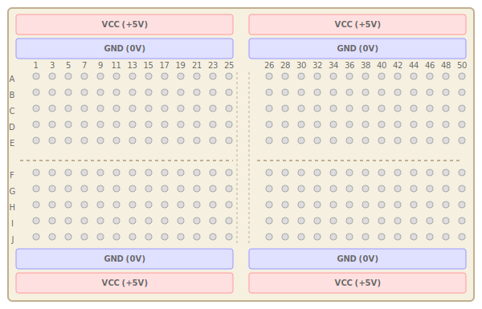
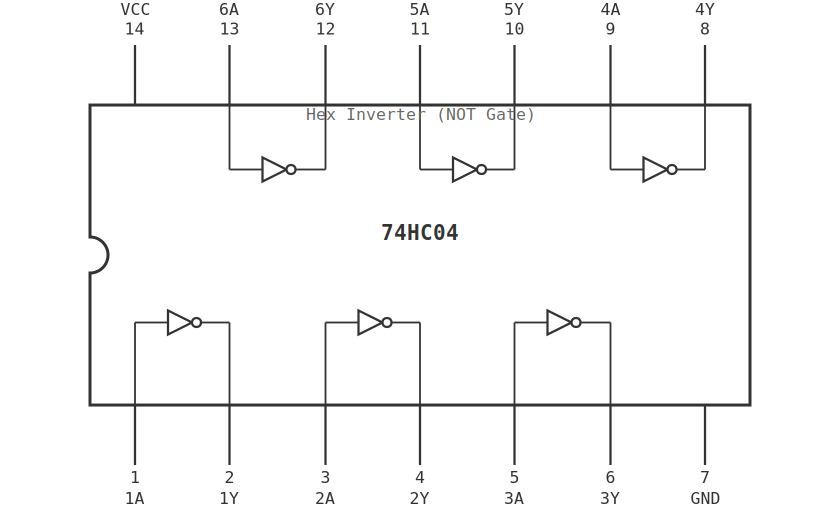
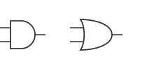
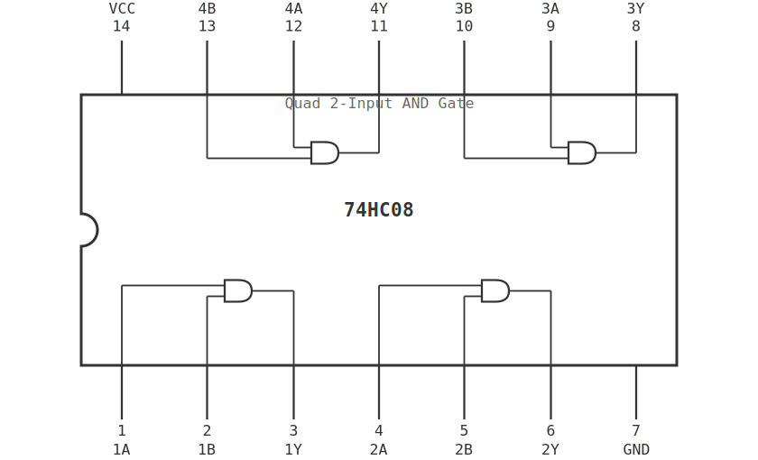
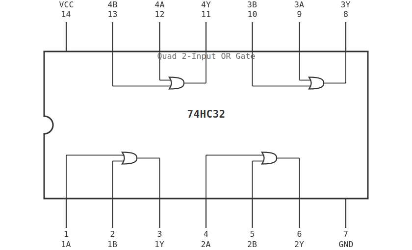
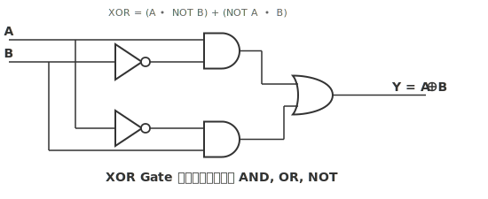
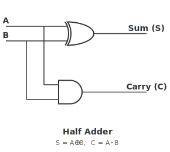

# ใบงานการทดลองที่ 1: การสร้างวงจรลอจิกพื้นฐาน

---

## วัตถุประสงค์

- ใช้งาน NOT Gate (Inverter) ได้
- ใช้งาน AND Gate และ OR Gate ได้
- สามารถสร้าง XOR Gate จาก AND, OR, NOT Gate ได้
- สามารถสร้างวงจร Half Adder จาก Logic Gate ได้
- ตรวจสอบการทำงานของวงจรด้วย Truth Table

---

## อุปกรณ์ที่ใช้ในการทดลอง

- Breadboard จำนวน 1 ชุด
- IC 74HC08 (AND Gate) จำนวน 1 ตัว
- IC 74HC32 (OR Gate) จำนวน 1 ตัว
- IC 74HC04 (NOT Gate) จำนวน 1 ตัว
- LED จำนวน 4 ดวง
- ตัวต้านทาน 330 Ω จำนวน 4 ตัว
- Push Button จำนวน 2 ตัว
- สาย Jumper ตามความเหมาะสม
- แหล่งจ่ายไฟ +5V จำนวน 1 ชุด
- Digital Oscilloscope พร้อม Probes จำนวน 1 ชุด
- Function Generator จำนวน 1 เครื่อง

---

## การทดลองที่ 1.1 การใช้งาน Breadboard และวงจรพื้นฐาน

### ขั้นตอนการทดลอง

1. ศึกษาโครงสร้างของ Breadboard
2. ต่อไฟเลี้ยง +5V และ GND เข้าสายรางของ Breadboard
3. ต่อ Push Button โดยขาหนึ่งเข้ากับ VCC (+5V)
4. ต่อ LED พร้อมตัวต้านทาน 330 Ω ระหว่างขาอีกด้านของ Push Button กับ GND
5. ทดลองกดและปล่อย Push Button พร้อมสังเกต LED
6. ใช้ Oscilloscope Probe สัญญาณที่ขา Output ของ Push Button เทียบกับ GND — สังเกต Contact Bounce (สัญญาณกระเพื่อมขณะกดและปล่อยปุ่ม)
7. ใช้ฟังก์ชัน Auto Trigger ของ Oscilloscope จับภาพสัญญาณขณะกดปุ่ม — บันทึกรูปคลื่น
8. บันทึกผลการทดลอง

#### ตารางที่ 1.1 ผลการทดลอง Push Button และ LED

| Push Button | LED |
|-------------|-----|
| 0 (ไม่กด)   |     |
| 1 (กด)      |     |

#### ตารางที่ 1.1a การสังเกต Contact Bounce ด้วย Oscilloscope

| สภาวะ          | จำนวน Bounce (โดยประมาณ) | ระยะเวลา Bounce (ms) |
|----------------|--------------------------|----------------------|
| กดปุ่ม          |                          |                      |
| ปล่อยปุ่ม       |                          |                      |

| Push Button | LED |
|-------------|-----|
| 0 (ไม่กด)   |     |
| 1 (กด)      |     |

### คำถามท้ายการทดลองที่ 1.1

1. เพราะเหตุใด LED จึงดับเมื่อไม่กด Push Button
2. หากสลับด้านของ Push Button ต่อเข้ากับ GND แทน VCC จะเกิดอะไรขึ้น

---

## การทดลองที่ 1.2 การทดลองวงจร NOT Gate (Inverter)

NOT Gate เป็นลอจิกเกตพื้นฐานที่มีอินพุต 1 ตัวและเอาต์พุต 1 ตัว โดยให้ค่าตรงข้ามกับอินพุต

### ขั้นตอนการทดลอง

1. ศึกษา Datasheet ของ IC 74HC04
2. ระบุขา VCC และ GND ของ IC
3. ต่อไฟเลี้ยง +5V และ GND ให้กับ IC
4. ต่อวงจร NOT Gate ด้วย IC 74HC04 โดยใช้ Push Button เป็นอินพุต และ LED แสดงผลลัพธ์
5. ทดลองครบทุกกรณี
6. ใช้ Oscilloscope 2 ช่อง Probe อินพุต (ขา Input ของ IC) และเอาต์พุต (ขา Output ของ IC) พร้อมกัน — วัดระดับแรงดัน V_OH และ V_OL
7. บันทึกผลการทดลอง

#### ตารางที่ 1.2 Truth Table ของ NOT Gate

| A | Y |
|---|---|
| 0 |   |
| 1 |   |

#### ตารางที่ 1.2a การวัดระดับแรงดันของ NOT Gate (74HC04)

| อินพุต | แรงดันอินพุต (V) | แรงดันเอาต์พุต (V) | ระดับลอจิก |
|--------|------------------|-------------------|------------|
| 0      |                  |                   |            |
| 1      |                  |                   |            |

### คำถามท้ายการทดลองที่ 1.2

1. NOT Gate มีประโยชน์อย่างไรในการออกแบบวงจรดิจิทัล
2. ถ้าต่อ NOT Gate ต่อกัน 2 ตัว จะได้ผลลัพธ์เป็นอย่างไร

---

## การทดลองที่ 1.3 การทดลองวงจร AND Gate และ OR Gate

### ขั้นตอนการทดลอง (AND Gate)

1. ต่อวงจร AND Gate ด้วย IC 74HC08
2. ใช้ Push Button เป็นอินพุต A และ B
3. ใช้ LED แสดงผลลัพธ์
4. ทดลองครบทุกกรณี
5. ใช้ Oscilloscope 3 ช่อง Probe อินพุต A, B และเอาต์พุต Y พร้อมกัน — ตรวจสอบว่าระดับแรงดันเอาต์พุตถูกต้องตามตาราง Truth Table
6. บันทึกผลการทดลอง

#### ตารางที่ 1.3 Truth Table ของ AND Gate

| A | B | Y |
|---|---|---|
| 0 | 0 |   |
| 0 | 1 |   |
| 1 | 0 |   |
| 1 | 1 |   |

### ขั้นตอนการทดลอง (OR Gate)

1. ต่อวงจร OR Gate ด้วย IC 74HC32
2. ทดลองครบทุกกรณี
3. ใช้ Oscilloscope 3 ช่อง Probe อินพุต A, B และเอาต์พุต Y — เปรียบเทียบระดับแรงดันกับ AND Gate
4. บันทึกผลการทดลอง

#### ตารางที่ 1.4 Truth Table ของ OR Gate

| A | B | Y |
|---|---|---|
| 0 | 0 |   |
| 0 | 1 |   |
| 1 | 0 |   |
| 1 | 1 |   |

### คำถามท้ายการทดลองที่ 1.3

1. AND Gate และ OR Gate แตกต่างกันอย่างไร
2. ถ้าเปลี่ยนอินพุตของ AND Gate เป็น 1 เสมอ จะได้ผลลัพธ์เหมือนเกตชนิดใด

---

## การทดลองที่ 1.4 การสร้างวงจร XOR Gate จาก AND, OR, NOT

XOR Gate สามารถสร้างได้จาก AND, OR, NOT Gate โดยใช้สมการ Boolean

XOR = (A · NOT B) + (NOT A · B)

### ขั้นตอนการทดลอง

1. วาด Logic Diagram จากสมการ XOR
2. ต่อวงจรบน Breadboard ด้วย IC 74HC08, 74HC32, 74HC04
3. ทดลองครบทุกกรณี
4. ใช้ Oscilloscope Probe อินพุต A, B และเอาต์พุต Y — สังเกต Glitch ที่เอาต์พุตเมื่ออินพุตเปลี่ยนพร้อมกัน (เนื่องจาก Propagation Delay ไม่เท่ากันในแต่ละ Path)
5. ใช้ Function Generator ป้อนสัญญาณ Square Wave ความถี่ 1 kHz ที่อินพุต A และ Push Button ที่อินพุต B — สังเกตเอาต์พุตบน Oscilloscope
6. บันทึกผลการทดลอง

#### ตารางที่ 1.5 Truth Table ของ XOR Gate

| A | B | Y |
|---|---|---|
| 0 | 0 |   |
| 0 | 1 |   |
| 1 | 0 |   |
| 1 | 1 |   |

### คำถามท้ายการทดลองที่ 1.4

1. XOR Gate แตกต่างจาก OR Gate อย่างไร
2. สามารถสร้าง XOR Gate ด้วย NAND Gate เพียงอย่างเดียวได้หรือไม่
3. ถ้าต้องการสร้าง XOR Gate แบบ 3-input จะต้องใช้ XOR Gate กี่ตัว

---

## การทดลองที่ 1.5 การสร้างวงจร Half Adder

Half Adder เป็นวงจรที่ใช้บวกเลขฐานสองจำนวน 1 บิต โดยมีอินพุต 2 บิต และเอาต์พุต 2 ค่า ได้แก่

- Sum (S)
- Carry (C)

โดยมีสมการดังนี้

- S = A XOR B
- C = A AND B

### ขั้นตอนการทดลอง

1. ใช้วงจร XOR Gate ที่สร้างในข้อ 1.4 และ AND Gate
2. รวมวงจรทั้งสองเข้าด้วยกัน
3. ใช้ LED ดวงที่ 1 แสดงค่า Sum
4. ใช้ LED ดวงที่ 2 แสดงค่า Carry
5. ทดลองอินพุตครบทั้ง 4 กรณี
6. ใช้ Oscilloscope 2 ช่อง Probe สัญญาณ Sum และ Carry พร้อมกัน — สังเกต Timing Relationship ระหว่าง Sum และ Carry
7. ใช้ Function Generator ป้อนสัญญาณ Square Wave ความถี่ 100 Hz ที่อินพุต A และใช้ Push Button ที่อินพุต B — ดู Waveform ของ Sum และ Carry บน Oscilloscope
8. บันทึกผลการทดลอง

#### ตารางที่ 1.6 บันทึกผลการทดลอง Half Adder

| A | B | Sum | Carry |
|---|---|---|---|
| 0 | 0 |     |       |
| 0 | 1 |     |       |
| 1 | 0 |     |       |
| 1 | 1 |     |       |

### คำถามท้ายการทดลองที่ 1.5

1. เพราะเหตุใด Half Adder จึงไม่สามารถบวกเลขหลายบิตได้
2. หากต้องการบวกเลข 2 บิตขึ้นไป จะต้องเพิ่มสัญญาณใด
3. วงจร Full Adder แตกต่างจาก Half Adder อย่างไร

---

## สรุปผลการทดลอง

อธิบายผลการทดลอง พร้อมวิเคราะห์ความถูกต้องของผลลัพธ์ และอธิบายสาเหตุของข้อผิดพลาด (ถ้ามี)

## คำถามท้ายใบงาน

1. เพราะเหตุใดการต่อวงจรบน Breadboard จึงต้องต่อ VCC และ GND ให้ถูกต้อง
2. หากอินพุตของ IC ถูกปล่อยให้เป็น Floating จะเกิดผลอย่างไร
3. วงจร XOR Gate สามารถสร้างจาก AND, OR, NOT Gate ได้อย่างไร จงเขียนสมการ
4. วงจร Half Adder ประกอบด้วย Logic Gate ใดบ้าง
5. Contact Bounce ที่สังเกตได้จาก Oscilloscope ส่งผลต่อการทำงานของวงจรดิจิทัลอย่างไร
6. การใช้ Oscilloscope ช่วยในการ Debug วงจรในแลปนี้อย่างไรบ้าง จงยกตัวอย่าง