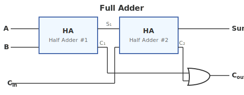
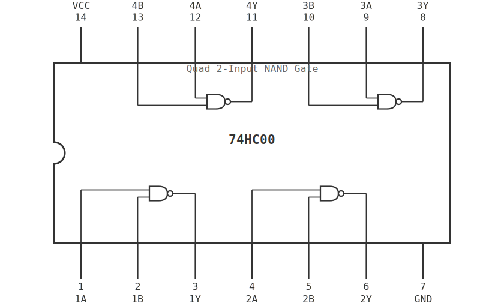

# ใบงานการทดลองที่ 2: การออกแบบวงจรแบบ combinational 

---

## วัตถุประสงค์

- อธิบายหลักการทำงานของวงจร Full Adder ได้
- สามารถสร้างวงจร Full Adder จาก Half Adder และ Logic Gate ได้
- อธิบายหลักการทำงานของ Multiplexer ได้
- สามารถสร้างวงจร Multiplexer ขนาด 2-to-1 บน Breadboard ได้
- วิเคราะห์การทำงานของวงจรแบบ combinational จาก Truth Table และ Boolean Equation ได้

---

## อุปกรณ์ที่ใช้ในการทดลอง

- Breadboard จำนวน 1 ชุด
- IC 74HC08 (AND Gate) จำนวน 2 ตัว
- IC 74HC32 (OR Gate) จำนวน 1 ตัว
- IC 74HC86 (XOR Gate) จำนวน 2 ตัว
- IC 74HC00 (NAND Gate) จำนวน 2 ตัว
- LED จำนวน 6 ดวง
- ตัวต้านทาน 330 Ω จำนวน 6 ตัว
- Push Button จำนวน 3 ตัว
- สาย Jumper ตามความเหมาะสม
- แหล่งจ่ายไฟ +5V จำนวน 1 ชุด
- Digital Oscilloscope พร้อม Probes จำนวน 1 ชุด
- Function Generator จำนวน 1 เครื่อง

---

## การทดลองที่ 2.1 การสร้างวงจร Full Adder

Full Adder เป็นวงจรบวกเลขฐานสองจำนวน 1 บิต โดยรองรับ Carry จากหลักก่อนหน้า (Carry In)

อินพุต

- A
- B
- Cin

เอาต์พุต

- Sum
- Cout

#### ตารางที่ 2.1 Truth Table ของ Full Adder

| A | B | Cin | Sum | Cout |
|---|---|---|---|---|
| 0 | 0 | 0   |     |       |
| 0 | 0 | 1   |     |       |
| 0 | 1 | 0   |     |       |
| 0 | 1 | 1   |     |       |
| 1 | 0 | 0   |     |       |
| 1 | 0 | 1   |     |       |
| 1 | 1 | 0   |     |       |
| 1 | 1 | 1   |     |       |

### ขั้นตอนการทดลอง

1. สร้าง Half Adder ชุดที่ 1
2. สร้าง Half Adder ชุดที่ 2
3. ใช้ OR Gate รวม Carry ทั้งสอง
4. ใช้ LED แสดงผล Sum และ Cout
5. ทดลองอินพุตครบทั้ง 8 กรณี
6. ใช้ Oscilloscope 4 ช่อง Probe A, B, Cin, Sum พร้อมกัน — ตรวจสอบการทำงานของวงจร Debug กรณีต่อวงจรผิด
7. ใช้ Oscilloscope Probe สัญญาณ Carry ระหว่าง Half Adder ทั้งสอง — ดู Timing ของ Carry Propagation
8. บันทึกผลการทดลอง

#### ตารางที่ 2.2 ผลการทดลอง

| A | B | Cin | Sum | Cout |
|---|---|---|---|---|
| 0 | 0 | 0   |     |       |
| 0 | 0 | 1   |     |       |
| 0 | 1 | 0   |     |       |
| 0 | 1 | 1   |     |       |
| 1 | 0 | 0   |     |       |
| 1 | 0 | 1   |     |       |
| 1 | 1 | 0   |     |       |
| 1 | 1 | 1   |     |       |

### คำถามท้ายการทดลองที่ 2.1

1. เพราะเหตุใด Full Adder จึงต้องใช้ Half Adder จำนวน 2 ชุด
2. หากต้องการสร้าง 4-bit Adder จะต้องใช้ Full Adder กี่ตัว

---

## การทดลองที่ 2.2 การสร้างวงจร Multiplexer 2-to-1

Multiplexer (MUX) เป็นวงจรที่ใช้เลือกข้อมูลจากอินพุตหลายชุดเข้าสู่เอาต์พุตเพียงชุดเดียว

อินพุต

- I0
- I1
- S

เอาต์พุต

- Y

#### ตารางที่ 2.3 Truth Table ของ Multiplexer 2-to-1

| S | I0 | I1 | Y |
|---|---|---|---|
| 0 | 0  | X  |   |
| 0 | 1  | X  |   |
| 1 | X  | 0  |   |
| 1 | X  | 1  |   |

### ขั้นตอนการทดลอง

1. ออกแบบวงจรจากสมการ Boolean

Y = (I0 · S̅) + (I1 · S)

2. สร้างวงจรบน Breadboard
3. ทดลองเปลี่ยนค่า S
4. ใช้ Oscilloscope 3 ช่อง Probe I0, I1 และ Y — สังเกตว่าเอาต์พุตเลือกอินพุตตามค่า S
5. ใช้ Function Generator ป้อนสัญญาณ Square Wave ที่ I0 (1 kHz) และ I1 (2 kHz) — เปลี่ยน S เพื่อดูการสลับช่องสัญญาณบน Oscilloscope
6. บันทึกผลการทดลอง

#### ตารางที่ 2.4 ผลการทดลอง

| I0 | I1 | S | Y |
|---|---|---|---|
| 0  | 0  | 0 |   |
| 0  | 1  | 0 |   |
| 1  | 0  | 0 |   |
| 1  | 1  | 0 |   |
| 0  | 0  | 1 |   |
| 0  | 1  | 1 |   |
| 1  | 0  | 1 |   |
| 1  | 1  | 1 |   |

### คำถามท้ายการทดลองที่ 2.2

1. Multiplexer ทำหน้าที่อะไร
2. หากต้องการสร้าง 4-to-1 Multiplexer จะต้องใช้สัญญาณ Select กี่บิต

---

## การทดลองที่ 2.3 การออกแบบวงจรด้วย NAND Gate (Universal Gate)

NAND Gate เป็น Universal Gate — สามารถสร้างลอจิกเกตชนิดอื่นได้จาก NAND เพียงอย่างเดียว

#### ตารางที่ 2.5 Truth Table ของ NAND Gate

| A | B | Y |
|---|---|---|
| 0 | 0 |   |
| 0 | 1 |   |
| 1 | 0 |   |
| 1 | 1 |   |

### การสร้างลอจิกเกตพื้นฐานจาก NAND Gate

- **NOT Gate**: ต่ออินพุตทั้งสองขาของ NAND เข้าด้วยกัน (Y = A NAND A = NOT A)
- **AND Gate**: ต่อ NAND → NOT (Y = NOT (A NAND B) = A AND B)
- **OR Gate**: ต่อ NOT → NAND (ตาม De Morgan's Law: Y = NOT A NAND NOT B = A OR B)

### ขั้นตอนการทดลอง

**ส่วนที่ 1:** สร้างวงจรตามสมการ F = (A · B) + (A ⊕ C)

1. วิเคราะห์สมการและวาด Logic Diagram ด้วย AND, OR, XOR Gate
2. ต่อวงจรบน Breadboard
3. ทดลองอินพุตครบทุกกรณีและบันทึกผล

**ส่วนที่ 2:** แปลงวงจรให้ใช้ NAND Gate เพียงอย่างเดียว

4. แปลงเกตแต่ละตัวในวงจรให้เป็น NAND Gate โดยใช้ NOT, AND, OR ที่สร้างจาก NAND
5. ต่อวงจร NAND-only บน Breadboard ด้วย IC 74HC00
6. ทดลองอินพุตครบทุกกรณีและบันทึกผล
7. ใช้ Oscilloscope 2 ช่อง Probe อินพุตและเอาต์พุตของวงจรส่วนที่ 1 (AND/OR/XOR) และส่วนที่ 2 (NAND-only) — เปรียบเทียบ Propagation Delay
8. เปรียบเทียบผลลัพธ์กับส่วนที่ 1

### คำถามท้ายการทดลองที่ 2.3

1. NAND Gate สามารถสร้างลอจิกเกตชนิดใดได้บ้าง
2. จงเขียนสมการ Boolean ของ F ในรูป NAND Gate เท่านั้น
3. การใช้ NAND Gate เพียงชนิดเดียวมีข้อดีอย่างไร
---

## สรุปผลการทดลอง

อธิบายผลการทดลอง พร้อมวิเคราะห์ความถูกต้องของผลลัพธ์ และอธิบายสาเหตุของข้อผิดพลาด (ถ้ามี)

## คำถามท้ายใบงาน

1. Half Adder และ Full Adder แตกต่างกันอย่างไร
2. Multiplexer มีประโยชน์อย่างไรในการออกแบบระบบดิจิทัล
3. เพราะเหตุใดวงจรแบบ combinational จึงไม่มีหน่วยความจำ
4. หากต้องการสร้างวงจร 8-bit Adder จะต้องใช้ Full Adder กี่ตัว
5. NAND Gate แตกต่างจาก AND Gate อย่างไร และเพราะเหตุใด NAND จึงเป็น Universal Gate
6. จากการทดลอง นักศึกษาพบปัญหาใดบ้าง และแก้ไขอย่างไร
7. การใช้ Oscilloscope 4 ช่องช่วยในการทดสอบ Full Adder อย่างไรเมื่อเทียบกับการดู LED เพียงอย่างเดียว
8. วงจร NAND-only มี Propagation Delay มากกว่าหรือน้อยกว่าวงจรเดิม เพราะเหตุใด