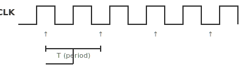
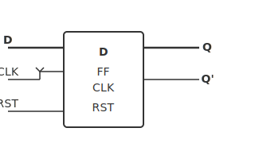
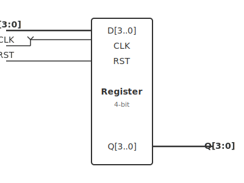

# ใบงานการทดลองที่ 5: การออกแบบวงจร Sequential

---

## วัตถุประสงค์

- อธิบายความแตกต่างระหว่างวงจรแบบ combinational และ sequential ได้
- อธิบายหลักการทำงานของสัญญาณ Clock ได้
- สามารถเขียน VHDL แบบ Process ได้
- สามารถออกแบบวงจร D Flip-Flop ด้วย VHDL ได้
- สามารถออกแบบ Register ขนาด 4 บิตได้

---

## อุปกรณ์ที่ใช้ในการทดลอง

- บอร์ด DE10-Lite จำนวน 1 บอร์ด
- สาย USB Type-A to Mini-B จำนวน 1 เส้น
- คอมพิวเตอร์ จำนวน 1 เครื่อง
- โปรแกรม Quartus Prime Lite Edition
- Digital Oscilloscope พร้อม Probes จำนวน 1 ชุด
- Function Generator จำนวน 1 เครื่อง

---

## การทดลองที่ 5.1 การทดลองสัญญาณ Clock

### ขั้นตอนการทดลอง

1. ศึกษาสัญญาณ Clock 50 MHz บนบอร์ด DE10-Lite
2. สร้างโปรเจกต์ใหม่
3. เขียน Process ที่ทำงานเมื่อเกิด Rising Edge
4. Compile และ Download โปรแกรม
5. ใช้ Oscilloscope Probe ขา FPGA Pin ที่เชื่อมกับสัญญาณ Clock (PIN_P11 หรือขา Clock ของบอร์ด) — สังเกตรูปคลื่นสัญญาณ Clock จริง
6. วัดค่า Frequency, Duty Cycle, Amplitude และ Rise Time ของสัญญาณ Clock 50 MHz

> หมายเหตุ: เนื่องจาก Clock มีความเร็วสูงมาก จึงยังไม่สามารถสังเกตการเปลี่ยนแปลงของ LED ได้โดยตรง แต่สามารถใช้ Oscilloscope ดูสัญญาณ Clock ได้

#### ตารางที่ 5.0 การวัดสัญญาณ Clock 50 MHz

| พารามิเตอร์ | ค่าที่วัดได้ |
|-------------|-------------|
| Frequency (MHz) | |
| Duty Cycle (%) | |
| Amplitude (V) | |
| Rise Time (ns) | |
| Fall Time (ns) | |

---

## การทดลองที่ 5.2 การสร้าง D Flip-Flop

กำหนดให้

- SW0 เป็นอินพุต D
- KEY0 เป็น Clock
- LED0 เป็นเอาต์พุต Q

#### ตารางที่ 5.1 ผลการทดลอง

| D | Clock Edge | Q |
|---|------------|---|
|0|↑||
|1|↑||

### ขั้นตอนการทดลอง

1. เขียน D Flip-Flop ด้วย Process
2. ใช้ rising_edge() ตรวจจับ Clock
3. Compile โปรแกรม
4. Download ลงบอร์ด
5. ทดลองเปลี่ยนค่า D ก่อนกด KEY0
6. สังเกตค่า Q
7. ใช้ Oscilloscope 3 ช่อง Probe สัญญาณ D (SW0), Clock (KEY0) และ Q (LED0) พร้อมกัน — สังเกตว่า Q จะเปลี่ยนสถานะเฉพาะเมื่อมี Rising Edge ของ Clock
8. ใช้ Function Generator ป้อนสัญญาณ Clock ความถี่ 10 Hz ที่ KEY0 (ผ่าน GPIO) — ดู Waveform D, Clock, Q บน Oscilloscope เห็นการทำงานแบบ Edge-Triggered ได้ชัดเจน

### คำถามท้ายการทดลองที่ 5.2

1. เพราะเหตุใด Q จึงไม่เปลี่ยนทันทีเมื่อ D เปลี่ยน
2. หากไม่กด Clock จะเกิดอะไรขึ้น

---

## การทดลองที่ 5.3 การสร้าง Register ขนาด 4 บิต

กำหนดให้

- SW3–SW0 เป็นข้อมูลเข้า
- KEY0 เป็น Clock
- LED3–LED0 เป็นข้อมูลออก

### ขั้นตอนการทดลอง

1. เขียน Register ขนาด 4 บิต
2. ใช้ Process และ rising_edge()
3. Compile โปรแกรม
4. Download ลงบอร์ด
5. ทดลองเปลี่ยนข้อมูลอินพุต
6. กด KEY0 เพื่อบันทึกข้อมูล
7. ใช้ Oscilloscope 2 ช่อง Probe Clock (KEY0) และ Data Bit 0 (LED0) — สังเกตว่า Data จะถูก Latch เฉพาะที่ Rising Edge ของ Clock
8. ใช้ Function Generator ป้อนสัญญาณ Clock ความถี่ 5 Hz — เปลี่ยน Switch ขณะ Clock ต่างระดับ สังเกตพฤติกรรมของ Register

#### ตารางที่ 5.2 ผลการทดลอง

| Data In | Data Out |
|---------|----------|
|0000||
|0101||
|1010||
|1111||

### คำถามท้ายการทดลองที่ 5.3

1. Register แตกต่างจาก D Flip-Flop อย่างไร
2. หากเพิ่มขนาด Register เป็น 8 บิต จะต้องแก้ไขส่วนใดของโปรแกรม

---

## การทดลองที่ 5.4 การเพิ่ม Reset

เพิ่มปุ่ม KEY1 เพื่อใช้ Reset Register

เมื่อกด KEY1

- LED ทุกดวงต้องดับ

### ขั้นตอนการทดลอง

1. เพิ่มสัญญาณ Reset
2. เขียนเงื่อนไข Reset ภายใน Process
3. ทดลองการทำงานร่วมกับ Clock
4. ใช้ Oscilloscope 4 ช่อง Probe D, Clock, Q และ Reset พร้อมกัน — สังเกตว่าเมื่อ Reset ทำงาน Q จะกลับเป็น 0 ทันทีโดยไม่รอ Clock

#### ตารางที่ 5.3 การวัด Timing ของ Reset

| สัญญาณ | ระดับ Before Reset | ระดับ After Reset |
|--------|-------------------|-------------------|
| D | | |
| Clock | | |
| Q | | |
| Reset | | |

---

## สรุปผลการทดลอง

อธิบายผลการทดลอง พร้อมวิเคราะห์ความถูกต้องของผลลัพธ์ และอธิบายสาเหตุของข้อผิดพลาด (ถ้ามี)

## คำถามท้ายใบงาน

1. เพราะเหตุใดวงจร Sequential จึงต้องใช้ Clock
2. D Flip-Flop มีหน้าที่อะไร
3. Register จัดเก็บข้อมูลได้อย่างไร
4. Process แตกต่างจาก Concurrent Assignment อย่างไร
5. หากต้องการสร้าง Counter จะต้องอาศัยองค์ประกอบใดจากการทดลองนี้
6. การใช้ Oscilloscope ดูสัญญาณ Clock 50 MHz จริงจาก FPGA ให้ข้อมูลอะไรบ้างที่สังเกตจาก LED ไม่ได้
7. จากรูปคลื่น D, Clock และ Q บน Oscilloscope จงอธิบายว่า D Flip-Flop ทำงานแบบ Edge-Triggered อย่างไร
8. การวัด Timing ของ Reset จาก Oscilloscope แสดงให้เห็นว่า Reset ทำงานแบบ Synchronous หรือ Asynchronous อย่างไร